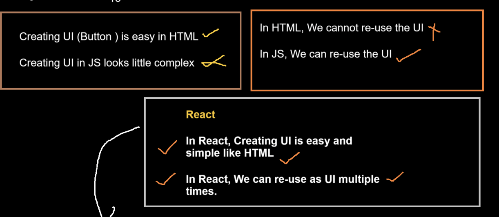
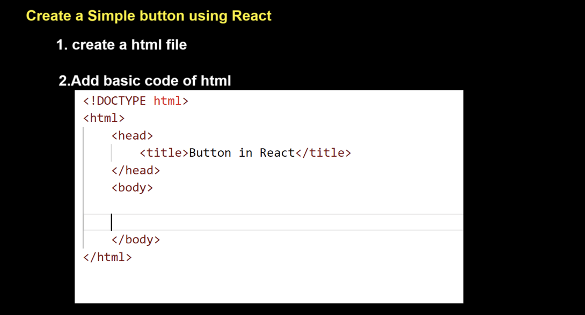
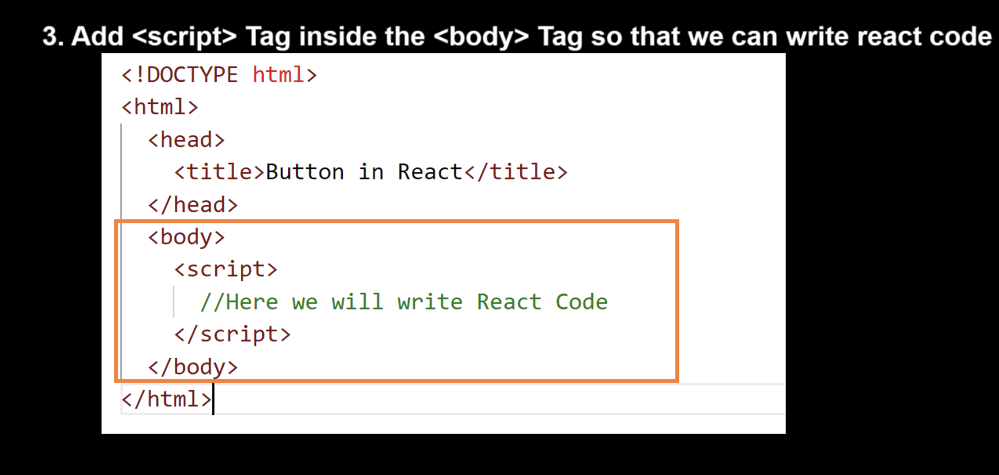
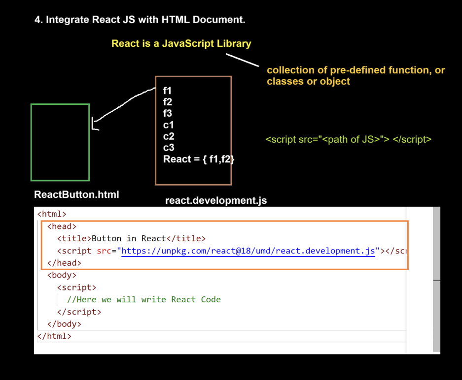
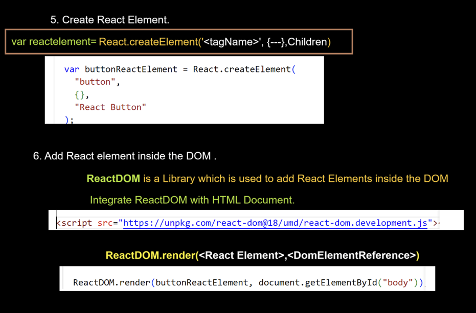
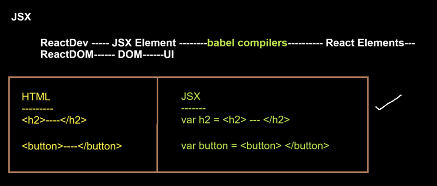

# Lecture 1 Kabir

## Prerequisite to learn react


React is a library not a framework!!


In Java we have package and in JS we have library!! both are same 

React is just predefined package devleoped in JS only!! like util in Java!!

React is used to create UI only!!

>Note:With React you cannot create Frontend Application as cannot send request server ,data management!! 

To create frontend application we need some other libraries like axios ,React-DOM!!

# Lecture 2
UI is collection of UI components ,this UI components help to interact with software!!

## Button in html

```html
<!DOCTYPE html>
<html>
  <head>
    <title>Button using HTML</title>
  </head>
  <body>
    <h2>Button in HTML</h2>
    <button>HTML Button</button>
  </body>
</html>
```
## Button using JS

```html
<!DOCTYPE html>
<html lang="en">
  <head>
    <title>JS Button</title>
  </head>
  <body>
    <h2>Javascript Button</h2>
    <script>
      //code to create a Button
      var buttonDomElement = document.createElement("button");
      //<button></button>

      buttonDomElement.innerText = "Javascript Button";
      //<button>Javascript Button</button>

      //Add the Button in the DOM
      document.querySelector("body").appendChild(buttonDomElement);
    </script>
  </body>
</html>
```
## HTMl list
```html
<!DOCTYPE html>
<html>
  <head>
    <title>List in HTML</title>
  </head>
  <body>
    <h2>List in HTML</h2>
    <ol>
      <li>Apple</li>
      <li>Samsung</li>
      <li>Oppo</li>
      <li>Oneplus</li>
    </ol>
    <ol>
      <li>Apple</li>
      <li>Samsung</li>
      <li>Oppo</li>
      <li>Oneplus</li>
    </ol>
    <ol>
      <li>Apple</li>
      <li>Samsung</li>
      <li>Oppo</li>
      <li>Oneplus</li>
    </ol>
    <ol>
      <li>Apple</li>
      <li>Samsung</li>
      <li>Oppo</li>
      <li>Oneplus</li>
    </ol>
    <ol>
      <li>Apple</li>
      <li>Samsung</li>
      <li>Oppo</li>
      <li>Oneplus</li>
    </ol>
    <ol>
      <li>Apple</li>
      <li>Samsung</li>
      <li>Oppo</li>
      <li>Oneplus</li>
    </ol>
    <ol>
      <li>Apple</li>
      <li>Samsung</li>
      <li>Oppo</li>
      <li>Oneplus</li>
    </ol>
  </body>
</html>

```
## Js list

```html
<!DOCTYPE html>
<html>
  <head>
    <title>List using JS</title>
  </head>
  <body>
    <h2>List in Javascript</h2>
    <script>
      function createList() {
        var olDomElement = document.createElement("ol"); //<ol> </ol>

        var liDomElement1 = document.createElement("li");
        var liDomElement2 = document.createElement("li");
        var liDomElement3 = document.createElement("li");
        var liDomElement4 = document.createElement("li");

        olDomElement.appendChild(liDomElement1); //<ol><li></li></ol>
        olDomElement.appendChild(liDomElement2);
        olDomElement.appendChild(liDomElement3);
        olDomElement.appendChild(liDomElement4);

        liDomElement1.innerText = "Apple"; //<li>Apple</li>
        liDomElement2.innerText = "Samsung";
        liDomElement3.innerText = "Vivo";
        liDomElement4.innerText = "OnePlus";

        //Add OrderedList with ListItems in the DOM
        document.querySelector("body").appendChild(olDomElement);
      }

      createList();
      createList();
      createList();
      createList();
      createList();
      createList();
    </script>
  </body>
</html>

```


See in JSlist we are reusing the list component using createList() function!!

>Note:Creating UI is easy in HTML but reusing component is good in JS!!

React give both this in one !!!

# Lecture 3







React is a library so we need to integrate it with html!! we integrate react.development.js in html file so we use script to add it!!


these are CDN link of the files!!


in createArgument we put 3 param
1. Tag name as string
2. object
3. children (whatever you put inside opening and closing tag of this tag is children we put here)

so 
```js
 var buttonReactElement = React.createElement(
        "button",
        {},
        "React Button"
      );
```
is 

```html
<button>React Button</button>

```
now this we have put in one variable reactelement!!


see reactButton.html!!

### JSX
JSX makes up a large portion of the code written in most React components and thus a large amount of React in general.

JSX elements are transformed into nested React.createElement() calls at a later step in our build process. JSX uses the tree structure of elements created by React.
