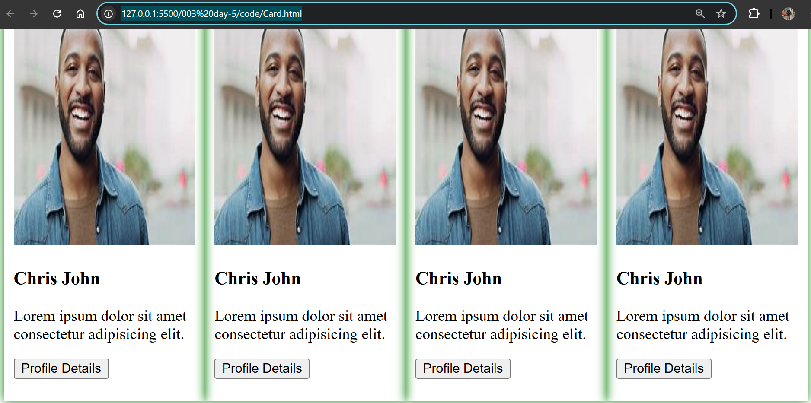

# Lec-5
want to create something like this!!



default width 100% (entire screen size),height depend of childrens (content inside div)

to make div a card we reduce the width and increase height!!then we put the border!!we put in style tag!!

```html
   <script type="text/babel">
      var imageUrl =
        "https://tse2.mm.bing.net/th?id=OIP.Ck2Usj84bIh_SiI2QJ7b-QHaEp&pid=Api&P=0&h=180";

      let card = (
        <div class="card">
          
          <h3>Chris John </h3>
          <p>Lorem ipsum dolor sit amet consectetur adipisicing elit.</p>
          <button>Profile Details </button>
        </div>
      );

      let container = (
        <div id="cardContainer">
          {card}
          {card}
          {card}
          {card}
        </div>
      );

      ReactDOM.render(container, document.getElementById("root"));
    </script>
```
>we add card in cardConstainer,see how we added or reused that element by {}

to add any js code any-where in html of JSX we use {}

>Note:can see how we adde imageUrl variable

we add class card and id cardContainer for style

```html
    <style>
      .card {
        box-shadow: 0 0 10px green;
        padding: 10px;
        width: 270px;
        height: 400px;
      }
      #cardContainer {
        display: flex;
        justify-content: space-evenly;
      }
    </style>
```
display:flex helps to show all children of it in row !! else it will be shown as column!!

justify-content helps to show all card having same space between them !!


## Card.html

```html
<!DOCTYPE html>
<html>
  <head>
    <style>
      .card {
        box-shadow: 0 0 10px green;
        padding: 10px;
        width: 270px;
        height: 400px;
      }
      #cardContainer {
        display: flex;
        justify-content: space-evenly;
      }
    </style>
    <script src="https://unpkg.com/react@18/umd/react.development.js"></script>
    <script src="https://unpkg.com/react-dom@18/umd/react-dom.development.js"></script>
    <script src="https://unpkg.com/@babel/standalone/babel.min.js"></script>
  </head>
  <body>
    <div id="root"></div>

    <script type="text/babel">
      var imageUrl =
        "https://tse2.mm.bing.net/th?id=OIP.Ck2Usj84bIh_SiI2QJ7b-QHaEp&pid=Api&P=0&h=180";

      let card = (
        <div class="card">
          
          <h3>Chris John </h3>
          <p>Lorem ipsum dolor sit amet consectetur adipisicing elit.</p>
          <button>Profile Details </button>
        </div>
      );

      let container = (
        <div id="cardContainer">
          {card}
          {card}
          {card}
          {card}
        </div>
      );

      ReactDOM.render(container, document.getElementById("root"));
    </script>
  </body>
</html>

```
can do same thing by function call and pass argument to show  !!

```html
<!DOCTYPE html>
<html>
  <head>
    <style>
      .card {
        box-shadow: 0 0 10px green;
        padding: 10px;
        width: 270px;
        height: 400px;
      }
      #cardContainer {
        display: flex;
        justify-content: space-evenly;
      }
    </style>
    <script src="https://unpkg.com/react@18/umd/react.development.js"></script>
    <script src="https://unpkg.com/react-dom@18/umd/react-dom.development.js"></script>
    <script src="https://unpkg.com/@babel/standalone/babel.min.js"></script>
  </head>
  <body>
    <div id="root"></div>

    <script type="text/babel">
      function createCard(name) {
        // JSX code to create a Card
        var imageUrl =
          "https://www.crushpixel.com/big-static7/preview4/portrait-young-professional-man-suit-258742.jpg";
        return (
          <div class="card">
            
            <h3> {name} </h3>
            <p>Lorem ipsum dolor sit amet consectetur adipisicing elit.</p>
            <button>Profile Details </button>
          </div>
        );
      }

      function multipleCard() {
        return (
          <div id="cardContainer">
            {createCard("rohan vemra")}
            {createCard("riya sharma")}
            {createCard("ajay sadguru")}
            {createCard("siddharath patel")}
          </div>
        );
      }

      ReactDOM.render(multipleCard(), document.getElementById("root"));
    </script>
  </body>
</html>


```

now we want to get different images

like this


see CardFnwithImageURl.html