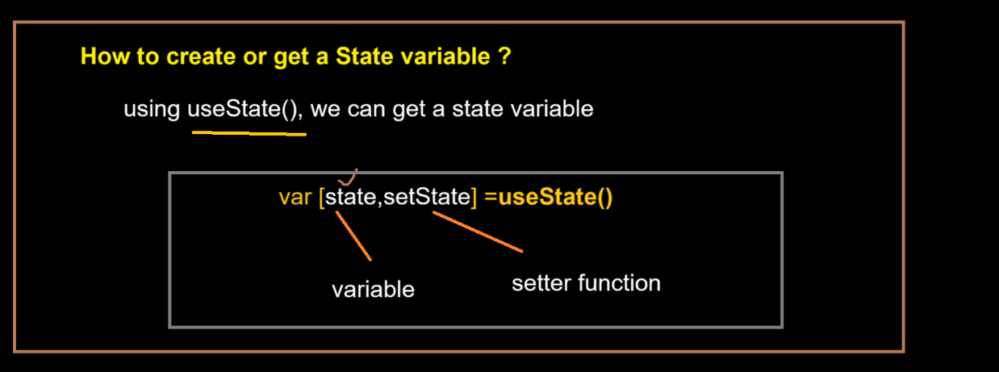
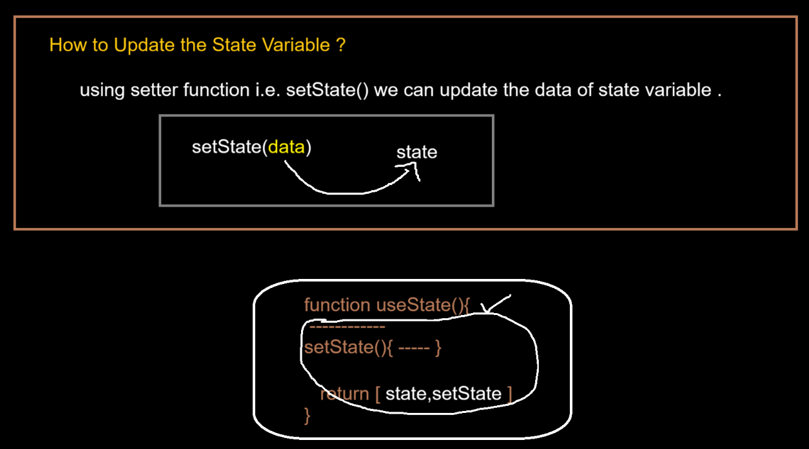
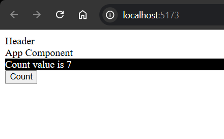
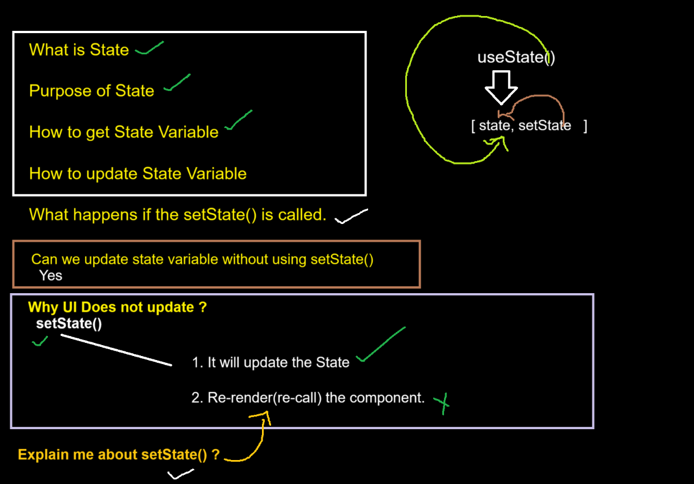
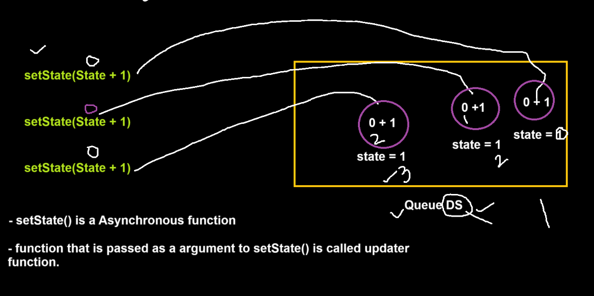

In JS we directly use DOM API to manipute DOM!!


In react we tell how DOM needs to be manipulated ,we will not 
manipulate DOM!! React will do it in most effiecient way!!



React says if any part of data chnages in UI ,it should come from a variable called as 
State!!

Whatever you create in State ,React takes care of putting and updating in UI!!!

useState() retuns an array whose 1st value is a variable and 2nd value is some fucntion!!




```jsx
import "./footer.css"
import {useState} from "react";

function Footer() {
     var [count, setCount] = useState(0);

     function  incrCount(){
         setCount(count + 1);
    }
    return (
        <>
        <div className="footer">Count value is {count}</div>
        <button onClick={incrCount}>Count</button>
        </>
    )
}
export default Footer

```



>Note:State is not a Object !! It is special type of variable!!


let us dive deeper into State 




