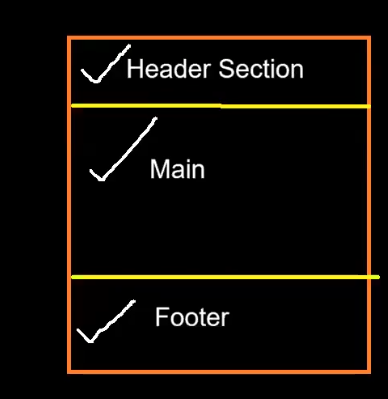
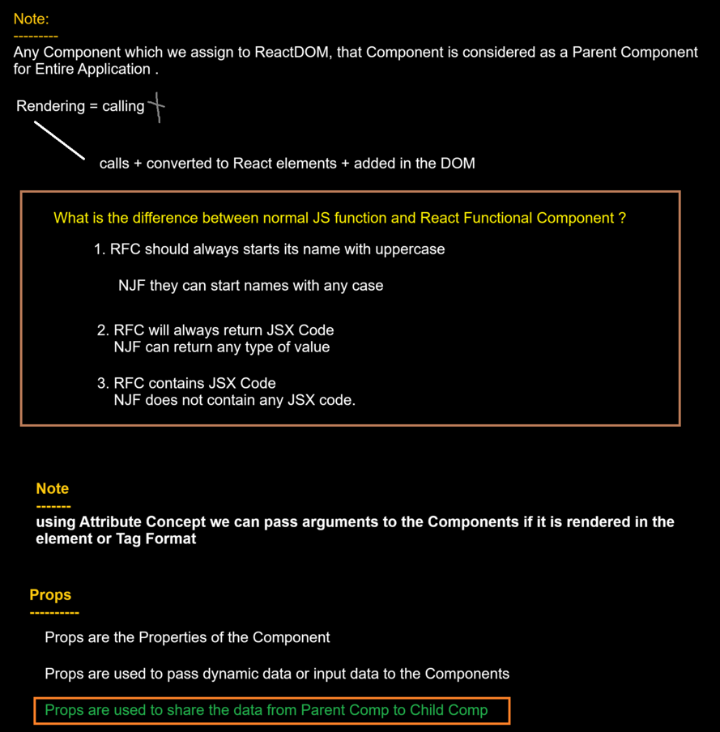
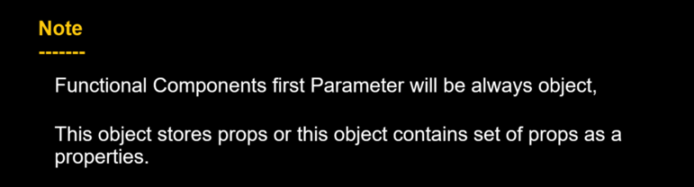
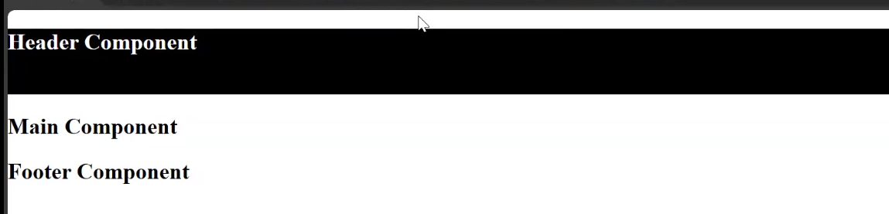
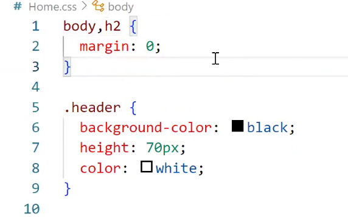

# Lecture-7

Already seen about functional components in previous class!!

Functional Component are functions starting with UpperCase and returning UI (whether JSX or react component)

we want some webpage like 




so we create 3 components ,1 component for each section!!

you can create all 3 in 1 component but adding in 1 will create issue with reusability!!

```html

<!DOCTYPE html>
<html>
  <head>
    <link rel="stylesheet" href="Home.css" />
    <script src="https://unpkg.com/react@18/umd/react.development.js"></script>
    <script src="https://unpkg.com/react-dom@18/umd/react-dom.development.js"></script>
    <script src="https://unpkg.com/@babel/standalone/babel.min.js"></script>
  </head>
  <body>
    <div id="root"></div>

    <script type="text/babel">
      function CreateCard(props) {
        // props = {title:"",imageUrl:""}
        return (
          <div class="card">
            
            <h3> {props.title} </h3>
            <p>Lorem ipsum dolor sit amet consectetur adipisicing elit.</p>
            <button>Profile Details </button>
          </div>
        );
      }

      function Header() {
        return (
          <div class="header flexContainer">
            <h2>Header Component </h2>
          </div>
        );
      }

      function Main() {
        return (
          <div class="main cardContainer">
            <CreateCard
              title="Raj Verma"
              imageUrl="https://www.crushpixel.com/big-static7/preview4/portrait-young-professional-man-suit-258742.jpg"
            />

            <CreateCard
              title="Aishwariya Sharma"
              imageUrl="https://i.pinimg.com/originals/e6/78/4b/e6784b9cd722d02e014d7e60ebe25e39.jpg"
            />

            <CreateCard
              title="Rohan Jaiswal"
              imageUrl="https://th.bing.com/th/id/OIP.kLuVl7_2soHqjgecM56X2AHaLL?rs=1&pid=ImgDetMain"
            />

            <CreateCard
              title="Preeti Reddy"
              imageUrl="https://i.pinimg.com/originals/3e/37/a1/3e37a1bd45c70cb972bf95105ba4adc6.jpg"
            />
          </div>
        );
      }

      function Footer() {
        return (
          <div class="footer flexContainer">
            <h2>Footer Component </h2>
          </div>
        );
      }

      function App() {
        return (
          <div>
            <Header />
            <Main />
            <Footer />
          </div>
        );
      }

      ReactDOM.render(<App />, document.getElementById("root"));
    </script>
  </body>
</html>

```
see code and see how we call CreateCardFunction from main,CreateCard had parameters in props Object , the first parameter is always Object ,it can have any name here we have put props,we prefer that only and we passing the parameters as attribute while calling !!




RFC--> react functional component
NJF--> Normal JS function

Above App is Parent Component as assigned to ReactDOM!!
Inside App we calling Child Components!! 

In react we say rendering not calling for components!!

Rendering== calls component + JSX converted to React element + these React element added to DOM!




## CSS tip



we removed body margin then what margin is this for??

this is for heading element we can remove margin of that and then can see the change!!



and see output:


to remove any kind of margins we can put 

```css
*{
    margin:0;
}
```

for justify-content and align-items to work we must have display:flex!! so that container is flex container!!
