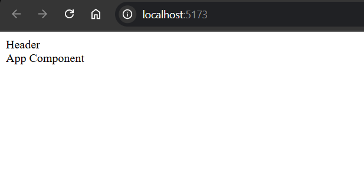
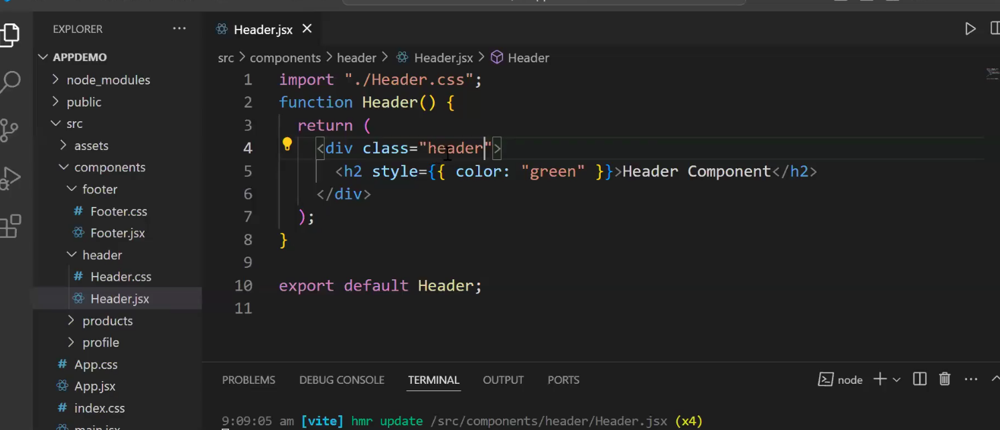
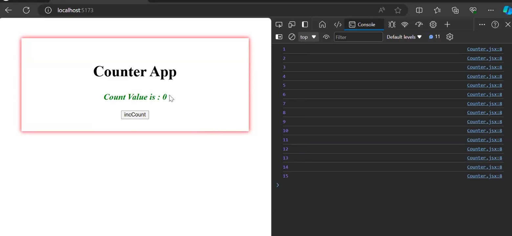

CRA--> Create React app 

too slow!!


We're using IntelliJ Ultimate to start React App!!

`npm run dev`--> to run development server provided by vite to access app!!

Now let us walkthorough the app!!Lecture-10

We create an App component in App.jsx!!Previously we created component in script!!!

Industry says there should be only one component in one file!! But it is just an recommendation!!
One file can have multiple components too!!

>Note: FileName and Component Name be same ,although if different it creates no problem
but just seeing file you must get what component it is!!


In src we create all our components!!

we created Header component 

```jsx

function Header() {
    return (
        <div className="header-container">Header</div>
    )
}
export default Header
```

then see app component

```jsx
import Header from "./Header.jsx";

function App() {

  return (
    <>
        <Header />
      <div> App Component</div>
    </>
  )
}

export default App

```
remove all css files!!




index.html is only html file you loading in the page!!

```html
<!doctype html>
<html lang="en">
  <head>
    <meta charset="UTF-8" />
    <link rel="icon" type="image/svg+xml" href="/vite.svg" />
    <meta name="viewport" content="width=device-width, initial-scale=1.0" />
    <title>Vite + React</title>
  </head>
  <body>
    <div id="root"></div>
    <script type="module" src="/src/main.jsx"></script>
  </body>
</html>

```
title Vite+React comes from here only!!

React component to show on Screen you must give it to App.jsx which is loaded in main.jsx 
which is loaded in
in index.html!!

>Note:Babel converts JSX to React!!

```jsx
createRoot(document.getElementById('root')).render(
    <StrictMode>
        <App />
    </StrictMode>,
)

```
Render() is what we have inside main.jsx!!where we add App in root div!! of index.html!!

Previously we have use ReactDOM.render() that we have till React 17 from React 18 we have
createRoot() as can see above function!!!

App is parent component of entire application!! as we have passed that to DOM!!

So reactDom is already there in node modules!!

>Note:From now on we follow a approach we create a folder components and in that we create 
a folder (named as componentName in small letters)!! so all files related to same component will be in same folder!!





Now suppose we have added css file inside Header component so now we just need to 
import that in Header.jsx no need to writing anything !! just create ,import and use !!
Easy!!

We use classname for css classes !! we have different meaning of class in React!!


```js
import "./footer.css"

function Footer() {
    var count=0;
    var incrCount=()=>{
        count+=1;
        console.log(count);
    }
    return (
        <>
        <div className="footer">Count value is {count}</div>
        <button onClick={incrCount}>Count</button>
        </>
    )
}
export default Footer
```



count value increasing but UI is not updating!!

IN react we do not directly interact with DOM!! In React ,React will manipulate DOM in 
best possible way!!


seee here too `<button onClick={incrCount}>Count</button>` we're telling React to call function ,
we are not calling function as no () so function is called by React!!

