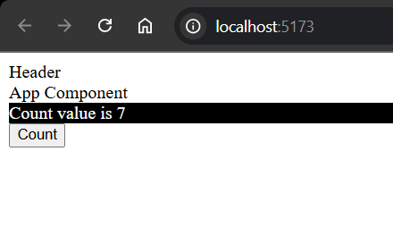
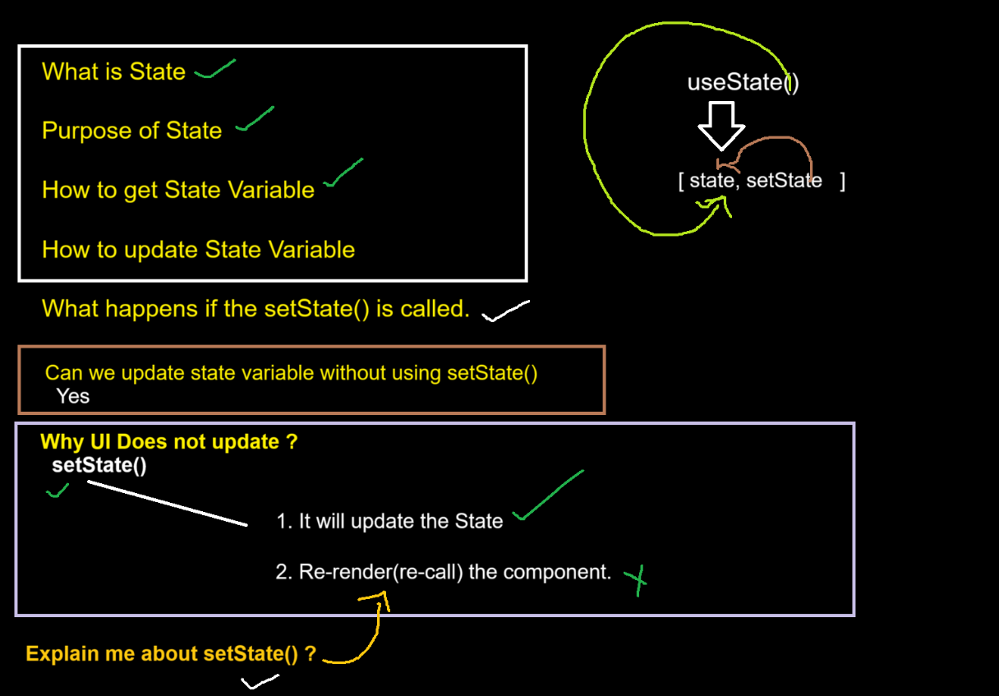
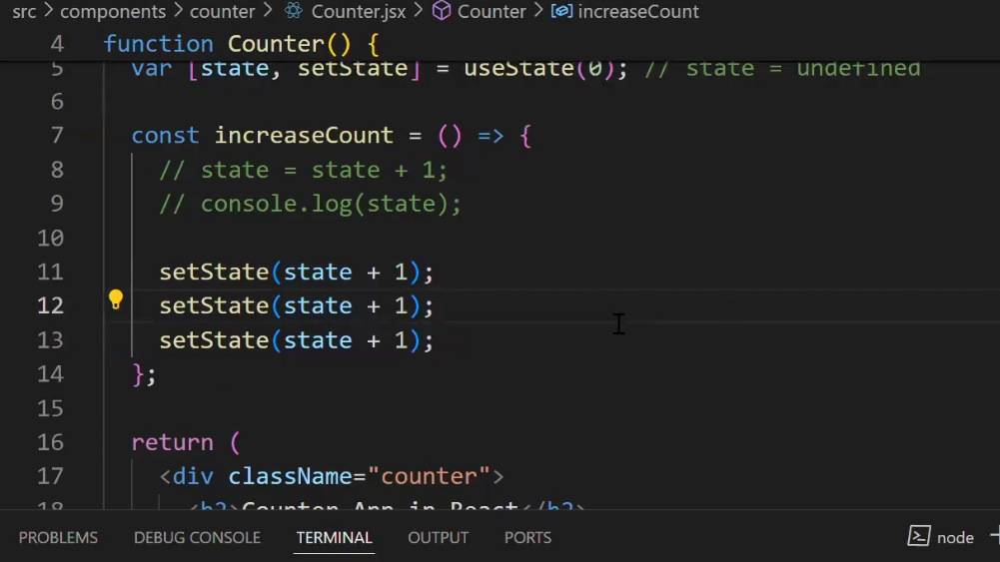
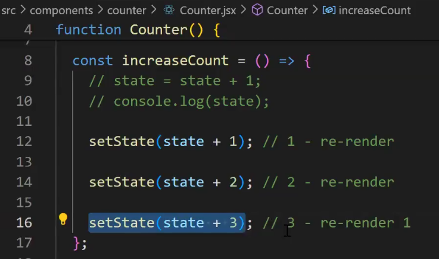
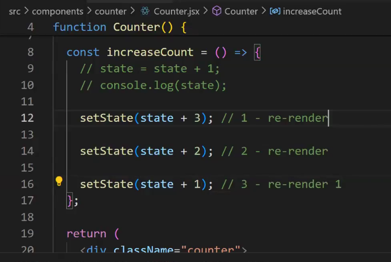
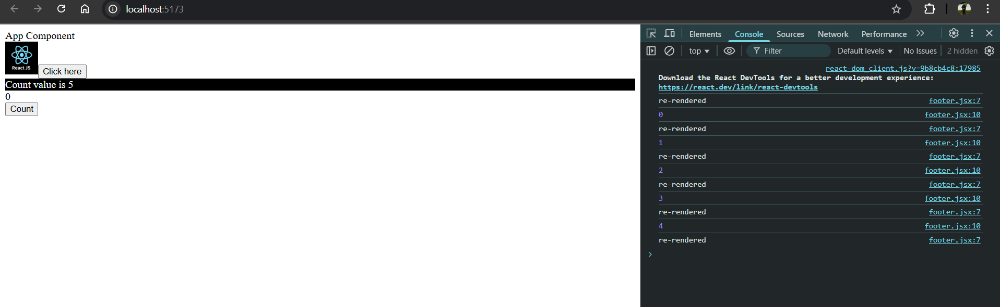
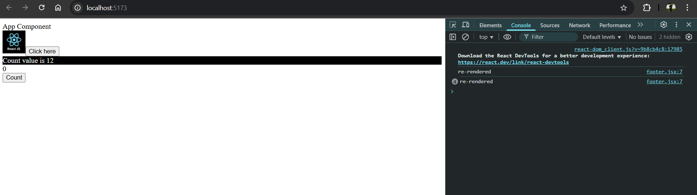

In JS we directly use DOM API to manipute DOM!!


In react we tell how DOM needs to be manipulated ,we will not 
manipulate DOM!! React will do it in most effiecient way!!


React says if any part of data chnages in UI ,it should come from a variable called as 
State!!

Whatever you create in State ,React takes care of putting and updating in UI!!!

useState() retuns an array whose 1st value is a variable and 2nd value is some fucntion!!


```jsx
import "./footer.css"
import {useState} from "react";

function Footer() {
     var [count, setCount] = useState(0);

     function  incrCount(){
         setCount(count + 1);
    }
    return (
        <>
        <div className="footer">Count value is {count}</div>
        <button onClick={incrCount}>Count</button>
        </>
    )
}
export default Footer

```



>Note:State is not a Object !! It is special type of variable!!


let us dive deeper into State 

useState() returns an array in that first element is state and 2nd element is setter function!!




we pass the initial value in useState() function as a parameter!!

without setter function (that we get in array 2nd function) we cannot update
state!! We can update the value but it will not get updated in UI!!
as setState() re-renders 
the component!!

If 10 setState() then that many times re-rendering can happen!! so use this setState very
carefully!!

Now suppose



It seems it will make state+=3!! but 3 times re-rendering will happen!!But here the 
answer will be 1 only here!!
 
we put a log statement so that we can know how many times component got re-rendered!!
but we see only one time statement is printed!! so only one time re-rendering!!

now if we do 



now output on click button is coming as 3!!

now if we reverse



on button click 


so only last SetState() is having effect!!


what happens is in queue we have all setState() calls!!

After 1st setState() state=1 it needs to do re-rendering but it stops as there are other 
setState() in queue !! so it stops for another setState() as re-rendering should not be 
done again and again!!

now another setState() will do initial value of state-->0+1=1 so it also set state=1 
as we have another setState() so this also stops re-rendering!!


another setState() they will do 0+1=1 then it do re-render!!


```jsx
function Footer() {
    var [count, setCount] = useState(0);
    var [state, setState] = useState(0);
    console.log("re-rendered");
    function  incrCount(){
        setCount(count + 1);
        setCount(count + 2);
        setState(state + 1);
        setCount(count + 3);
        setState(state + 2);
    }
    return (
        <>
            <div className="footer">Count value is {count}</div>
            <div>{state}</div>
            <button onClick={incrCount}>Count</button>
        </>
    )
}
export default Footer
```

Now suppose we have this!!

output is here only one time re-renedered and state=2 and count=3 !!

also see 

```jsx
import "./footer.css"
import {useState} from "react";

function Footer() {
     var [count, setCount] = useState(0);
    var [state, setState] = useState(0);
    console.log("re-rendered");
     function  incrCount(){
         setCount(count + 1);
         console.log(count);
    }
    return (
        <>
        <div className="footer">Count value is {count}</div>
            <div>{state}</div>
        <button onClick={incrCount}>Count</button>
        </>
    )
}
export default Footer
```



on Ui we have set count=count+1 but on console previous value is printed!!
as setCount() is Asynchronous function so it takes time to show result to console.log()!!

Before setCount() ,log is exceuted so it get previous value!!

now our requirement is as many time as we call setState() we should get updated value!!

```jsx
import "./footer.css"
import {useState} from "react";

function Footer() {
     var [count, setCount] = useState(0);
    var [state, setState] = useState(0);
    console.log("re-rendered");
     function  incrCount(){
         setCount((prevState)=>{
             return prevState + 1;
         });

         setCount((prevState)=>{
             return prevState + 1;
         });

         setCount((prevState)=>{
             return prevState + 1;
         });
    }
    return (
        <>
        <div className="footer">Count value is {count}</div>
            <div>{state}</div>
        <button onClick={incrCount}>Count</button>
        </>
    )
}
export default Footer
```
This setCount() taking a function as an argument ,that function is called as updater 
function!!




see 4 times re-rendered in one time we added 1, 3 times