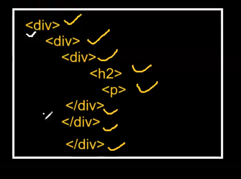

# Lecture-4

## Html List

```html
<!DOCTYPE html>
<html lang="en">
  <head>
    <meta charset="UTF-8" />
    <meta name="viewport" content="width=device-width, initial-scale=1.0" />
    <title>Document</title>
  </head>
  <body>
    <ol type="a" style="color: red; background-color: black">
      <li>Rohan</li>
      <li>Raj</li>
      <li>Rahul</li>
    </ol>
  </body>
</html>

```
## react list

see list.html!!

```html
<!DOCTYPE html>
<html>
  <head>
    <style></style>
    <link />
    <title>List in React</title>
    <script src="https://unpkg.com/react@18/umd/react.development.js"></script>
    <script src="https://unpkg.com/react-dom@18/umd/react-dom.development.js"></script>
  </head>

  <body>
    <div id="root"></div>

    <script>
      var container = React.createElement(
        "ol",
        {
          type: "a",
          id: "users",
          style: {
            color: "green",
            backgroundColor: "black",
            padding: "10px",
          },
        },
        [
          React.createElement("li", {}, "Rohan Verma"),
          React.createElement("li", {}, "Riya Sharma"),
          React.createElement("li", {}, "Raj Jaiswal"),
        ]
      );

      ReactDOM.render(container, document.getElementById("root"));
    </script>
  </body>
</html>

```
so you see what {} in 2nd param is for ,it is for tags or attributes!!

>Note: In Style attribute we write it as Object in react, Also in react backgroundcolor of style should be in camel case, see closely below part

```html
    <script>
      var container = React.createElement(
        "ol",
        {
          type: "a",
          id: "users",
          style: {// see style in object
            color: "green",
            backgroundColor: "black",// background camel case
            padding: "10px",
          },
        },
        [
          React.createElement("li", {}, "Rohan Verma"),
          React.createElement("li", {}, "Riya Sharma"),
          React.createElement("li", {}, "Raj Jaiswal"),
        ]
      );

      ReactDOM.render(container, document.getElementById("root"));
    </script>
```
3rd parameter we pass as array if multiple tags are present as child!!

now this is pretty difficult to make list or other attributes like this!!

we need this type of structure now!!


first try yourself!!

sol-->task1.html 

React looks difficult now!!

Getting React element seems difficult , so we use JSX elements,JSX is compiled to react element by Babel!!

We have seen creating list uisng react!!

Step-1 create simple html page

Step-2 create a div by id=root

Step-3 integrate react and react dom

Step-4 Integrate babel (go to babeljs.io) there we get script tag add that

```html
<script src="https://unpkg.com/@babel/standalone/babel.min.js"></script>
```
then need to add type=text/babel in script of body

## Button using JSX

```html
<!DOCTYPE html>
<html>
  <head>
    <script src="https://unpkg.com/react@18/umd/react.development.js"></script>
    <script src="https://unpkg.com/react-dom@18/umd/react-dom.development.js"></script>
    <script src="https://unpkg.com/@babel/standalone/babel.min.js"></script>
  </head>

  <body>
    <div id="root"></div>

    <script type="text/babel">
      //   var container = <h2> h2 JSX Element </h2>;

      var container = <button>JSX Button </button>;

      ReactDOM.render(container, document.getElementById("root"));
    </script>
  </body>
</html>

```
 at last we add the JSX element to root !!
 
 see how we create JSX element!! 

 >Note : In JS file we write html is JSX!!

## JSX list
we first create a div id of root

then write this

```html
  <script type="text/babel">
      var container = (
        <ol type="a">
          <li>Apple</li>
          <li>Samsung</li>
          <li>Oppo</li>
          <li>Vivo</li>
        </ol>
      );
```
we have put ol in a variable called container so this is JSX, then we put in ReactDOM

```html
<!DOCTYPE html>
<html>
  <head>
    <script src="https://unpkg.com/react@18/umd/react.development.js"></script>
    <script src="https://unpkg.com/react-dom@18/umd/react-dom.development.js"></script>
    <script src="https://unpkg.com/@babel/standalone/babel.min.js"></script>
  </head>
  <body>
    <div id="root"></div>
    <script type="text/babel">
      var container = (
        <ol type="a">
          <li>Apple</li>
          <li>Samsung</li>
          <li>Oppo</li>
          <li>Vivo</li>
        </ol>
      );

      ReactDOM.render(container, document.getElementById("root"));
    </script>
  </body>
</html>


````

## Template

```html
<!DOCTYPE html>
<html>
  <head>
    <script src="https://unpkg.com/react@18/umd/react.development.js"></script>
    <script src="https://unpkg.com/react-dom@18/umd/react-dom.development.js"></script>
    <script src="https://unpkg.com/@babel/standalone/babel.min.js"></script>
  </head>
  <body>
    <div id="root"></div>
    <script type="text/babel">
      //here add JSX element
    ReactDOM.render(container, document.getElementById("root"));
    </script>
  </body>
</html>
```
Only creation of react element is replaced by JSX element!!

HTML kind of code inside Javascript is called as JSX!!

So creating UI in react is simple is as simple as HTML!!


