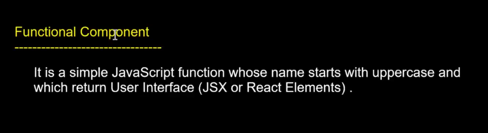

# Lecture 6

We have a template so will use that!!

React needs practice so practice on same day!!

we have seen arguments we passed to function!! and thats how it display different images on different cards!!

so we can create a function like below

>Note: we take div id=root ,here you can take any id,not only root!!

If we get Ui inside function we get Reusability!!Also we can pass dynamic data into UI!!

So it is better always create UI in JS function!!


```javascript
        function createContainer(title) {
          return (
            <div id="container">
              <h2>{title} </h2>
              <p>
                Lorem ipsum dolor sit, amet consectetur adipisicing elit.
                Consectetur quos adipisci quis exercitationem, doloremque
                accusamus. Maxime fugiat dolore ipsa quaerat! Vero placeat
                architecto dolores? Sit dignissimos soluta eum odio amet sequi,
                quidem aperiam eveniet obcaecati laborum aliquam quae! Voluptate
                facilis ipsa doloremque vel natus inventore blanditiis rem eos
                omnis totam, saepe reiciendis iusto corrupti dolores atque
                assumenda dicta accusantium molestias aliquam. Ut, non similique
                sed delectus voluptatum veniam nulla. Laborum iste adipisci
                veniam! Eum fugiat recusandae repudiandae similique dolore
                adipisci inventore fugit magnam explicabo molestiae eligendi,
                ipsum culpa! Cum atque cupiditate maiores quos nesciunt earum
                ducimus repellat delectus. Voluptates dolor ipsam a? Cumque
                dignissimos quae unde ratione vitae temporibus in doloremque
                reiciendis odit sit saepe beatae, facere qui, adipisci rem? Ipsum,
                vitae, placeat ab quis qui doloremque aliquam non fugiat neque
                perspiciatis consequuntur eum sit! Voluptatum eius accusantium
                veritatis dolorum voluptate consequatur minus dicta, officia unde
                architecto et minima beatae.
              </p>
              <button>More Details </button>
            </div>
          );
        }

        function multipleContainer() {
          return (
            <div>
              {createContainer("React JS")}
              {createContainer("Angular 18")}
              {createContainer("Node JS")}
            </div>
          );
        }
```
Another way!!

In Js we call function by `f()`
In react we can call function using tag format!!
`<f></f>` or `</f>`

If using this way no need to put {} like we have done for f() `{f()}` but it must follow a rule

>Rule:first letter of function be uppercase

```html
    function CreateContainer() {
        return (
          <div id="container">
            <h2>React JS </h2>
            <p>
              Lorem ipsum dolor sit, amet consectetur adipisicing elit.
              Consectetur quos adipisci quis exercitationem, doloremque
              accusamus. Maxime fugiat dolore ipsa quaerat! Vero placeat
              architecto dolores? Sit dignissimos soluta eum odio amet sequi,
              quidem aperiam eveniet obcaecati laborum aliquam quae! Voluptate
              facilis ipsa doloremque vel natus inventore blanditiis rem eos
              omnis totam, saepe reiciendis iusto corrupti dolores atque
              assumenda dicta accusantium molestias aliquam. Ut, non similique
              sed delectus voluptatum veniam nulla. Laborum iste adipisci
              veniam! Eum fugiat recusandae repudiandae similique dolore
              adipisci inventore fugit magnam explicabo molestiae eligendi,
              ipsum culpa! Cum atque cupiditate maiores quos nesciunt earum
              ducimus repellat delectus. Voluptates dolor ipsam a? Cumque
              dignissimos quae unde ratione vitae temporibus in doloremque
              reiciendis odit sit saepe beatae, facere qui, adipisci rem? Ipsum,
              vitae, placeat ab quis qui doloremque aliquam non fugiat neque
              perspiciatis consequuntur eum sit! Voluptatum eius accusantium
              veritatis dolorum voluptate consequatur minus dicta, officia unde
              architecto et minima beatae.
            </p>
            <button>More Details </button>
          </div>
        );
      }

      function MultipleContainer() {
        return (
          <div>
            <CreateContainer />
            <CreateContainer />
            <CreateContainer />
          </div>
        );
      }

      ReactDOM.render(
        <MultipleContainer />,
        document.getElementById("coreelement")
      );
```

This was functional component!!



There are two type of components in React
1. Functional component
2. Class Component(Not recommended to use)

React is 95 percent functional component!!

libraries have less rules but frameworks have more!!

React is a library and Angular is framework!!

Angular is using OOPs but slowly it is moving to functional programming as it is easy!!

React application is collection of components!!

Above app has 2 components
1. CreateContainer
2. MultipleContainer