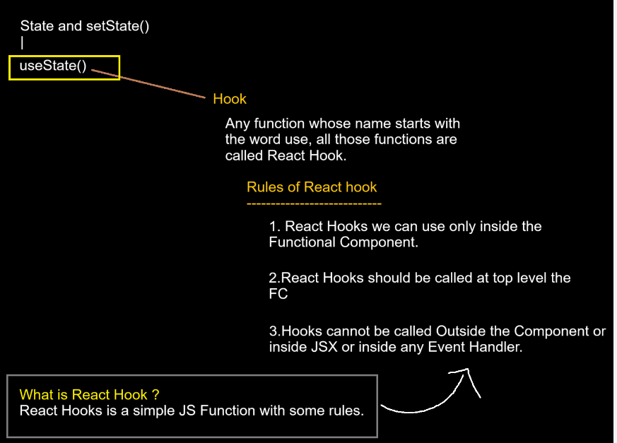
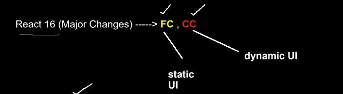

# Notes

Hooks can be used inside functional component and not in class component!!

FC--> Functional Component!!

2nd point says Hooks should be called at initial lines!!
It says you never call hooks at end of component!! Also Hooks cannot be called outside 
component or iside JSX(inside return where returning jSX) or 
(Outside functional component) or inside Event handler!!

from now on we say useState() Hook!!

