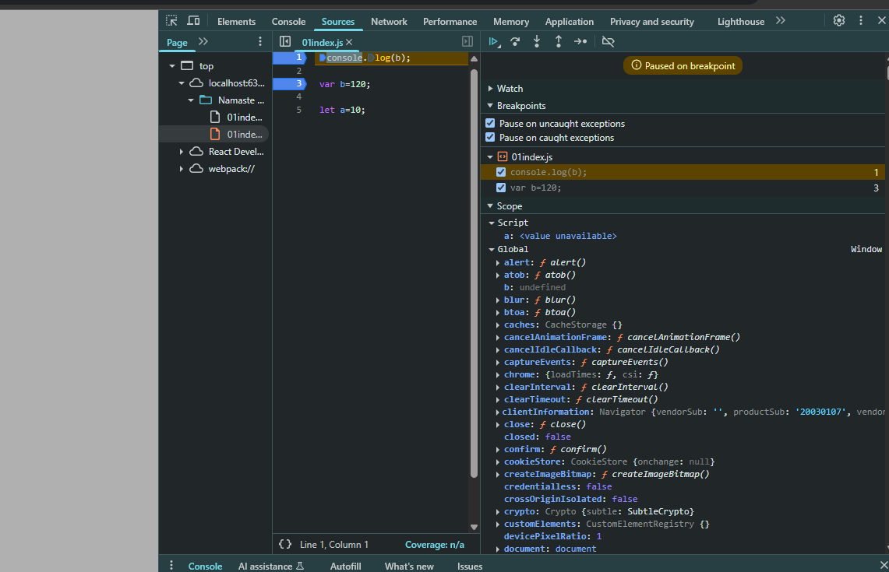
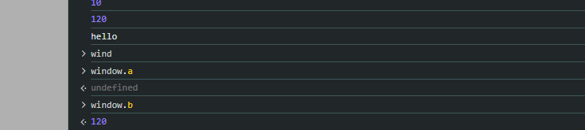

#  Ep-8 Notes

 `let` and `const` are hoisted(Memeory is given to variables and fucntion even before single line of code is exceuted), but not initialized — and that’s key to understanding the `Temporal Dead Zone (TDZ)`.

 ### What does “hoisted but not initialized” mean?
When JavaScript runs code, it does this in two phases:

- Creation Phase (memory is allocated):

    - var variables are set to undefined.

    - let and const variables are hoisted too, but they are put in a "Temporal Dead Zone" and are not initialized.

- Execution Phase:

    - Code runs line by line.

    - Once it reaches the line where let or const is declared, it is initialized.

`Temporal Dead Zone (TDZ)` in JavaScript refers to the time between when a variable is declared (with let or const) and when it is initialized. During this time, accessing the variable throws a ReferenceError.

```js 
console.log(myVar); // ❌ ReferenceError: Cannot access 'myVar' before initialization
let myVar = 10;
```

✅ TDZ applies to:
- let

- const

❌ TDZ does not apply to:
var — variables declared with var are hoisted and initialized as undefined, so no error occurs, though the value is undefined.

```js
 console.log(a); // ✅ undefined
var a = 5;
```

### ⏳ Why TDZ Exists:
To prevent bugs due to accessing variables before they're ready and to promote cleaner, more predictable code.

### ✅ Best Practices:
- Always declare variables at the top of the block.

- Avoid accessing let or const before declaration.

## How to bebug in browser 

#### 🛠️  Manually Add Breakpoints
 You can  click to the left of a line number in the Sources tab to set breakpoints:

- Open your HTML or JavaScript file in Chrome.

- In DevTools, go to Sources.

- Navigate to your script.

- Click a line number → A blue dot (breakpoint) appears.

- Refresh the page or trigger the code → Execution pauses at that line.

## Let us debug

see 

```js 
console.log(b);

var b=120;

let a=10;

```



paused at line 1 so not even taht is executed and can see a value is unavailable but b can see is undefined , even before any execution!! This is because phase 1 is completed and a ,b has been given memories!!

You can see a in `script` but b in`global` , so `let` and `const` are put in separate memory space Which cannot be accessed till you assign a value!!!
When value of a is assigned the `TDZ` of a ends!!After that there will not be any `Refernece Error`!!

also after execution you see a is not attached to global object but b is!!



see `window` global object , b is giving value but a is not!!

so `let` is strict then `var`!! also if you do not want to modify `let` variable use `const`!!

see 

```js 

var a=100

var a="mohit"

```
This totally works  but `let` and `const` will not work here!!

```js 

let a ;

a=10 
```
This works in case of let but with `const` it will not work!! You will get `Missing Initializer in const declaration`!!

when we try to assign constant variable we get `TypeError :Assignment to costant variable!!` const should be initialized when declared !!

use `const` whenever possible , you won't run into unexpected error!!
then use `let` if value changing!! 

# Ep-9 notes Block scope 


