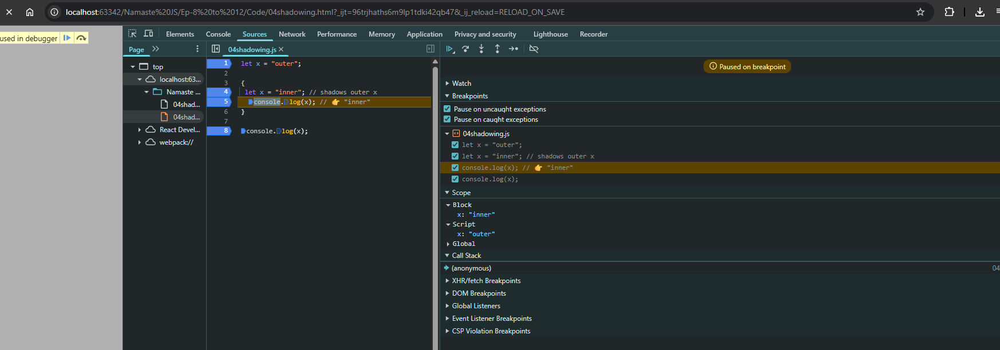
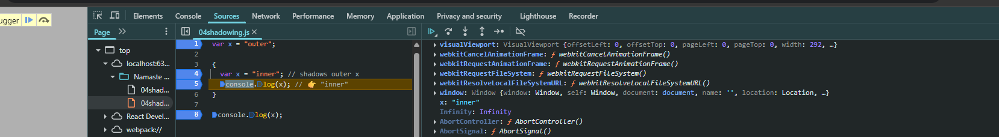
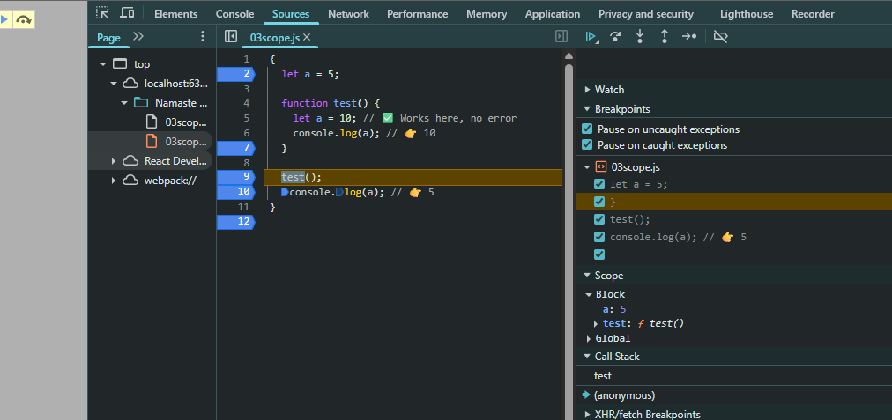
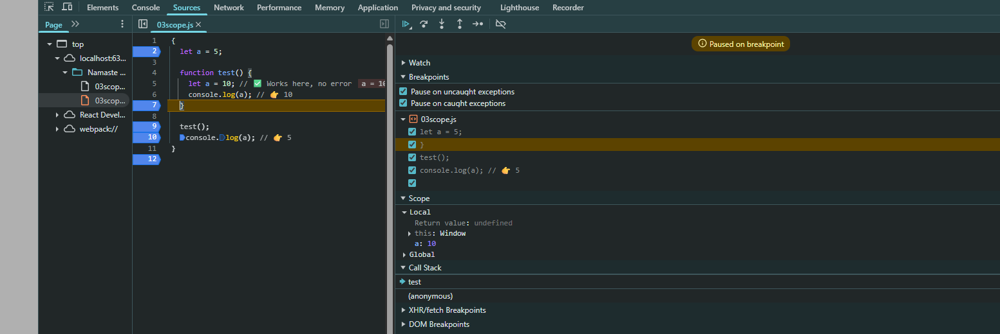
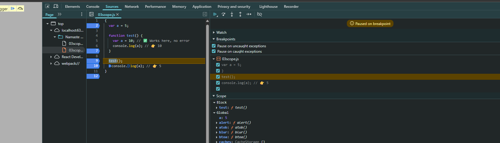

#  Ep-8 Notes

 `let` and `const` are hoisted(Memeory is given to variables and fucntion even before single line of code is exceuted), but not initialized — and that’s key to understanding the `Temporal Dead Zone (TDZ)`.

 ### What does “hoisted but not initialized” mean?
When JavaScript runs code, it does this in two phases:

- Creation Phase (memory is allocated):

    - var variables are set to undefined.

    - let and const variables are hoisted too, but they are put in a "Temporal Dead Zone" and are not initialized.

- Execution Phase:

    - Code runs line by line.

    - Once it reaches the line where let or const is declared, it is initialized.

`Temporal Dead Zone (TDZ)` in JavaScript refers to the time between when a variable is declared (with let or const) and when it is initialized. During this time, accessing the variable throws a ReferenceError.

```js 
console.log(myVar); // ❌ ReferenceError: Cannot access 'myVar' before initialization
let myVar = 10;
```

✅ TDZ applies to:
- let

- const

❌ TDZ does not apply to:
var — variables declared with var are hoisted and initialized as undefined, so no error occurs, though the value is undefined.

```js
 console.log(a); // ✅ undefined
var a = 5;
```

### ⏳ Why TDZ Exists:
To prevent bugs due to accessing variables before they're ready and to promote cleaner, more predictable code.

### ✅ Best Practices:
- Always declare variables at the top of the block.

- Avoid accessing let or const before declaration.

## How to bebug in browser 

#### 🛠️  Manually Add Breakpoints
 You can  click to the left of a line number in the Sources tab to set breakpoints:

- Open your HTML or JavaScript file in Chrome.

- In DevTools, go to Sources.

- Navigate to your script.

- Click a line number → A blue dot (breakpoint) appears.

- Refresh the page or trigger the code → Execution pauses at that line.

## Let us debug

see 

```js 
console.log(b);

var b=120;

let a=10;

```


paused at line 1 so not even taht is executed and can see a value is unavailable but b can see is undefined , even before any execution!! This is because phase 1 is completed and a ,b has been given memories!!

You can see a in `script` but b in`global` , so `let` and `const` are put in separate memory space Which cannot be accessed till you assign a value!!!
When value of a is assigned the `TDZ` of a ends!!After that there will not be any `Refernece Error`!!

also after execution you see a is not attached to global object but b is!!


see `window` global object , b is giving value but a is not!!

so `let` is strict then `var`!! also if you do not want to modify `let` variable use `const`!!

see 

```js 

var a=100

var a="mohit"

```
This totally works  but `let` and `const` will not work here!!

```js 

let a ;

a=10 
```
This works in case of let but with `const` it will not work!! You will get `Missing Initializer in const declaration`!!

when we try to assign constant variable we get `TypeError :Assignment to costant variable!!` const should be initialized when declared !!

use `const` whenever possible , you won't run into unexpected error!!
then use `let` if value changing!! 

# Ep-9 notes Block scope 

Block scope in JavaScript refers to the visibility of variables inside curly braces `{ ... }`.

## 🔒 What is Block Scope?
A block is any section of code wrapped in {} — such as inside. A block is also known  as `compound statement`. A block is used to combine various js statements!!

we use blocks where js needs one statement!!

```js
if(true) //now after this we need one statement to combine multiple statements we put {} here

```

if, for, while, switch, try/catch, or even just a {} alone.

Variables declared using **let** and **const** are block scoped, meaning:

They can only be accessed within the block they were declared in.

```js 
{
  let a = 10;
  const b = 20;
  console.log(a); // ✅ 10
}

console.log(a); // ❌ ReferenceError: a is not defined
console.log(b); // ❌ ReferenceError: b is not defined
```

### 🚫 What about var?
var ignores block scope — it is function scoped, not block scoped:

```js

{
  var x = 5;
}
console.log(x); // ✅ 5 — even though it's outside the block!

```
### Why this happens?

variables declared as `var` are put in `global` scope and variables put in `let` and `const` are in Block scope (a separate space which ends when block ends)

 ex:

```js 
for (let i = 0; i < 3; i++) {
  console.log(i); // ✅ Accessible here
}
console.log(i); // ❌ ReferenceError: i is not defined

```

ex: 

```js
for (var i = 0; i < 3; i++) {}
console.log(i); // ✅ 3

```

## 🌑 Shadowing in JavaScript
Shadowing happens when a variable declared in a local scope (e.g., inside a function or block) has the same name as a variable in an outer scope. The inner variable "shadows" the outer one — it hides it within that scope.

```js 

let x = "outer";

{
  let x = "inner"; // shadows outer x
  console.log(x); // 👉 "inner"
}

console.log(x); // 👉 "outer"

```
Here, the inner x hides (or shadows) the outer x only inside the block.

but same wtith `var`

```js 

var x = "outer";

{
  var x = "inner"; // shadows outer x
  console.log(x); // 👉 "inner"
}

console.log(x);// 👉 "inner"

```
as `var` is global scope!! but with let inner x is block scopr and outer b you see is in script scope!!see below debugger of let first 



see one x in sciprt and other in block 
but with `var` you see one x in block scope!!



### 📘 Function Scope Shadowing
```js 
let msg = "Hello";

function greet() {
  let msg = "Hi"; // shadows outer msg
  console.log(msg); // 👉 "Hi"
}

greet();
console.log(msg); // 👉 "Hello"

```
### ⚠️ Shadowing with var (Function Scoped):

```js 
let a = 1;

function demo() {
  var a = 2; // shadows outer a
  console.log(a); // 👉 2
}

demo();
console.log(a); // 👉 1

```
✔ Here, outer let a is in the global scope, and inner var a is inside a function scope.
Since JavaScript allows function scope to shadow outer variables, this is allowed — var a in demo() does not conflict with let a globally.

### Works
```js
{
  let a = 5;

  function test() {
    var a = 10; // ✅ Works here, no error
    console.log(a); // 👉 10
  }

  test();
  console.log(a); // 👉 5
}


```
when function ends we stop and see 



anonymous has a =5 in block and see test 



it has a=10 in local scope

if both are let see before `test` fuction call , global a=5 



`function test() { var a = 10; }`
This defines a new variable a inside the function — and var is function-scoped, so this a exists only inside test(). so that why with var we get sam result!!

but if no function only blocks 

```js

{
  var a = 5;

 {
    var a = 10; // ✅bot a are global a and that is assigned as 10
    console.log(a); 
  }

  console.log(a); // 👉 10
}

```

>Note:Do not shadow let variable by var ,it is `illegal shadowing`!! but var can be shadowed by let variable!!

#### 💡 Good to Know:
- Shadowing is allowed, but can lead to confusion, especially in large scopes.

- It’s not the same as redeclaring — shadowing only affects inner scopes.


# Ep-10 closures


