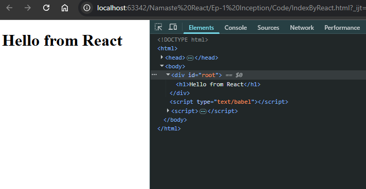
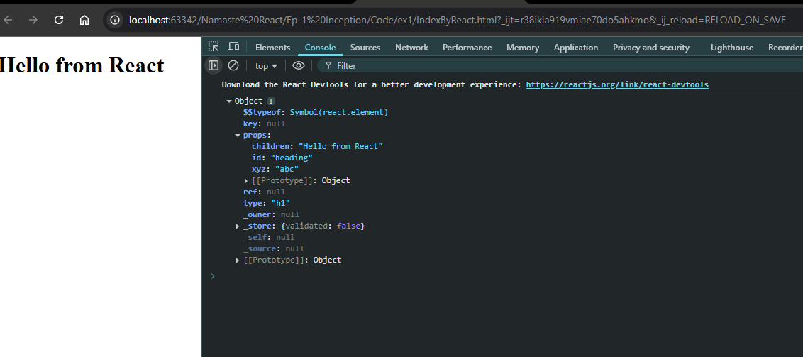
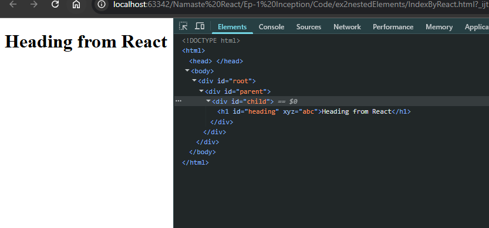
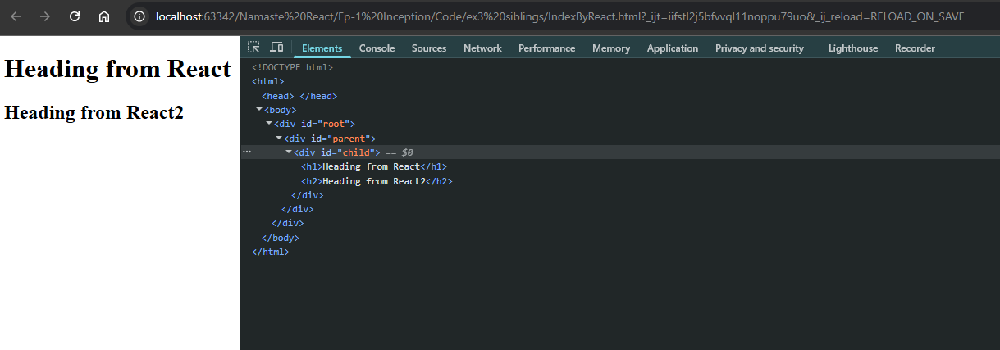
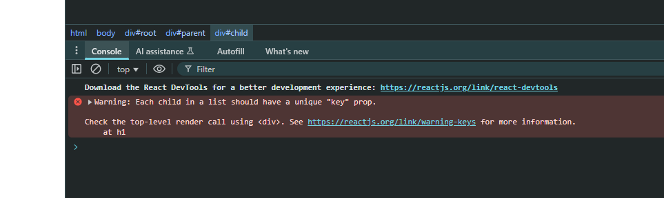

## Ep-1 Inception

```html
<!DOCTYPE html>
<html lang="en">
<head>
    <meta charset="UTF-8">
    <meta name="viewport" content="width=device-width, initial-scale=1.0">
    <title>Document</title>
</head>
<body>
    <div id="root">
        <h1>Hi from Html</h1>
    </div>    
</body>
</html>
```
This is simple html we know !!This is in index.html!!

Now we want to do same by JS !!

```html
<!DOCTYPE html>
<html lang="en">
<head>
    <meta charset="UTF-8">
    <meta name="viewport" content="width=device-width, initial-scale=1.0">
    <title>Document</title>
</head>
<body>
    <div id="root">

    </div>
    <script>
        let heading=document.createElement("h1");
        heading.innerHTML="Hello worldfrom JS";
        let el=document.getElementById("root");
        el.appendChild(heading);
    </script>
</body>
</html>
```
This is same we do in JS!!This is how we do in JS!!

can see Adding React by CDN in Kabir lectures!! can see template.html here below!!

```html
<!DOCTYPE html>
<html>
  <head>
    <script src="https://unpkg.com/react@18/umd/react.development.js"></script>
    <script src="https://unpkg.com/react-dom@18/umd/react-dom.development.js"></script>
    <script src="https://unpkg.com/@babel/standalone/babel.min.js"></script>
  </head>
  <body>
    <div id="root"></div>

    <script type="text/babel"></script>
  </body>
</html>

```
 CDN is network where react library is hosted and we put them in our project!!

 Now what the links have??
  in 1st link can see various functions!! It's all plain JS code written by Fb developers!!


After you run that react app and in console you write REact you will get some object!!It  is core React!!

the 2nd link we have React-dom !! This is useful for DOM operations!!

Why 2 different links?? 
 React-dom is bridge bewteen React and Browser!! React is used for mobile for 3d and much more but we need for browser DOM!!


These two files have great algorithm in it!!

> In src tag  HTML we put sometimes crossorigin why??

Now we use above code to create h1 !!

```html
<!DOCTYPE html>
<html>
  <head>

  </head>
  <body>
    <div id="root">
      <script src="https://unpkg.com/react@18/umd/react.development.js"></script>
      <script src="https://unpkg.com/react-dom@18/umd/react-dom.development.js"></script>
      <script src="https://unpkg.com/@babel/standalone/babel.min.js"></script>
      <script>
        const heading=React.createElement("h1",{},"Hello from React");

        const root=ReactDOM.createRoot(document.getElementById("root"));

        root.render(heading);
      </script>
    </div>

    <script type="text/babel"></script>
  </body>
</html>


```



>see we getting h1 inside root!!

createRoot comes from ReactDOM !!

createElemenet comes from React!!1st parameter is tag 2nd is attributes and 3rd is the content inside tag!!

eg we want id heading in const heading 

`const heading=React.createElement("h1",{id:"heading",xyz:"abc"},"Hello from React");`
 we even giving custom tag like xyz!! The createElement returns a React Element!! REact Element is normal JS object!! It has children and attributes 

then we render heading into root!!


It is not a good practice to put all react code in here!!Put it in JS file!!

Can see ReactInSeparateJS file aboev in code section!!

>Note:The createElement returns a React Element!! REact Element is normal JS object!! It has property props which has children and attributes 

let us see that in ex1 folder

```html
<!DOCTYPE html>
<html>
  <head>

  </head>
  <body>
    <div id="root">
      <script src="https://unpkg.com/react@18/umd/react.development.js"></script>
      <script src="https://unpkg.com/react-dom@18/umd/react-dom.development.js"></script>
      <script src="https://unpkg.com/@babel/standalone/babel.min.js"></script>
      <script src="app.js"></script>
    </div>
  </body>
</html>
```


```Javascript
const heading=React.createElement("h1"
    ,{id:"heading",xyz:"abc"}
    ,"Hello from React");

console.log(heading);

const root=ReactDOM.createRoot(document.getElementById("root"));

root.render(heading);
```

Output:



can see props here!!

Render() function takes React element as input !! when we do `root.render(heading)` heading and root both are React elememts!! render converts heading element to h1 tag and put on DOM!!


React was build was philosophy to manipulate DOM with JS!! Manipulating DOM is very costly !! React makes the manipulation of DOM very effeciently!!


Now we want nested elements!!see ex2

we will use 3rd parameter of createElement() and put nested createElement as 3rd parameter is content !!

```javascript
const parent=React.createElement("div"
    ,{id:"parent"}
    ,React.createElement("div"
        ,{id:"child"},
        React.createElement("h1"
            ,{id:"heading",xyz:"abc"}
            ,"Heading from React")));


const root=ReactDOM.createRoot(document.getElementById("root"));

root.render(parent);
```





We get what we wanted!!

Now we want siblings !! add multiple siblings !! can see ex3!!

so 3rd parameter we give as array !!

```javascript
const parent=React.createElement("div"
    ,{id:"parent"}
    ,React.createElement("div"
        ,{id:"child"},
       [ React.createElement("h1",{},"Heading from React"),
        React.createElement("h2",{},"Heading from React2"),]
    ));


const root=ReactDOM.createRoot(document.getElementById("root"));

root.render(parent);

```



we are getting error 



will see it later!!

This was core react!!!

 Now we see React.createElement is making code very complex for now!! so that's why we use JSX!!

now see 

```html
<!DOCTYPE html>
<html>
  <head>

  </head>
  <body>
    <div id="root">

      <script src="app.js"></script>
      <script src="https://unpkg.com/react@18/umd/react.development.js"></script>
      <script src="https://unpkg.com/react-dom@18/umd/react-dom.development.js"></script>
      <script src="https://unpkg.com/@babel/standalone/babel.min.js"></script>
      
    </div>
  </body>
</html>
```

If we put `<script src="app.js"></script>` befoire CDN links !!Then our app will not work !!
Even the CDN links should be in order as we provided above!!