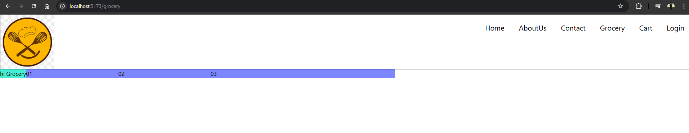
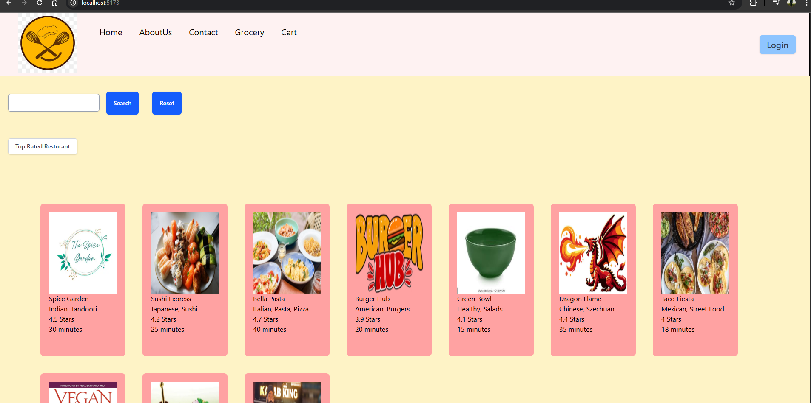

# Ep-10 

How to make app look beautiful!!Till now we have used simple CSS!!

In prd we generally ue Styled-components or MUI (Material UI) or Chakra UI or tailwind!! 

MUI gives component out of the box!! They give pre-styled components !! They give components which are already very beautiful!!It has css in it!!

Along With MUI ,poeple use bootstrap,tailwind and other CSS frameworks!!

Ant Design is another framework used!!

## Tailwind CSS

Not move to css ,just style in CSS!!

to install we use command `npm install tailwindcss @tailwindcss/vite`

check package.json

```json
  "dependencies": {
    "@tailwindcss/vite": "^4.1.10",
    "react": "^19.1.0",
    "react-dom": "^19.1.0",
    "react-router": "^7.6.2",
    "react-router-dom": "^7.6.2",
    "tailwindcss": "^4.1.10"
  },
```

so tailwind installed!!then in vite.config.js

```js
import { defineConfig } from 'vite'
import react from '@vitejs/plugin-react'
import tailwindcss from "@tailwindcss/vite";

// https://vite.dev/config/
export default defineConfig({
  plugins: [react() ,
          tailwindcss() ,],
})

```
In global css we have index.css

```css
@import "tailwindcss";

.UserCard{
    width:30%;
    margin:10px;
    border:1px solid black;
}

.UserCardClass{
    width:30%;
    margin:10px;
    border:1px solid lawngreen;
}
```

In grocery.jsx let us test 

```jsx
const Grocery=()=> {
    return <div className="flex flex-row">
        <h1 className="bg-teal-300">hi Grocery</h1>
        <div className="bg-indigo-400 basis-64">01</div>
        <div className="bg-indigo-400 basis-64">02</div>
        <div className="bg-indigo-400 basis-128">03</div>
    </div>
}

export default Grocery;
```
Output:



Tailwind gives you classname for every CSS you want to write!!

just put `justify-between` to show gap in flex-items!!


tailwind is having initial learning curve!! Once you start using CSS more and more in tailwind ,it will be easier!!

use `tailwind Intellisense` Extension in VScode

in tailwind 

sm-small

md-medium

lg- large

xl- extra large 

2xl- double extra large


p-padding 

m-margin


in `flex` can put `item-center` to put items in center and then can give `gap-<number>` togive gaps between items!!

x -axis means right and left tailwind use `x` for it

y-axis means top and bottom tailwind use `y` for it





This is how our page looks now!!

`rounded` to give round corners of button!!

Read tailwind documentation!! 

Advantage --> no need to move between html and css file!!

Disadvantage--> makes code look ugly if we have to apply a lot of css!!

Tailwind also give pre-build components!!


