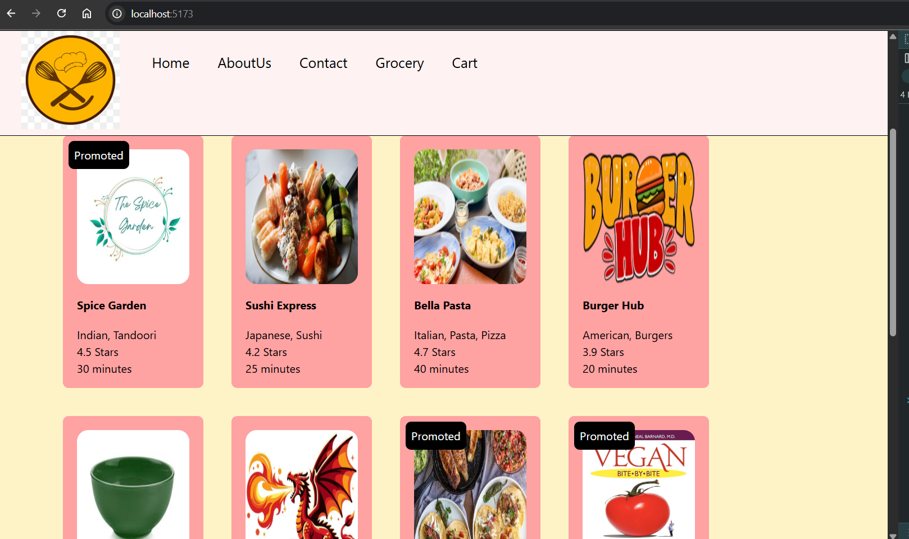
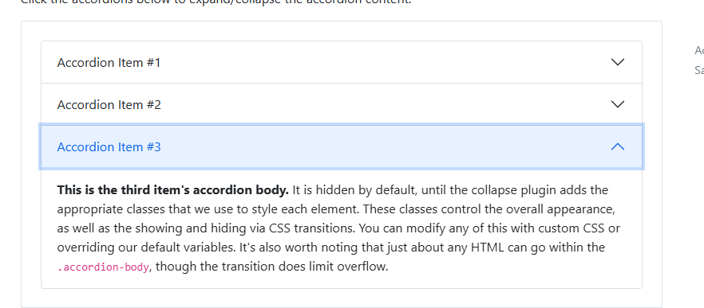
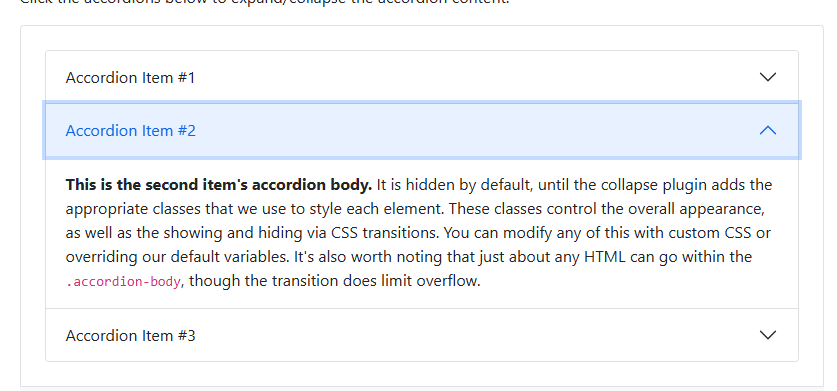
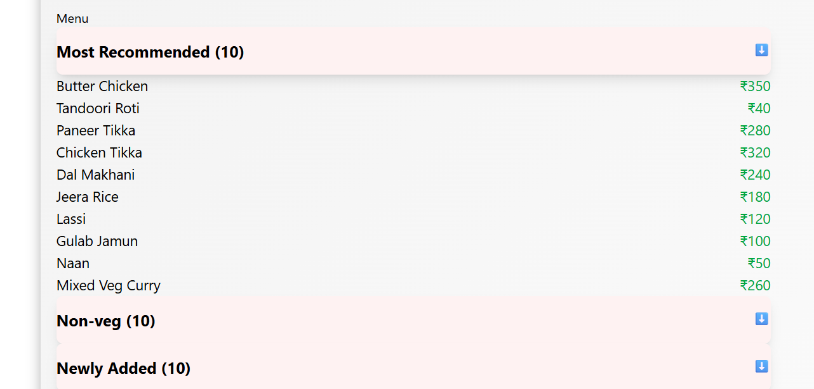

# Ep-11 Data is new oil

Today we will see about higher-order components!!

## Higher Order components

These are function that takes a component and returns a component!!

It add extra features to the input component and return it!!It just enhances input component!!

You see some profile of restuarants that have promoted label that means that are promoted by site!! It si an extra feature ,
which restuarnt pays to get promoted!! You see it will be very much similar to other cards ,only a promoted label will be added!!


So now we will have a promoted label on some carts!!

On backend Added promoted and put lombok library for allArgsConstructor,Getters and setters!!

On restaurants added Promoted field!!

We have RestaurantCard ,we want to add promoted label on this for restaurants for which promoted=true!!

So Higher-order Component takes RestaurantCard as input and put promoted label on it!!


```jsx
const withPromotionLabel=(RestuarantCard )=>{

    //return functional component
    return (props)=>{

        return ( <div>
                <label className="absolute bg-black text-white m-2 p-2 rounded-lg">Promoted</label>
                <RestuarantCard{...props}/>
            </div>
        )
    }
}

export default withPromotionLabel;
```
See above WithPromotionLabel is function taking component and returning a component !!
The data we are passing is in props!! We directly pass that too our original RetaurantCard Component!! to call this we added 

`  const ResCardPromoted=withPromotionLabel(RestuarantCard);`

and then 

```jsx
          <div className="flex flex-wrap gap-2 p-20">
              {resturants.map((restaurant, index) => (
                    restaurant.promoted === false ?
                            (
                                <div className="m-4" key={index}>
                                    <RestuarantCard data={restaurant}/>
                                </div>
                            ) : (
                                <div className="m-4" key={index}>
                                    <ResCardPromoted data={restaurant}/>
                                </div>
                            )

                ))}
 ```               
see how we have passed ResCardPromoted if promoted=true!!


```jsx

const Body = () => {

    let [resturants,setResturants]=useState([]);

    const [searchTerm, setSearchTerm] = useState("");

    const ResCardPromoted=withPromotionLabel(RestuarantCard);

    useEffect(() => {fetchdata()},[])

    const fetchdata = async()=> {
        const data=await fetch("http://localhost:8080/api/res");
        const json=await data.json()
        console.log(json)
        setResturants(json)
    }

    const searchdata = async(kw)=> {
        const data=await fetch(`http://localhost:8080/api/res/search?keyword=${kw}`);
        const json=await data.json()
        setResturants(json)
    }

    const onlineStatus=useOnlineStatus();
    console.log(onlineStatus)
    if(onlineStatus===false){
        return <h1>No interent connection</h1>
    }

    if(resturants.length==0){
        return <Shimmer/>
    }
    return (
        <div className="body bg-amber-100">
            <div className="p-[20px]">
                <input type="text" className="bg-white border border-gray-400 rounded-md px-4 py-2 shadow-sm focus:outline-none focus:ring-2 focus:ring-blue-50 "     
                  value={searchTerm}
                       onChange={(e) => setSearchTerm(e.target.value)}/>
                <button className="inline-flex items-center  px-4 py-4 m-4 border border-transparent text-sm font-medium rounded-md shadow-sm text-white bg-blue-600 hover:bg-blue-700 focus:outline-none focus:ring-2 focus:ring-offset-2 focus:ring-blue-500"
                        onClick={()=>searchdata(searchTerm)}>Search</button>
                <button className="inline-flex items-center px-4 py-4 m-4 border border-transparent text-sm font-medium rounded-md shadow-sm text-white bg-blue-600 hover:bg-blue-700 focus:outline-none focus:ring-2 focus:ring-offset-2 focus:ring-blue-500"
                        onClick={()=>fetchdata()}>Reset</button>
            </div>
            <div className="p-[20px]" >
                <button className="inline-flex items-center px-4 py-2 border border-gray-300 text-sm font-medium rounded-md shadow-sm text-gray-700 bg-white hover:bg-gray-50 focus:outline-none focus:ring-2 focus:ring-offset-2 focus:ring-indigo-500 filter" onClick={() => {
                    resturants=resturants.filter(
                        (resturant => resturant.stars>4.0)
                    )
                    setResturants(resturants);
                }}>
                Top Rated Resturant</button>
            </div>
            <div className="flex flex-wrap gap-2 p-20">
                {resturants.map((restaurant, index) => (
                        restaurant.promoted === false ?
                            (
                                <div className="m-4" key={index}>
                                    <RestuarantCard data={restaurant}/>
                                </div>
                            ) : (
                                <div className="m-4" key={index}>
                                    <ResCardPromoted data={restaurant}/>
                                </div>
                            )

                ))}

            </div>
        </div>
    )
};

export default Body;
```
Output: 

Can see Promoted label on top of card!!



## Layers of React

One layer is Data Layer and another is UI layer !!

Data Layer is state ,props ,variables!! 

Ui layer is JSX!!

How to manage data is very important!!

Now for menu items we are going to do grouping !! like One group of drinks ,one group of newly Added,One group of recommended!!

Main thing is how to get the relevant data!!

`chnaged backend api's for now ` ,backend sending MenuItems in cards!!

Now we want to have accordian ,UI should be able to close whenever we want and open!!





This is what accordian is!!!

We want to show accordian!!!!

`Window +;` for emoji on windows!!

to divide width into half we use `w-[6/12]` in tailwind as tailwind divides pages into 6 sections so 6 is half of that!!

`flex justify-between ` in taiwind to space in between flex items!!

to give background border always use `background` first!!

```jsx
import {useState} from "react";

const ResTaurantCategory=( props)=>{

    const [isOpen, setIsOpen] = useState(false);

    const toggleAccordion = () => {
        setIsOpen(!isOpen);
    };

    const {card, menuItems} = props.data;
    return <div className=" w-[900px]  border-b-2 border-gray-400 ">
        {/* Header*/}
        <div className="flex justify-between py-4 bg-red-50 shadow-lg rounded-lg mx-auto cursor-pointer" onClick={toggleAccordion}>
            <span className="text-xl font-bold ">{card} ({menuItems.length})</span>
            <span  >⬇️ </span>
        </div>
        {isOpen && menuItems.map((item, index) => (

            <div className="flex justify-between w-full m-auto" key={index} >
                <span className="text-lg">{item.name}</span>
                <span className="text-lg text-green-600">₹{item.price}</span>
            </div>
        ))}
    </div>
}

export default ResTaurantCategory;

```

see accordian !! Need to use IsOpen State variable!!


!!

you can add an add button and much more!!

We have toggle !! We click it opens and another click it is closed!!

