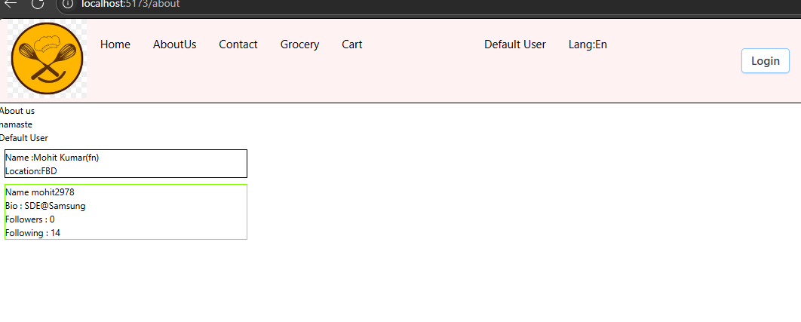
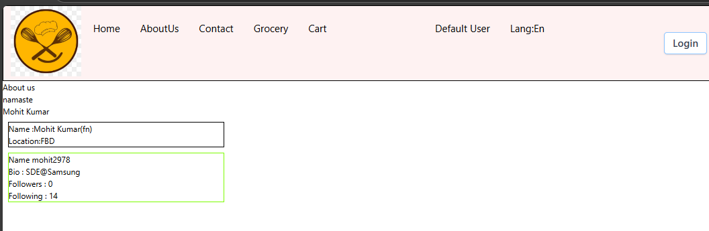

# Ep-11 Data is new oil

Today we will see about higher-order components!!

## Higher Order components

These are function that takes a component and returns a component!!

It add extra features to the input component and return it!!It just enhances input component!!

You see some profile of restuarants that have promoted label that means that are promoted by site!! It si an extra feature ,
which restuarnt pays to get promoted!! You see it will be very much similar to other cards ,only a promoted label will be added!!


So now we will have a promoted label on some carts!!

On backend Added promoted and put lombok library for allArgsConstructor,Getters and setters!!

On restaurants added Promoted field!!

We have RestaurantCard ,we want to add promoted label on this for restaurants for which promoted=true!!

So Higher-order Component takes RestaurantCard as input and put promoted label on it!!


```jsx
const withPromotionLabel=(RestuarantCard )=>{

    //return functional component
    return (props)=>{

        return ( <div>
                <label className="absolute bg-black text-white m-2 p-2 rounded-lg">Promoted</label>
                <RestuarantCard{...props}/>
            </div>
        )
    }
}

export default withPromotionLabel;
```
See above WithPromotionLabel is function taking component and returning a component !!
The data we are passing is in props!! We directly pass that too our original RetaurantCard Component!! to call this we added 

`  const ResCardPromoted=withPromotionLabel(RestuarantCard);`

and then 

```jsx
          <div className="flex flex-wrap gap-2 p-20">
              {resturants.map((restaurant, index) => (
                    restaurant.promoted === false ?
                            (
                                <div className="m-4" key={index}>
                                    <RestuarantCard data={restaurant}/>
                                </div>
                            ) : (
                                <div className="m-4" key={index}>
                                    <ResCardPromoted data={restaurant}/>
                                </div>
                            )

                ))}
 ```               
see how we have passed ResCardPromoted if promoted=true!!


```jsx

const Body = () => {

    let [resturants,setResturants]=useState([]);

    const [searchTerm, setSearchTerm] = useState("");

    const ResCardPromoted=withPromotionLabel(RestuarantCard);

    useEffect(() => {fetchdata()},[])

    const fetchdata = async()=> {
        const data=await fetch("http://localhost:8080/api/res");
        const json=await data.json()
        console.log(json)
        setResturants(json)
    }

    const searchdata = async(kw)=> {
        const data=await fetch(`http://localhost:8080/api/res/search?keyword=${kw}`);
        const json=await data.json()
        setResturants(json)
    }

    const onlineStatus=useOnlineStatus();
    console.log(onlineStatus)
    if(onlineStatus===false){
        return <h1>No interent connection</h1>
    }

    if(resturants.length==0){
        return <Shimmer/>
    }
    return (
        <div className="body bg-amber-100">
            <div className="p-[20px]">
                <input type="text" className="bg-white border border-gray-400 rounded-md px-4 py-2 shadow-sm focus:outline-none focus:ring-2 focus:ring-blue-50 "     
                  value={searchTerm}
                       onChange={(e) => setSearchTerm(e.target.value)}/>
                <button className="inline-flex items-center  px-4 py-4 m-4 border border-transparent text-sm font-medium rounded-md shadow-sm text-white bg-blue-600 hover:bg-blue-700 focus:outline-none focus:ring-2 focus:ring-offset-2 focus:ring-blue-500"
                        onClick={()=>searchdata(searchTerm)}>Search</button>
                <button className="inline-flex items-center px-4 py-4 m-4 border border-transparent text-sm font-medium rounded-md shadow-sm text-white bg-blue-600 hover:bg-blue-700 focus:outline-none focus:ring-2 focus:ring-offset-2 focus:ring-blue-500"
                        onClick={()=>fetchdata()}>Reset</button>
            </div>
            <div className="p-[20px]" >
                <button className="inline-flex items-center px-4 py-2 border border-gray-300 text-sm font-medium rounded-md shadow-sm text-gray-700 bg-white hover:bg-gray-50 focus:outline-none focus:ring-2 focus:ring-offset-2 focus:ring-indigo-500 filter" onClick={() => {
                    resturants=resturants.filter(
                        (resturant => resturant.stars>4.0)
                    )
                    setResturants(resturants);
                }}>
                Top Rated Resturant</button>
            </div>
            <div className="flex flex-wrap gap-2 p-20">
                {resturants.map((restaurant, index) => (
                        restaurant.promoted === false ?
                            (
                                <div className="m-4" key={index}>
                                    <RestuarantCard data={restaurant}/>
                                </div>
                            ) : (
                                <div className="m-4" key={index}>
                                    <ResCardPromoted data={restaurant}/>
                                </div>
                            )

                ))}

            </div>
        </div>
    )
};

export default Body;
```
Output: 

Can see Promoted label on top of card!!


## Layers of React

One layer is Data Layer and another is UI layer !!

Data Layer is state ,props ,variables!! 

Ui layer is JSX!!

How to manage data is very important!!

Now for menu items we are going to do grouping !! like One group of drinks ,one group of newly Added,One group of recommended!!

Main thing is how to get the relevant data!!

`chnaged backend api's for now ` ,backend sending MenuItems in cards!!

Now we want to have accordian ,UI should be able to close whenever we want and open!!


This is what accordian is!!!

We want to show accordian!!!!

`Window +;` for emoji on windows!!

to divide width into half we use `w-[6/12]` in tailwind as tailwind divides pages into 6 sections so 6 is half of that!!

`flex justify-between ` in taiwind to space in between flex items!!

to give background border always use `background` first!!

```jsx
import {useState} from "react";

const ResTaurantCategory=( props)=>{

    const [isOpen, setIsOpen] = useState(false);

    const toggleAccordion = () => {
        setIsOpen(!isOpen);
    };

    const {card, menuItems} = props.data;
    return <div className=" w-[900px]  border-b-2 border-gray-400 ">
        {/* Header*/}
        <div className="flex justify-between py-4 bg-red-50 shadow-lg rounded-lg mx-auto cursor-pointer" onClick={toggleAccordion}>
            <span className="text-xl font-bold ">{card} ({menuItems.length})</span>
            <span  >⬇️ </span>
        </div>
        {isOpen && menuItems.map((item, index) => (

            <div className="flex justify-between w-full m-auto" key={index} >
                <span className="text-lg">{item.name}</span>
                <span className="text-lg text-green-600">₹{item.price}</span>
            </div>
        ))}
    </div>
}

export default ResTaurantCategory;

```

see accordian !! Need to use IsOpen State variable!!


!!

you can add an add button and much more!!

We have toggle !! We click it opens and another click it is closed!!

Now we want If one Accordian is opened all other accordian should be collapsed!!that behavior is called "single open accordion", where opening one section automatically closes the others.

`React dev Tools` is chrome extension that will help you to debug the React code!!It will add two more tab in Developer Console!! `Components` shows components hierarchy!! and other tab is `Profiler`!! `Profiler` records your react App!! 

 What Profiler Shows You:
- Render Time:

    - How long each component took to render (in milliseconds).

- Re-renders:

    - How many times a component rendered during the profiling session.

- What caused re-renders:

    - Props changed? State changed? It tells you exactly why a render happened.

- Flamegraph and Ranked views:

    - Visual tools to show which components are slowest.

- Helps spot performance bottlenecks.


In components you will be able to see all props you have passed ! you will be able to see all data!!

Our  code starts from App!!

now we want accordian ,if i open one other one should be closed so there must be something that is shared beetween all of them so they know other one is opened!!

so we give collpase and open power to parent of this !! 

----

 ## Lift the state up
Manage which category is open from the parent component, instead of inside each individual accordion.

`When we are controlling from parent then child is called as Controlled Component.`

`When parent have no control then child is called as Uncontrolled component.`

We want at a time only one accordian should be expanded!!

Sometimes we lift state up to parent to control our children!!Now see code

---

#### Child component 

```jsx

const ResTaurantCategory=( props)=>{

    const {card, menuItems} = props.data;
    const isOpen = props.isOpen;
    const setShowIndex=props.setIndex;

    const handleClick=()=>{
        setShowIndex();
    }

    return <div className=" w-[900px]  border-b-2 border-gray-400 ">
        {/* Header*/}
        <div className="flex justify-between py-4 bg-red-50 shadow-lg rounded-lg mx-auto cursor-pointer"
             onClick={handleClick}>
            <span className="text-xl font-bold ">{card} ({menuItems.length})</span>
            <span>{isOpen ? "🔼" : "⬇️"}</span>
        </div>
        {isOpen && menuItems.map((item, index) => (
            <div key={index} >
               <MenuItems name={item.name} price={item.price} />
            </div>
        ))}
    </div>
}

export default ResTaurantCategory;

```
#### Parent component

```jsx

const RestaurantDetails = () => {
    const { resName } = useParams();
    const [showIndex, setshowIndex] = useState(-1);
    const restaurant = useResturantMenu(resName);
    if (!restaurant) return <div>No restaurant selected.</div>;


    return (
        <div className="restaurant-card">
            
            <div className="restaurant-info">
                <h2 className="restaurant-name">{restaurant.name}</h2>
                <p className="restaurant-cuisines">
                    <strong>Cuisines:</strong> {restaurant.cuisines.join(', ')}
                </p>
                <p className="restaurant-rating">⭐ {restaurant.stars} stars</p>

                <h3 className="menu-heading">Menu</h3>


                <div >
                    {restaurant.cards?.map((item, index) => (
                        <div key={index} className="flex space-between">
                            <div><ResTaurantCategory data={item}
                                                     isOpen={index===showIndex && true }
                                                     setIndex={()=>setshowIndex(index)}
                            /></div>
                        </div>
                    ))}
                </div>
            </div>
        </div>
    );
};

export default RestaurantDetails;


```

used `   const [showIndex, setshowIndex] = useState(-1);` in parent component first!! then see data we are passing into the component !!


```jsx
                <div >
                    {restaurant.cards?.map((item, index) => (
                        <div key={index} className="flex space-between">
                            <div><ResTaurantCategory data={item}
                                                     isOpen={index===showIndex && true }
                                                     setIndex={()=>setshowIndex(index)}
                            /></div>
                        </div>
                    ))}
                </div>
```

Every `ResTaurantCategory ` has a `index` we know that so we are putting id `showIndex===that index` then we show that component!!

we setting index by `setshowIndex()` function!!

now see child component 

```jsx
    const isOpen = props.isOpen;
    const setShowIndex=props.setIndex;

    const handleClick=()=>{
        setShowIndex();
    }

    return <div className=" w-[900px]  border-b-2 border-gray-400 ">
        {/* Header*/}
        <div className="flex justify-between py-4 bg-red-50 shadow-lg rounded-lg mx-auto cursor-pointer"
             onClick={handleClick}>
            <span className="text-xl font-bold ">{card} ({menuItems.length})</span>
            <span>{isOpen ? "🔼" : "⬇️"}</span>
        </div>

```

using isOpen from parent!! setShowIndex in child is function which we put on `handleClick()`!!

so when we click `handleClick()` is called, which calls `setShowIndex()` of parent and which sets showIndex to that element's index!! now in parent isopem we se `index===showIndex` and that element whose index will be set as showIndex will set `isOpen=true` and that element will be shown in accordian!!

Now if we open any accordian we not able to close all , so to close all after opening any one use this code in parent 

```jsx
                <div >
                    {restaurant.cards?.map((item, index) => (
                        <div key={index} className="flex space-between">
                            <div><ResTaurantCategory data={item}
                                                     isOpen={index===showIndex && true }
                                                     setIndex={()=>setshowIndex((prev) => (prev === index ? null : index))}
                            /></div>
                        </div>
                    ))}
                </div>
            </div>

```

see `setIndex={()=>setshowIndex((prev) => (prev === index ? null : index))}` this line how we check if `prev===index` means last time too we have clicked same index so close all and setShowIndex as null!!

## Props Drilling 

`React has one way data-flow (from parent to chilren only)!!`
Now we want data from parent to grand-grandchilren, how to pass data? we pass through intermediate nodes through parents till it reach to grand-grandchildren!!This is called props-drilling!!

 Now if we have very big react application then?


Then we pass to all intermediate nodes?Not a good way!!

`Read about props drilling in React documentation`!!

We should avoid props drilling ,like passing props 5 level down ,1-2 level down is fine!! 
This is problem in React!!

Solution is `React context`!!

>Note:`React Dev tools` extension you can get in any browser!!

## Context API

Data like loggedIn User details we need across all over the components!!Some piece of data that can be accessed from anywhere !!


The Context API has been designed to distribute data from a component to data consumers without explicitly passing props through the whole component tree. This is immensely useful for language settings as well as a global styling schema (Theme).

The Context API consists of two main actors:

- Context Provider
- Context Consumer

The Provider acts as a central instance for the corresponding data structure, whereas the Consumer can consume this data at any point in the app. It forms a sort of “semi-global” data instance that is only valid in certain parts of the component hierarchy.

This does not mean that the data structure cannot be complex. It is not limited to strings or arrays but can consist of complex data. An application can have an unlimited amount of Contexts (for example, one for the user-chosen language, one for the styling schema, etc.), and Providers can be reused with different values. But let’s take it one step at a time.

generally contetx is not put in components ,we place in utils !!

`const LanguageContext = createContext(defaultValue);` -->TO create context!! 
eg example 

 In Languagecontext.js

```jsx
import  {createContext} from 'react';

const LanguageContext = createContext('de');
export default LanguageContext;

```
Let us create another context

```jsx
import  {createContext} from 'react';

const UserContext = createContext({"user":"Default User"});

export default UserContext;
```

This is provider.CreateContext comes from React. Now to use it we need consumer so see consumer now!!

```jsx
    const langContext=useContext(LanguageContext);
    const userContext=useContext(UserContext);
    const{user} = userContext;
    return (
        <div className=" flex h-[150px] w-full border  bg-red-50 fixed top-0 z-50">
            <div className="rounded-lg">
                
            </div>
            <div className="flex  place-content-between  w-450 py-5">
              <ul className="flex gap-10  justify-center text-xl p-[10px]">
                  <li >
                      <Link to={`/`}>Home</Link>
                  </li>
                  <li>
                      <Link to={`/about`}>AboutUs</Link>
                  </li>
                  <li>
                      <Link to={`/contact`}>Contact</Link>
                  </li>
                  <li>
                      <Link to={`/grocery`}>Grocery</Link>
                  </li>
                  <li>Cart</li>
              </ul>
                <ul className="flex gap-10  justify-end text-xl py-[10px]">
                    <li>{user}</li>
                    <li>Lang:{langContext}</li>
                </ul>
                <button className="inline-flex items-center px-4  m-8 border border-blue-300 text-xl font-medium rounded-md shadow-sm text-gray-700 bg-white hover:bg-blue-300 focus:outline-neutral-500 focus:ring-2 focus:ring-offset-2 focus:ring-indigo-500"
                        onClick={()=>{
                            if (buttonVal ==="Login"){setbuttonVal("Logout")}
                            else setbuttonVal("Login");
                        }}>{buttonVal}</button>
            </div>
        </div>
    )
```
we using `useContext` hook to get the context!! now we can use ot anywhere!!

The useContext() Hook is passed a Context object, which you can create by using `createContext()`. It will then return the value of the next higher-up provider in the component hierarchy. If the value in the Context is changed within the provider, the useContext() Hook will trigger a re-render with the updated data from the provider. That just about sums up the functionality of the useContext() Hook.

Although no props have been passed to the DisplaySelectedLanguage component, it still knows the currently selected language and will also demonstrate this accurately by rendering the following:

If the value within the Provider component changes, all Consumer components will re-render if they are located within the current Provider’s Context.


Now in case of class based components we will not be able to use hooks!!So how can i access that!!


```jsx
import UserCard from "./UserCard.jsx";
import UserClass from "./UserClass.jsx";
import React from "react";
import UserContext  from "../utils/UserContext.js";

class AboutUs extends React.Component {

    constructor(props) {
        super(props);

    }
 render() {

     return (
         <div>
             <h1>About us</h1>
             <h2>namaste</h2>
            <UserContext.Consumer>
                {(data)=>console.log(data)}
             </UserContext.Consumer>
             <UserCard name={"Mohit Kumar(fn)"} />
             <UserClass name={"Mohit Kumar(class)"}
                        location={"FBD"}/>
         </div>
     );
 }
};

export default AboutUs;


```

see consumer we use 

```jsx
 <UserContext.Consumer>
                {(data)=>console.log(data)}
             </UserContext.Consumer>
```
Now we need to display it 

```jsx
import UserCard from "./UserCard.jsx";
import UserClass from "./UserClass.jsx";
import React from "react";
import UserContext  from "../utils/UserContext.js";

class AboutUs extends React.Component {

    constructor(props) {
        super(props);

    }
 render() {

     return (
         <div>
             <h1>About us</h1>
             <h2>namaste</h2>
            <UserContext.Consumer>
                {({user})=><h3>{user}</h3>}
             </UserContext.Consumer>
             <UserCard name={"Mohit Kumar(fn)"} />
             <UserClass name={"Mohit Kumar(class)"}
                        location={"FBD"}/>
         </div>
     );
 }
};

export default AboutUs;

```


---

### Changing value of context

We need to use contextProvider to update the context!!

```jsx

class AboutUs extends React.Component {

    constructor(props) {
        super(props);

    }
 render() {

     return (
       <UserContext.Provider value={{user:"Mohit Kumar"}}>
           <div>
               <h1>About us</h1>
               <h2>namaste</h2>
               <UserContext.Consumer>
                   {({user})=><h3>{user}</h3>}
               </UserContext.Consumer>
               <UserCard name={"Mohit Kumar(fn)"} />
               <UserClass name={"Mohit Kumar(class)"}
                          location={"FBD"}/>
           </div>
       </UserContext.Provider>
     );
 }
};

export default AboutUs;
```

we wrap whole JSX inside `UseContext.Provider` !! and provide value of whatever context you want to update!!

>NOte:see we wrapped only About us component so only in aboutUs component value is changed, as can see Heade still shows default value but about us shows `Mohit Kumar` so if you want in whole App value should change , you should wrap whole application with provider in App.js



### Using Multiple context providers 

```jsx
import React from 'react';

const MyContext = React.createContext('1');

const App = () => (
  <MyContext.Provider value="1">
  <MyContext.Provider value="2">
    <MyContext.Consumer>
      {(value) => <p>The value is {value}</p>}
    </MyContext.Consumer>
  </MyContext.Provider>
</MyContext.Provider>
);

export default App;


```

The Consumer component gets its data from the most adjacent Context Provider, which is the one passing the value of 2.

Although it does not make sense to nest the same Context Providers within each other, it is not uncommon or incorrect to use different Context Providers within each other. An application can consist of a Theme Provider, a Language Provider, and an Account Provider. The latter would take care of data handling for logged-in users and manage access tokens or user-specific settings.

>Note: To whatever you want to chnage wrap it with provider 

suppose code is like just pseudo code!!

```jsx
<provider value={{user:"Mohit Kumar"}}>
 <provider value={{user:"Elon Musk"}}>
    <Header/>
</provider>
<app/>
</provider>
```

Now in header value be `Elon Musk` and in app value be  `Mohit Kumar`

Now let us try to change value by Input Box!!!
 see In app we giving setFunction too to all components!!
```jsx

function App() {

    const [user, setUser] = useState("Mkr");

    useEffect(() => {
        setUser("Deepak");
    },[])
  return (
  <UserContext.Provider value={{user,setUser}}>
      <>
          <Header />
          <main className="mt-[150px]">
              <Outlet />
          </main>
      </>
  </UserContext.Provider>
  )
}
```
Now in userCard changing user using SetUser receieved by app 

```jsx

const UserCard = ({name}) => {

    const userProp=useContext(UserContext);
    const {user,setUser}=userProp;
    console.log("user props is");
    console.log(userProp)
    console.log(setUser);


    return (
        <div className="UserCard">
            <h3>Name :{name}</h3>
            <h3>Location:FBD</h3>
            <div>
                <input className={"border border-red-700"} type="text" placeholder="Your Email"
                       value={user}
                onChange={(e) => setUser(e.target.value)}/>
            </div>
        </div>
    )
}

```

for userCard to recieve setUser you must remove provider from AboutUs component !!

```jsx
class AboutUs extends React.Component {

    constructor(props) {
        super(props);

    }
 render() {

     return (
       // <UserContext.Provider value={{user:"Mohit Kumar"}}>
           <div>
               <h1>About us</h1>
               <h2>namaste</h2>
               <UserContext.Consumer>
                   {({user})=><h3>{user}</h3>}
               </UserContext.Consumer>
               <UserCard name={"Mohit Kumar(fn)"} />
               <UserClass name={"Mohit Kumar(class)"}
                          location={"FBD"}/>
           </div>
       // </UserContext.Provider>
     );
 }
};

export default AboutUs;


```
if we do not remove then 

You're only providing:
`{ user: "Mohit Kumar" }`
But UserCard expects both:
`{ user, setUser }`
When you do:

`const { user, setUser } = useContext(UserContext);`
setUser will be undefined, causing errors when you try to call it.

so better to comment in AboutUs

---

when using `Redux` we do not need `context` ,both create same thing!! 
Redux is state management library ,not in React need to do `npm install` but context is in React!! 

No need of Redux for small application!! 

In large application we can use `context` too but!!
Redux has became common pattern and widely used!! 

Redux offers a lot!! 
