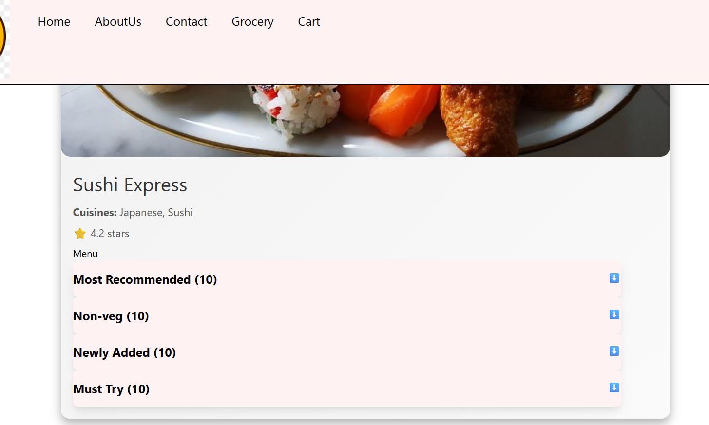

# Ep-11 Data is new oil

Today we will see about higher-order components!!

## Higher Order components

These are function that takes a component and returns a component!!

It add extra features to the input component and return it!!It just enhances input component!!

You see some profile of restuarants that have promoted label that means that are promoted by site!! It si an extra feature ,
which restuarnt pays to get promoted!! You see it will be very much similar to other cards ,only a promoted label will be added!!


So now we will have a promoted label on some carts!!

On backend Added promoted and put lombok library for allArgsConstructor,Getters and setters!!

On restaurants added Promoted field!!

We have RestaurantCard ,we want to add promoted label on this for restaurants for which promoted=true!!

So Higher-order Component takes RestaurantCard as input and put promoted label on it!!


```jsx
const withPromotionLabel=(RestuarantCard )=>{

    //return functional component
    return (props)=>{

        return ( <div>
                <label className="absolute bg-black text-white m-2 p-2 rounded-lg">Promoted</label>
                <RestuarantCard{...props}/>
            </div>
        )
    }
}

export default withPromotionLabel;
```
See above WithPromotionLabel is function taking component and returning a component !!
The data we are passing is in props!! We directly pass that too our original RetaurantCard Component!! to call this we added 

`  const ResCardPromoted=withPromotionLabel(RestuarantCard);`

and then 

```jsx
          <div className="flex flex-wrap gap-2 p-20">
              {resturants.map((restaurant, index) => (
                    restaurant.promoted === false ?
                            (
                                <div className="m-4" key={index}>
                                    <RestuarantCard data={restaurant}/>
                                </div>
                            ) : (
                                <div className="m-4" key={index}>
                                    <ResCardPromoted data={restaurant}/>
                                </div>
                            )

                ))}
 ```               
see how we have passed ResCardPromoted if promoted=true!!


```jsx

const Body = () => {

    let [resturants,setResturants]=useState([]);

    const [searchTerm, setSearchTerm] = useState("");

    const ResCardPromoted=withPromotionLabel(RestuarantCard);

    useEffect(() => {fetchdata()},[])

    const fetchdata = async()=> {
        const data=await fetch("http://localhost:8080/api/res");
        const json=await data.json()
        console.log(json)
        setResturants(json)
    }

    const searchdata = async(kw)=> {
        const data=await fetch(`http://localhost:8080/api/res/search?keyword=${kw}`);
        const json=await data.json()
        setResturants(json)
    }

    const onlineStatus=useOnlineStatus();
    console.log(onlineStatus)
    if(onlineStatus===false){
        return <h1>No interent connection</h1>
    }

    if(resturants.length==0){
        return <Shimmer/>
    }
    return (
        <div className="body bg-amber-100">
            <div className="p-[20px]">
                <input type="text" className="bg-white border border-gray-400 rounded-md px-4 py-2 shadow-sm focus:outline-none focus:ring-2 focus:ring-blue-50 "     
                  value={searchTerm}
                       onChange={(e) => setSearchTerm(e.target.value)}/>
                <button className="inline-flex items-center  px-4 py-4 m-4 border border-transparent text-sm font-medium rounded-md shadow-sm text-white bg-blue-600 hover:bg-blue-700 focus:outline-none focus:ring-2 focus:ring-offset-2 focus:ring-blue-500"
                        onClick={()=>searchdata(searchTerm)}>Search</button>
                <button className="inline-flex items-center px-4 py-4 m-4 border border-transparent text-sm font-medium rounded-md shadow-sm text-white bg-blue-600 hover:bg-blue-700 focus:outline-none focus:ring-2 focus:ring-offset-2 focus:ring-blue-500"
                        onClick={()=>fetchdata()}>Reset</button>
            </div>
            <div className="p-[20px]" >
                <button className="inline-flex items-center px-4 py-2 border border-gray-300 text-sm font-medium rounded-md shadow-sm text-gray-700 bg-white hover:bg-gray-50 focus:outline-none focus:ring-2 focus:ring-offset-2 focus:ring-indigo-500 filter" onClick={() => {
                    resturants=resturants.filter(
                        (resturant => resturant.stars>4.0)
                    )
                    setResturants(resturants);
                }}>
                Top Rated Resturant</button>
            </div>
            <div className="flex flex-wrap gap-2 p-20">
                {resturants.map((restaurant, index) => (
                        restaurant.promoted === false ?
                            (
                                <div className="m-4" key={index}>
                                    <RestuarantCard data={restaurant}/>
                                </div>
                            ) : (
                                <div className="m-4" key={index}>
                                    <ResCardPromoted data={restaurant}/>
                                </div>
                            )

                ))}

            </div>
        </div>
    )
};

export default Body;
```
Output: 

Can see Promoted label on top of card!!


## Layers of React

One layer is Data Layer and another is UI layer !!

Data Layer is state ,props ,variables!! 

Ui layer is JSX!!

How to manage data is very important!!

Now for menu items we are going to do grouping !! like One group of drinks ,one group of newly Added,One group of recommended!!

Main thing is how to get the relevant data!!

`chnaged backend api's for now ` ,backend sending MenuItems in cards!!

Now we want to have accordian ,UI should be able to close whenever we want and open!!


This is what accordian is!!!

We want to show accordian!!!!

`Window +;` for emoji on windows!!

to divide width into half we use `w-[6/12]` in tailwind as tailwind divides pages into 6 sections so 6 is half of that!!

`flex justify-between ` in taiwind to space in between flex items!!

to give background border always use `background` first!!

```jsx
import {useState} from "react";

const ResTaurantCategory=( props)=>{

    const [isOpen, setIsOpen] = useState(false);

    const toggleAccordion = () => {
        setIsOpen(!isOpen);
    };

    const {card, menuItems} = props.data;
    return <div className=" w-[900px]  border-b-2 border-gray-400 ">
        {/* Header*/}
        <div className="flex justify-between py-4 bg-red-50 shadow-lg rounded-lg mx-auto cursor-pointer" onClick={toggleAccordion}>
            <span className="text-xl font-bold ">{card} ({menuItems.length})</span>
            <span  >⬇️ </span>
        </div>
        {isOpen && menuItems.map((item, index) => (

            <div className="flex justify-between w-full m-auto" key={index} >
                <span className="text-lg">{item.name}</span>
                <span className="text-lg text-green-600">₹{item.price}</span>
            </div>
        ))}
    </div>
}

export default ResTaurantCategory;

```

see accordian !! Need to use IsOpen State variable!!



!!

you can add an add button and much more!!

We have toggle !! We click it opens and another click it is closed!!

Now we want If one Accordian is opened all other accordian should be collapsed!!that behavior is called "single open accordion", where opening one section automatically closes the others.

`React dev Tools` is chrome extension that will help you to debug the React code!!It will add two more tab in Developer Console!! `Components` shows components hierarchy!! and other tab is `Profiler`!! `Profiler` records your react App!! 

 What Profiler Shows You:
- Render Time:

    - How long each component took to render (in milliseconds).

- Re-renders:

    - How many times a component rendered during the profiling session.

- What caused re-renders:

    - Props changed? State changed? It tells you exactly why a render happened.

- Flamegraph and Ranked views:

    - Visual tools to show which components are slowest.

- Helps spot performance bottlenecks.


In components you will be able to see all props you have passed ! you will be able to see all data!!

Our  code starts from App!!

now we want accordian ,if i open one other one should be closed so there must be something that is shared beetween all of them so they know other one is opened!!

so we give collpase and open power to parent of this !! 

----

 ## Lift the state up
Manage which category is open from the parent component, instead of inside each individual accordion.

`When we are controlling from parent then child is called as Controlled Component.`

`When parent have no control then child is called as Uncontrolled component.`

We want at a time only one accordian should be expanded!!

Sometimes we lift state up to parent to control our children!!Now see code

---

#### Child component 

```jsx

const ResTaurantCategory=( props)=>{

    const {card, menuItems} = props.data;
    const isOpen = props.isOpen;
    const setShowIndex=props.setIndex;

    const handleClick=()=>{
        setShowIndex();
    }

    return <div className=" w-[900px]  border-b-2 border-gray-400 ">
        {/* Header*/}
        <div className="flex justify-between py-4 bg-red-50 shadow-lg rounded-lg mx-auto cursor-pointer"
             onClick={handleClick}>
            <span className="text-xl font-bold ">{card} ({menuItems.length})</span>
            <span>{isOpen ? "🔼" : "⬇️"}</span>
        </div>
        {isOpen && menuItems.map((item, index) => (
            <div key={index} >
               <MenuItems name={item.name} price={item.price} />
            </div>
        ))}
    </div>
}

export default ResTaurantCategory;

```
#### Parent component

```jsx

const RestaurantDetails = () => {
    const { resName } = useParams();
    const [showIndex, setshowIndex] = useState(-1);
    const restaurant = useResturantMenu(resName);
    if (!restaurant) return <div>No restaurant selected.</div>;


    return (
        <div className="restaurant-card">
            
            <div className="restaurant-info">
                <h2 className="restaurant-name">{restaurant.name}</h2>
                <p className="restaurant-cuisines">
                    <strong>Cuisines:</strong> {restaurant.cuisines.join(', ')}
                </p>
                <p className="restaurant-rating">⭐ {restaurant.stars} stars</p>

                <h3 className="menu-heading">Menu</h3>


                <div >
                    {restaurant.cards?.map((item, index) => (
                        <div key={index} className="flex space-between">
                            <div><ResTaurantCategory data={item}
                                                     isOpen={index===showIndex && true }
                                                     setIndex={()=>setshowIndex(index)}
                            /></div>
                        </div>
                    ))}
                </div>
            </div>
        </div>
    );
};

export default RestaurantDetails;


```

used `   const [showIndex, setshowIndex] = useState(-1);` in parent component first!! then see data we are passing into the component !!


```jsx
                <div >
                    {restaurant.cards?.map((item, index) => (
                        <div key={index} className="flex space-between">
                            <div><ResTaurantCategory data={item}
                                                     isOpen={index===showIndex && true }
                                                     setIndex={()=>setshowIndex(index)}
                            /></div>
                        </div>
                    ))}
                </div>
```

Every `ResTaurantCategory ` has a `index` we know that so we are putting id `showIndex===that index` then we show that component!!

we setting index by `setshowIndex()` function!!

now see child component 

```jsx
    const isOpen = props.isOpen;
    const setShowIndex=props.setIndex;

    const handleClick=()=>{
        setShowIndex();
    }

    return <div className=" w-[900px]  border-b-2 border-gray-400 ">
        {/* Header*/}
        <div className="flex justify-between py-4 bg-red-50 shadow-lg rounded-lg mx-auto cursor-pointer"
             onClick={handleClick}>
            <span className="text-xl font-bold ">{card} ({menuItems.length})</span>
            <span>{isOpen ? "🔼" : "⬇️"}</span>
        </div>

```

using isOpen from parent!! setShowIndex in child is function which we put on `handleClick()`!!

so when we click `handleClick()` is called, which calls `setShowIndex()` of parent and which sets showIndex to that element's index!! now in parent isopem we se `index===showIndex` and that element whose index will be set as showIndex will set `isOpen=true` and that element will be shown in accordian!!

Now if we open any accordian we not able to close all , so to close all after opening any one use this code in parent 

```jsx
                <div >
                    {restaurant.cards?.map((item, index) => (
                        <div key={index} className="flex space-between">
                            <div><ResTaurantCategory data={item}
                                                     isOpen={index===showIndex && true }
                                                     setIndex={()=>setshowIndex((prev) => (prev === index ? null : index))}
                            /></div>
                        </div>
                    ))}
                </div>
            </div>

```

see `setIndex={()=>setshowIndex((prev) => (prev === index ? null : index))}` this line how we check if `prev===index` means last time too we have clicked same index so close all and setShowIndex as null!!
 