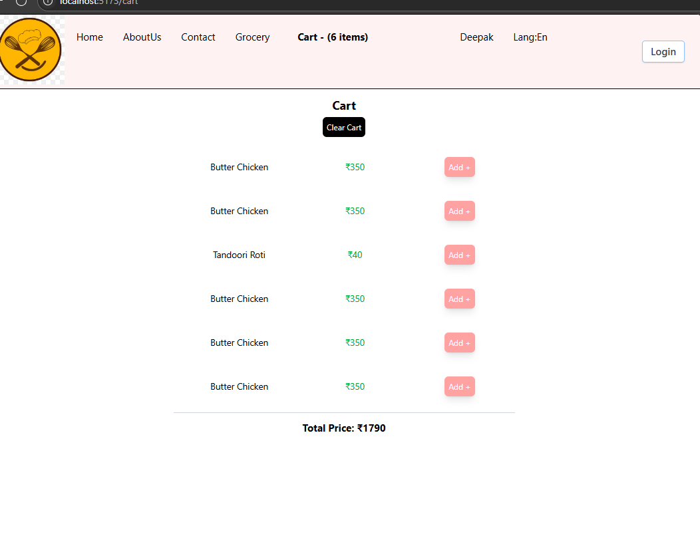

# Redux Ep-12 Let's Build our store

Redux is not mandatory ,small or medium-sized application no need of redux ,but huge application needs Redux!!!`All application build using Redux can be built without Redux`!!

Redux is separate Library and React is separate so we need to install Redux in React!!

Redux is not the only library for managing state there are other like `Zustand`!!

Redux makes application easy to debug!!We have `Redux dev tools`!!

Redux is not only used with React but popularly used with React!!

There are two libraries redux offers

1. React-Redux --> bridge between react and redux!!
2. Redux toolkit (RTK)--> newer way to write redux!!Only Redux(Vanilla Redux) was complicated ,Reduc ToolKit made it bit easier!! Vanilla Redux require too much of boilerPlate code now after Redux toolkit removes boiler plate code!!

old way is called as `React Redux` or `Vanilla Redux`!!

new way ois to use with `Redux Toolkit`!!

Now we will devlop Cart!! Like we have cart on swiggy!!

## Architecture of Redux-toolkit
 
 We use word `Redux` for `Redux-toolkit` from now!!

  
  
 


## What we gonna do?

 ####  Redux ToolkitAdd commentMore actions
  - Install @reduxjs/toolkit (@ and / are there in name of RTK library) and react-redux (2libraries to install)
  - Build our store
  - Connect our store to our app
  - Slice (cartSlice)
  - dispatch(action) --> to write to Store
  - Selector --> to read from Store

installed both see package.json 

```json
  "dependencies": {
    "@reduxjs/toolkit": "^2.8.2",
    "@tailwindcss/vite": "^4.1.10",
    "react": "^19.1.0",
    "react-dom": "^19.1.0",
    "react-redux": "^9.2.0",
    "react-router": "^7.6.2",
    "react-router-dom": "^7.6.2",
    "tailwindcss": "^4.1.10"
  },
```
So now we build our stor inside utils!! Noww we need to create Store!!

we put store in utils!!

```jsx
import { configureStore } from "@reduxjs/toolkit";
// import cartReducer from "./cartSlice";

const appStore = configureStore({
    // reducer: {
    //     cart: cartReducer,
    // },
});

export default appStore;

```

We use `configureStore()` function to create store that comes from `RTK`!! Inside store we add slices!! See Commented part!!

Now let us provide store to Application!! so in app.jsx!! So put entire application under Provider !!

```jsx
import {Provider} from "react-redux";

function App() {

    const [user, setUser] = useState("Mkr");

    useEffect(() => {
        setUser("Deepak");
    },[])
  return (
      <Provider store={appStore}>
          <UserContext.Provider value={{user,setUser}}>
              <>
                  <Header />
                  <main className="mt-[150px]">
                      <Outlet />
                  </main>
              </>
          </UserContext.Provider>
      </Provider>
  )
}
```
Provider is from React-Redux and in store we tell store!! Provider comes from react-redux as it acts as bridge ,RTK just create store to put store to React we use React-redux!!

creating store is `RTK` job but providing Store to react is `react-rddux` job!!

In Provider we provide `appStore` a sProvider !! If you want a portion of app to have redux not whole application put that part in `Provider`!!

Now lwt us create cartSlice!! We putting it in utils!!

`createSlice()` comes from reduxjs is used to from redux !! It takes configurations !!

1. name --> let us name as cart

2. Initial state -->inital state of slice

3. Reducers --> correspoding to action we put reducer function!!

action is cart 

- addItem 
- removeItem 
- clearCart


each of this has reducer function!! Each function has access to `state` and `action`!! let us take an example from counter!!

```js
import { createSlice } from '@reduxjs/toolkit';

// Initial state
const initialState = {
  count: 0,
};

// Create the slice
const counterSlice = createSlice({
  name: 'counter',
  initialState,
  reducers: {
    increment(state) {
      state.count += 1; // Immer allows direct state mutation
    },
    decrement(state) {
      state.count -= 1;
    },
    incrementByAmount(state, action) {
      state.count += action.payload;
    },
  },
});

// Export actions
export const { increment, decrement, incrementByAmount } = counterSlice.actions;

// Export reducer
export default counterSlice.reducer;
```
>Here we export actions as weel as reducers both

- action is an object passed into the reducer that tells it what to do.

- action.type is mandatory.

- action.payload is optional — for passing data (e.g. amounts, user info, etc.)

## How to use it 

tell configuerer about reducer

```js
import { configureStore } from '@reduxjs/toolkit';
import counterReducer from './counterSlice';

const store = configureStore({
  reducer: {
    counter: counterReducer,
  },
});
```

Use in react component 

```jsx
import React from 'react';
import { useSelector, useDispatch } from 'react-redux';
import { increment, decrement, incrementByAmount } from './counterSlice';

const Counter = () => {
  const count = useSelector((state) => state.counter.count); //state.sliceName.dataName
  const dispatch = useDispatch();

  return (
    <div>
      <h2>{count}</h2>
      <button onClick={() => dispatch(increment())}>+1</button>
      <button onClick={() => dispatch(decrement())}>-1</button>
      <button onClick={() => dispatch(incrementByAmount(5))}>+5</button>
    </div>
  );
};

export default Counter;

```
### Can You Write a Reducer Without state and action?
Technically, you must include both state and action in the reducer function signature — even if you’re not using them.

✅ Why? Because:

- Redux always calls the reducer with (state, action)

- If you omit one, you may get an error or unexpected behavior.

Now back to cart example !!

```js
import { createSlice} from "@reduxjs/toolkit";

const cartSlice = createSlice({
    name: "cart",
    initialState: {
        items: [],
    },
    reducers: {
        addItem: (state, action) => {
            state.items.push(action.payload);
        },
        removeItem: (state, action) => {
            state.items.pop();
        },
        clearCart: (state, action) => {
            return { items: [] };
        },
    },
});

export const { addItem, removeItem, clearCart } = cartSlice.actions;

export default cartSlice.reducer;
```

In above reducers we are modifying the state directly !!


#### How these  two export working??

cartSlice is big Object having `actions` and `reducers` in the cartSlice!! so we exporting both from the cartSlice!!

whatever we pass to state ,we put in payload!!

This is our cartSlice Reducer!!

now in appStore we tell about this reducer

```jsx
import { configureStore } from "@reduxjs/toolkit";
import cartReducer from "./cartSlice";

const appStore = configureStore({
    reducer: {
        cart: cartReducer,
    },
});

export default appStore;

```
This is how we add slice to store!! For each slice we have We have reducer in Store!! Here reducer in store is big reducer for our whole app!!

Now we have added link for cart created cart componnet and at header linked cart component !!

in main.jsx

```jsx

            },
            {
                path: "/cart",
                element: <Cart />,
            },
            
 ```

In header

```jsx
                  </li>
                  <li className="px-4 font-bold text-xl">
                      <Link to="/cart">Cart - ({cartItems.length} items)</Link>
                  </li>
              </ul>
```

to get cart items from store in header

```jsx
    const cartItems = useSelector((store) => store.cart.items);
    console.log(cartItems);
```

See cart.jsx

```jsx
const Cart = () => {
    const cartItems = useSelector((store) => store.cart.items);

    console.log(cartItems);

    const dispatch = useDispatch();

    const handleClearCart = () => {
        dispatch(clearCart());
    };

    return (
        <div className="text-center m-4 p-4">
            <h1 className="text-2xl font-bold">Cart</h1>
            <div className="w-6/12 m-auto">
                <button
                    className=" p-2 m-2 bg-black text-white rounded-lg"
                    onClick={handleClearCart}
                >
                    Clear Cart
                </button>
                {cartItems?.length === 0 && (
                    <h1> Cart is empty. Add Items to the cart!</h1>
                )}

                {cartItems?.length !== 0  && cartItems.map((item, index) => (
                    <div key={index} >
                        <MenuItems name={item.name} price={item.price} />
                    </div>
                ))}

            </div>
        </div>
    );
};

export default Cart;
```

now to clearCart we dispatch of clearCart()!!

MenuItems add items to cart 

```jsx


const MenuItems=({name,price})=>{

    const dispatch = useDispatch();
    const handleAddItem = () => {
        dispatch(addItem({name : name,price : price}));
    };

    return (
        <div className="flex items-center w-full my-4 px-4" >
            <span className="flex-1 text-lg">{name}</span>
            <span className="flex-1 text-lg text-green-600 my-4 text-center">₹{price}</span>
            <button
                className="p-2 mx-16 my-4 rounded-lg bg-red-300 text-white shadow-lg cursor-pointer"
                onClick={() => handleAddItem()} >
                    Add +
            </button>
        </div>
    )

}
export default MenuItems;
```

useSelector() is a hook!!It comes from react-redux library!!! useSelector helps to subscribe to store!!

`const cartItems = useSelector((store) => store.cart.items);`--> tells which part of store we need to access!!

now cartItems has data of store.Items!!

in slice when you do `console.log(state)` it prints just proxy object .state is a Proxy (because of Immer.js) So logging it like console.log(state) may not show updated changes immediately.
to print state use `console.log("Items array:", [...state.items]);`

this is how we dispatch an item 

```jsx
  const dispatch = useDispatch();
   const handleClearCart = () => {
        dispatch(clearCart());
    };
```
To dispatch we need `useDispatch()` hook!!
LEt us see another example!!
```jsx
    const dispatch = useDispatch();
    const handleAddItem = () => {
        dispatch(addItem({name : name,price : price}));
    };
```    
the item we passing is `action.payload` in reducers!!

```jsx
        addItem: (state, action) => {
            state.items.push(action.payload);
            console.log(state.items);
            console.log("Items array:", [...state.items]);

        },
```        
to put anything or update  on store  we use `dispatch()` and in dispatch we give action!!

to call reducers we call by `dispatch(action(...))` and in slice we have fucntion corresponding to every action!!Like above you can see function corresponding to addItem action!!

# Very Imp 
## ✅ 1. onClick={() => handleAddItem()}
✅ Meaning:
This is an arrow function that will call handleAddItem() when the button is clicked.

✅ Correct ✅
This is the right way to pass parameters or control when the function runs.

🔍 Use case:
When you want to call a function on click, not during render.

## ❌ 2. onClick={handleAddItem()}
❌ Meaning:
This calls the function immediately while rendering the component — not on click.

❌ Wrong ❌
Instead of passing a function reference, you're passing the result of handleAddItem() to onClick.

🔥 Example:
If handleAddItem() logs something, you’ll see it run as soon as the component renders — even without clicking anything.

## ✅ 3. onClick={() => handleAddItem(item)}
✅ Meaning:
You're defining an arrow function that calls handleAddItem(item) only when clicked.

✅ Correct ✅
Use this when you want to pass arguments to your function on click.


## ❌ 4. onClick={handleAddItem(item)}
❌ Meaning:
This immediately calls handleAddItem(item) during render, and sets onClick to whatever that function returns (probably undefined).

❌ Wrong ❌
Same mistake as (2) — the function runs at render, not on click.

## Add total to cart

Now added total at end of cart .for total we use reduce function 

```jsx

const Cart = () => {
    const cartItems = useSelector((store) => store.cart.items);

    console.log(cartItems);
    const totalPrice = cartItems.reduce((acc, item) => acc + (item.price || 0), 0);
    const dispatch = useDispatch();

    const handleClearCart = () => {
        dispatch(clearCart());
    };

    return (
        <div className="text-center m-4 p-4">
            <h1 className="text-2xl font-bold">Cart</h1>
            <div className="w-6/12 m-auto">
                <button
                    className=" p-2 m-2 bg-black text-white rounded-lg"
                    onClick={handleClearCart}
                >
                    Clear Cart
                </button>
                {cartItems?.length === 0 && (
                    <h1> Cart is empty. Add Items to the cart!</h1>
                )}

                {cartItems?.length !== 0  && cartItems.map((item, index) => (
                    <div key={index} >
                        <MenuItems name={item.name} price={item.price} />
                    </div>
                ))}

                <hr className="my-4 border-t-2 border-gray-300" />

                {cartItems.length > 0 && (
                    <h2 className="text-xl font-bold mt-4">
                        Total Price: ₹{totalPrice}
                    </h2>
                )}

            </div>
        </div>
    );
};

export default Cart;

```



## Things to consider

`const cartItems = useSelector((store) => store.cart.items);`

Always get what is needed in cartItems do not get whole store and then cart

❌ below one is wrong

```jsx
const store = useSelector((store) => store);
const cartItems=store.cart.items
```
This is very less Efficient!!This makes update the component on every change in store !! but we do not want that !! we want to get updates of cart slice only!

In appstore we have `reducer`

```jsx
const appStore = configureStore({
    reducer: {
        cart: cartReducer,
    },
});

export default appStore;
```
one big reducer but in Slice we have multiple small reducers!!

```jsx
const cartSlice = createSlice({
    name: "cart",
    initialState: {
        items: [],
    },
    reducers: {
        addItem: (state, action) => {
            state.items.push(action.payload);
            console.log(state.items);
            console.log("Items array:", [...state.items]);

        },
        removeItem: (state, action) => {
            console.log(state);
            console.log(action.payload);
            state.items.pop();
        },
        clearCart: (state, action) => {
            console.log(state.items);
            return { items: [] };
        },
    },
});

export const { addItem, removeItem, clearCart } = cartSlice.actions;

export default cartSlice.reducer;
```
At end of Slice ,we returning one reducer which is combination of these small reducers!!

- when we used to use `vanilla redux` we was not meant to mutate the state!!`state.items.push(action.payload);` was not allowed in `vanilla redux`!! We used to create a copy and push to that copy!!

  ```jsx
  const newState=[...state]
  newState.items.push(action.payload);
  return newState
  ```

and return that newState!!

A lot of developers used to modify state ,but in RTK we got option to make change to state!! 
And no need to return now!!

Redux uses `Immer.js` library which create copy of state update to that and then create immutable state which is returned!!

In clearCart 

### ✅ Correct ✅
```jsx
        clearCart: (state, action) => {
            console.log(state.items);
            return { items: [] };
        },

```
### 
❌ Wrong ❌
```jsx
        clearCart: (state, action) => {
           state=[];
        },

```

In Redux Toolkit (which uses Immer internally), the state parameter is not the actual state object, but a draft. You can mutate the draft directly (e.g., push items, change properties), but you cannot reassign it like this.

This just changes the local reference of state inside the reducer — it does not change the actual Redux store state.

---
Immer can be used in any context in which immutable data structures need to be used. For example in combination with React state, React or Redux reducers, or configuration management. Immutable data structures allow for (efficient) change detection: if the reference to an object didn't change, the object itself did not change. In addition, it makes cloning relatively cheap: Unchanged parts of a data tree don't need to be copied and are shared in memory with older versions of the same state.

Generally speaking, these benefits can be achieved by making sure you never change any property of an object, array or map, but by always creating an altered copy instead. In practice this can result in code that is quite cumbersome to write, and it is easy to accidentally violate those constraints. Immer will help you to follow the immutable data paradigm by addressing these pain points:

- Immer will detect accidental mutations and throw an error.
- Immer will remove the need for the typical boilerplate code that is needed when creating deep updates to immutable objects: Without Immer, object copies need to be made by hand at every level. Typically by using a lot of ... spread operations. When using Immer, changes are made to a draft object, that records the changes and takes care of creating the necessary copies, without ever affecting the original object.
- When using Immer, you don't need to learn dedicated APIs or data structures to benefit from the paradigm. With Immer you'll use plain JavaScript data structures, and use the well-known mutable JavaScript APIs, but safely.

>Basically old state is never chnaged a copy of that is changed and that copy is assigned to state each time we update!!

🧠 Step-by-Step View
- You dispatch an action to Redux:

  ```js
  dispatch(updateName("Mohit"));

  ```
- Redux Toolkit gives your reducer a draft copy (proxy) of the current state:

  ```js
  updateName: (state, action) => {
      state.user.name = action.payload; // Looks like a mutation
  }
  ```
- Immer tracks changes made to the draft.

- Immer builds a new state object, with:

    - Only the parts that changed copied.

- Unchanged parts reused from the old state.

- Redux replaces the old state in the store with this new version.

when you do `state=[]`

This just rebinds the local variable state to a new array. You're not modifying the draft — you're just saying:

`"Hey, now this variable state points to this new array instead."` State is a local variable!!

But Immer is still tracking the original proxy, and you’re no longer interacting with it.

So:

- No mutation happened to the draft ✅

- No new state will be produced ❌

- The change is ignored completely ❌

#### ✅ state.length = 0 — Why It Works
This is a mutation of the draft array (proxy).

```js
state.length = 0;
```
This tells Immer:

`“Hey, this draft array’s contents have changed — clear it out.”`

Because Immer is still tracking the draft, it knows how to:

- Create a new copy of the array

- Remove all its contents

- Return a new state that’s empty

✅ return [] — Why It Also Works
This is another correct way, because:

- If you return a new value from the reducer, Redux Toolkit knows to use that as the new state.

- Immer bypasses the draft and replaces the state directly.

return [] doesn’t mutate the draft — it completely replaces it.

That’s allowed, because Immer (and Redux Toolkit) says:

`"If the reducer returns a new value, I’ll use that as the new state — and completely ignore the draft."`

This is intentional behavior supported by Immer.

---
### Reading state for log

we can not directly read state  so cannot do `console.log(state)` as state is a proxy object!!

Instead do `console.log(currrent(state))`!!

when you do state=[] and do log state you will see empty state but cart will not be empty as this change is made in local state!!Original state is not chnaged!!

### RTK says either mutate a existing state or return a new state!! so return [] works well!

in our case we need to return 

```js 
 return { items: [] };
 ```

 as we want empty items!!

 ## Redux dev tools

 another extension for debugging!!!

 It gives trace too where we have called!!