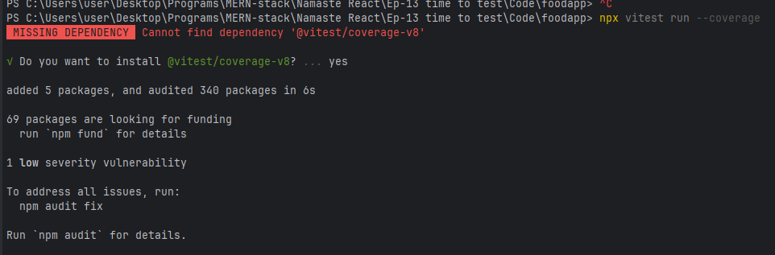
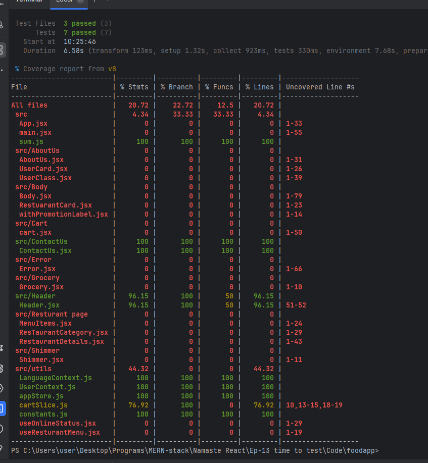
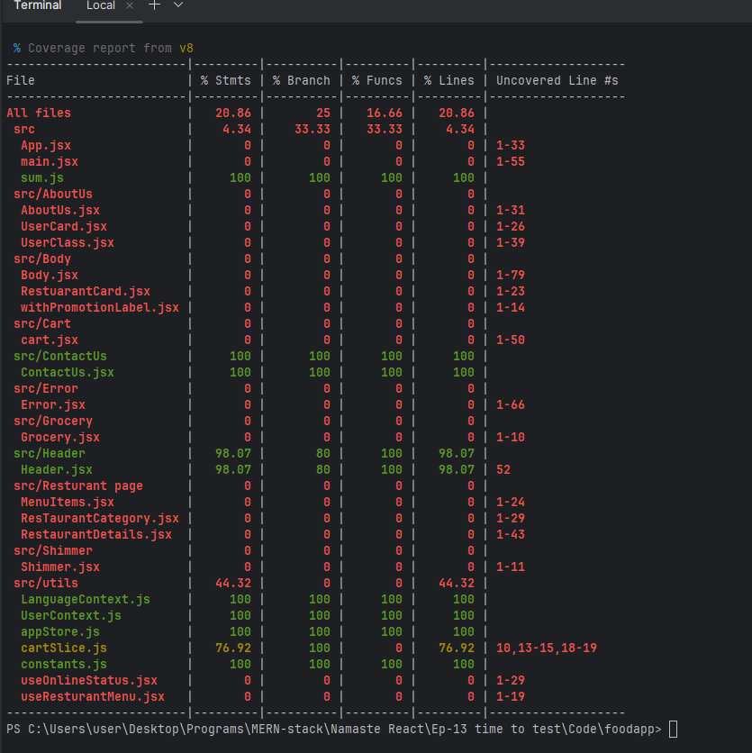
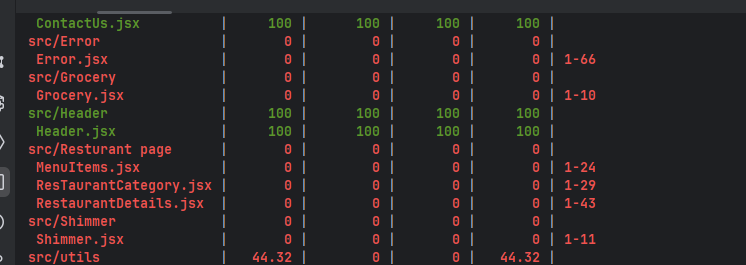

# Ep-13 time to test

We know testing is very important !! Testing is a huge Domain!! We only concerned about Developer testing !!

Even a single line of code can put bug anywhere !! When we have 100's of components !!and these components talk to each other!!

Developer can do 
- `manual tetsing`--> like we do by doing that specific action 

- `write code to test the application`

### types of testing developer can do!!

- unit testing --> test component separately!! test component in isolation of application!! 

- Integration testing --> testing integration of components!!We write code to test components comunicating with each other!!

- End to end testing(E2E testing) --> test all flows !! test from user to land on page and do everything user can do!!used vy selenium ,pupeteer!!

we are concerned by 1st 2 testing !! Testing is part of development!! Writing test case for code is very important!!

## Library 

`react-testing library` is most standard way to do testing in React!!
React Testing Library builds on top of DOM Testing Library by adding APIs for working with React components.

`npm install --save-dev @testing-library/react @testing-library/dom` --> to install!! `create react app` has testing library but with  `vite` we need to install it!! `react-testing library`  uses `jest` which is used to create testCase for JS !!`Jest` used Babel!! so we need `jest` too!!


`npm install --save-dev jest`--> to install jest!!

Jest is not supported by `vite`!!

Vite is designed around ES modules and modern tooling, whereas Jest was built for CommonJS and doesn't natively support Vite's ESM-based architecture and plugin system. So while you can use Jest in a Vite project, it requires extra setup (as described earlier), and you'll miss out on some of Vite's features like native module resolution, Vite aliases, and faster ESM loading.

`Vitest is Vite's native test runner and is built to integrate seamlessly with Vite and React.`

So we have installed vitest and put scripts for that

`> npm install -D vitest` --> to install vitest

```json
{
  "name": "foodapp",
  "private": true,
  "version": "0.0.0",
  "type": "module",
  "scripts": {
    "dev": "vite",
    "build": "vite build",
    "lint": "eslint .",
    "preview": "vite preview",
    "test": "vitest"
  },
  "dependencies": {
    "@reduxjs/toolkit": "^2.8.2",
    "@tailwindcss/vite": "^4.1.10",
    "react": "^19.1.0",
    "react-dom": "^19.1.0",
    "react-redux": "^9.2.0",
    "react-router": "^7.6.2",
    "react-router-dom": "^7.6.2",
    "tailwindcss": "^4.1.10"
  },
  "devDependencies": {
    "@eslint/js": "^9.25.0",
    "@testing-library/dom": "^10.4.0",
    "@testing-library/react": "^16.3.0",
    "@types/react": "^19.1.2",
    "@types/react-dom": "^19.1.2",
    "@vitejs/plugin-react": "^4.4.1",
    "eslint": "^9.25.0",
    "eslint-plugin-react-hooks": "^5.2.0",
    "eslint-plugin-react-refresh": "^0.4.19",
    "globals": "^16.0.0",
    "vite": "^6.3.5",
    "vitest": "^3.2.4"
  }
}

```
Now see above package.json and scripts!! Scripts we need to add 

```json
{
  "scripts": {
    "test": "vitest"
  }
}
```
to run `npm test command`!!

create new file vite.config.js

```js
import { defineConfig } from 'vite';
import react from '@vitejs/plugin-react';

export default defineConfig({
    plugins: [react()],
    test: {
        environment: 'jsdom',
        globals:true,
        setupFiles: './src/setupTests.js',
        include: ['src/**/*.test.jsx'],
    },
});
```

our vite.config.ja looks like 

```js

import { defineConfig } from 'vite'
import react from '@vitejs/plugin-react'
import tailwindcss from "@tailwindcss/vite";

// https://vite.dev/config/
export default defineConfig({
  plugins: [react() ,
          tailwindcss() ,],
    test: {
        environment: 'jsdom',
        globals:true,
        setupFiles: './src/setupTests.js',
        include: ['src/**/*.test.jsx'],
    },
})

```
create setUpTests.js and put this statement there 

```js

import '@testing-library/jest-dom';

```

In eslint.config.js put 
```js

    // ✅ This block handles test files
    files: ['**/*.test.{js,jsx}', '**/*.spec.{js,jsx}'],Add commentMore actions
    plugins: {
      vitest,
    },
    languageOptions: {
      globals: vitest.environments['vitest/globals'].globals,
    },
    rules: {
      ...vitest.configs.recommended.rules,
    },
  },
  ```

Let us write some test cases for js !!
we write a sum function 

```js
export const sum=(a,b) => {
    console.log(a,b);
    return a + b;
}
```

This was sum function!!
```jsx
import { sum } from "../sum.js";
import {describe,it,expect} from "vitest";
import "@testing-library/jest-dom/vitest"

describe("Sum function should caculate the sum of two numbers", () => {
    it('should calculate the sum of two numbers', () => {
        const result = sum(3, 4);

        // Assertion
        expect(result).toBe(7);
    });
});
```

descibe takes 2 argument 1 is string and 2nd is callback function where we write test case!!

Now let us do unit testing  

>for header check Do we have Home on the header!!

```jsx
describe('renders header', () => {
    it('renders correctly', () => {
        render(
            <MemoryRouter>
                <Provider store={appStore}>
                    <Header />
                </Provider>
            </MemoryRouter>
        );
        expect(screen.getByText("Home")).toBeInTheDocument();
    })
```

In describe we write all testcases

Expect is assertion and after expect you can check via lot of functions!!

#### ContactUs.text.jsx

```jsx
import { render, screen } from "@testing-library/react";
import "@testing-library/jest-dom";
import ContactUs from "../ContactUs/ContactUs.jsx";

describe("Contact Us Page Test Case", () => {
  

    it("Should load ContactUs us component", () => {
        render(<ContactUs />);

        const headings = screen.getAllByRole("heading");
        // Assertion
        expect(headings[0]).toBeInTheDocument();
    });

    it("Should load button inside ContactUs component", () => {
        render(<ContactUs />);

        const button = screen.getByRole("button");

        // Assertion
        expect(button).toBeInTheDocument();
    });

    it("Should load input name inside ContactUs component", () => {
        render(<ContactUs />);

        const inputName = screen.getByPlaceholderText("Your Name");

        // Assertion
        expect(inputName).toBeInTheDocument();
    });

    it("Should load 3 input boxes on the ContactUs component", () => {
        render(<ContactUs />);

        // Querying
        const inputBoxes = screen.getAllByRole("textbox");

        //console.log(inputBoxes.length);

        // Assertion

        expect(inputBoxes.length).toBe(3);
    });
});
```
in `describe` in `it` we write each testcase , for each testcase we need to render component again and again!!

>Note: some repositories write `test()` in place of `it()`.`it()` is alias of `test()`

`render` renders on JSDOM!!

`expect` is assertion where we tell correct output!!And testing library compares the result with the expected result!

- getBy-->
Synchronous. Throws error if not found or more than one match.

**ByRole** is a query method that searches elements by their ARIA role—which is how screen readers (and other assistive tech) understand what an element does.
These method returns `React element `. So when you log them you see whole JSON!!

✅ Example: Common Roles

HTML Element	Implicit ARIA Role
`<button>`-->	button

`<h1> - <h6>`-->	heading

`<a href="...">`-->	link

`<input type="text">`-->	textbox

`<input type="checkbox">`-->	checkbox

`<form>`-->	form

``-->	img 

if there are multiple values returned by `screen.getByRole("button")` then you can pass 2nd parameter too `screen.getByRole("button",{name:"Login"})` ,it gives you button having name `Login`~~

**ByText** is a query method that searches that particular text on screen!!

This is unit testing !! Let us unit test Header !!

#### Header.test.jsx
```jsx

describe('renders header', () => {
    it('renders correctly', () => {
        render(
            <MemoryRouter>
                <Provider store={appStore}>
                    <Header />
                </Provider>
            </MemoryRouter>
        );
        expect(screen.getByText("Home")).toBeInTheDocument();
    })

    it("Should render Header Component with a Cart items 0 ", () => {
        render(
            <BrowserRouter>
                <Provider store={appStore}>Add commentMore actions
                    <Header />
                </Provider>
            </BrowserRouter>
        );

        const cartItems = screen.getByText("Cart - (0 items)");

        expect(cartItems).toBeInTheDocument();
    });

});
```
>Note:We using React-redux in useSelector() hook in Header!! We have to provide store to header as useSelecctor() is not part of React ,but our testing library understand React only so useState(),useEffect() is understood but not Redux!! So we provide Provider!!

>Note: Link is coming from React-router-DOM so we need to provide context of react-router-DOM!! So for that we need to provide Router!! We provide Browser Router generally!!

`screen.getByText("Cart - (0 items)")` here you can pass regex too just see `screen.getByText("\Cart\")` here `\Cart` is regex!! Now whether we have cart-1,cart-0 or whatever ,we will get the test case passed!! 

If any test fails you see whole html on logs!!


### Code coverage

testcase covers how much percentage of code!!

`npm install -D c8` --> for code coverage

`npx vitest run --coverage` --> to run!! For first time you need to get a dependency then you will be able to see coverage



After that see coverage




see header statements code covergae `96.15` let us add one more test case In Header

```jsx

    it("Should change Login Button to Logout on click", () => {
        render(
        <BrowserRouter>
        <Provider store={appStore}>
            <Header />
            </Provider>
        </BrowserRouter>
    );

        const loginButton = screen.getByRole("button", { name: "Login" });

        fireEvent.click(loginButton);

        const logoutButton = screen.getByRole("button", { name: "Logout" });

        expect(logoutButton).toBeInTheDocument();
    });
```
Now see code coverage!!



see it increased , now can see which lines not covered !! line '52` is not covered !!

Line 52 was after login value is set as logot that was not covered so modified TC(test case)

```jsx
    it("Should change Login Button to Logout on click", () => {
        render(
        <BrowserRouter>
        <Provider store={appStore}>
            <Header />
            </Provider>
    </BrowserRouter>
    );

        const loginButton = screen.getByRole("button", { name: "Login" });

        fireEvent.click(loginButton);

        const logoutButton = screen.getByRole("button", { name: "Logout" });

        fireEvent.click(logoutButton);

        expect(logoutButton).toBeInTheDocument();
    });

});
```
Now coverage is 100 Percent 



```jsx
screen.getByRole('button', { name: 'Submit' });
screen.getByRole('heading', { name: /welcome/i });
```

the name refers to the element's accessible name—which usually comes from:

#### 🔤 What is "accessible name"?

It’s the text that screen readers use to describe the element, and it can come from:

✅ Common Sources of name in HTML

Element	-->How name is set (in HTML)-->	Example HTML

`<button>`-->	Inner text-->`	<button>Submit</button>`

`<input>`-->	Associated-->` <label>	<label>Email<input type="text" /></label>`

``-->	alt attribute-->`	`

`<a>`-->	Link text	-->`<a href="/">Home</a>`


Now let us test for RestuarantCard!! see it 

```jsx
import {Link} from "react-router";

const RestuarantCard = (props ) => {

    if (!props || !props.data) {
        return null; // or a fallback UI
    }
    const { name, cuisines, stars, eta ,imageUrl}=props.data;

    return (
        <div className=" w-50 h-90 p-5 bg-red-300 hover:bg-red-200 rounded-lg hover:cursor-pointer hover:border-gray-800">
            
            <h3 className="font-bold py-4.5 hover:cursor-pointer hover:text-2xl hover:text-amber-600" ><Link
                to={`restuarants/${name}`}>
                {name}</Link></h3>
            <h4>{cuisines.join(", ")}</h4>
            <h4>{stars} Stars</h4>
            <h4>{eta} minutes</h4>
        </div>
    )
}

export default RestuarantCard;
```
It is getting props so we need props in it to test!!

we need to put fix data in place of it so see

```jsx
import { render, screen } from "@testing-library/react";
import {describe,it,expect} from "vitest";
import "@testing-library/jest-dom/vitest"
import RestuarantCard from "../Body/RestuarantCard.jsx";
import MOCK_DATA from "./mockData/ResCardDataMock.json";
import {BrowserRouter} from "react-router";

it("should render RestaurantCard component with props Data", () => {
    render(
        <BrowserRouter>
        <RestuarantCard data={MOCK_DATA} />
            </BrowserRouter>);

    const name = screen.getByText("Spice Garden");

    expect(name).toBeInTheDocument();
});

it("should render RestaurantCard component with Promoted Label", () => {

});
```

Till now we were doing uit testing ,tetsing one component al alone ,now we do integration testing where we check the flow!!

we first test search functionality in serch bar in body!!

so in body multiple components needs tow ork together!!

In body we are calling external backend API to get the data which is async call!!

`fetch` cannot be done so we need to create mock function for fetch!!

```jsx
import { fireEvent, render, screen } from "@testing-library/react";
import MOCK_DATA from "./mockData/mockList.json";
import  MOCK_SEARCH_RESULT from "./mockData/GreenBowl.json";
import { BrowserRouter } from "react-router";
import Body from "../Body/Body.jsx";
import { vi } from "vitest";
import {act} from "react";

// Reset before each test
beforeEach(() => {
    vi.restoreAllMocks();
});

global.fetch = vi.fn((url) => {
    if (url.includes("/api/res/search")) {
        // Mock search result (e.g., Green Bowl)
        return Promise.resolve({
            json: () => Promise.resolve(MOCK_SEARCH_RESULT),
        });
    } else if (url.includes("/api/res")) {
        // Mock initial list
        return Promise.resolve({
            json: () => Promise.resolve(MOCK_DATA),
        });
    }
});

it("Should Search Res List for Green bowl text input ", async () => {
    await act(async () =>
        render(
            <BrowserRouter>
                <Body />
            </BrowserRouter>
        )
    );

    const cardsBeforeSearch = screen.getAllByTestId("resCard");

    expect(cardsBeforeSearch.length).toBe(11);

    const searchBtn = screen.getByRole("button", { name: "Search" });

    const searchInput = screen.getByTestId("searchInput");

    fireEvent.change(searchInput, { target: { value: "Green Bowl" } });

    // ✅ Wrap click in act
    await act(async () => {
        fireEvent.click(searchBtn);
    });

    // ✅ Use findAllByTestId to wait for UI to update
    const cardsAfterSearch = await screen.findAllByTestId("resCard");
    expect(cardsAfterSearch.length).toBe(1);
});

it("Should filter Top Rated Restaurant", async () => {
    await act(async () =>
        render(
            <BrowserRouter>
                <Body />
            </BrowserRouter>
        )
    );

    const cardsBeforeFilter = screen.getAllByTestId("resCard");

    expect(cardsBeforeFilter.length).toBe(11);

    const topRatedBtn = screen.getByRole("button", {
        name: "Top Rated Resturant",
    });
    fireEvent.click(topRatedBtn);

    const cardsAfterFilter = screen.getAllByTestId("resCard");
    expect(cardsAfterFilter.length).toBe(9);
});
```
when calling fireEvent.click(searchBtn) outside of an `async act(...)` block. This means React hasn't finished updating the DOM after the fetch() inside searchdata() is called — so you're still seeing the old list of 11 cards. so to search `Green Bowl` put in await act!!

create mock data can see it in tests folder!!

Now see mock fetch function 

```jsx

global.fetch = vi.fn((url) => {
    if (url.includes("/api/res/search")) {
        // Mock search result (e.g., Green Bowl)
        return Promise.resolve({
            json: () => Promise.resolve(MOCK_SEARCH_RESULT),
        });
    } else if (url.includes("/api/res")) {
        // Mock initial list
        return Promise.resolve({
            json: () => Promise.resolve(MOCK_DATA),
        });
    }
});

```

>Note:We want fetch function same as browser fetch which returns a promise and get json and then in that json we have a function which has promise we resolve that too!!

whenever `stateUpdate` or `fetch` wrap `render` in to an `act` function.act returns a promise, when we use act we make ,`it` function callback as `async`!!then `act` further takes up an async function !!

```jsx
   await act(async () =>
        render(
            <BrowserRouter>
                <Body />
            </BrowserRouter>
        )
    );

 ```


 `screen.getByTestId("searchInput");` for this to work we added `data-testid` this in input

 ```html
       
                <input  data-testid="searchInput" type="text" className="bg-white border border-gray-400 rounded-md px-4 py-2 shadow-sm focus:outline-none focus:ring-2 focus:ring-blue-50 "
                  value={searchTerm}   

```

`getByTestId` always works . You can always use it!!

### 1. beforeEach()

Runs before each individual test (it() block).

Use this to reset mocks, re-render components, or reset variables.

Example use: cleaning or preparing data before each test.

 ### 2. afterEach()
Runs after each individual test.

Use it to clean up after a test (reset timers, mocks, DOM elements, etc.).

###  3. beforeAll()
Runs once before all tests in a describe block or entire file.

Useful for expensive setup tasks (e.g., starting a server, DB connection).

###  4. afterAll()
Runs once after all tests finish.

Use it to clean up global resources (e.g., close DB, shut down server).