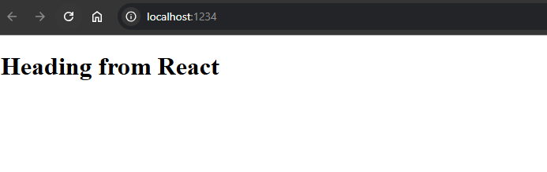
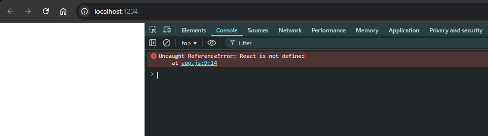
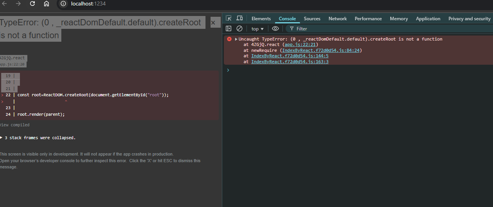
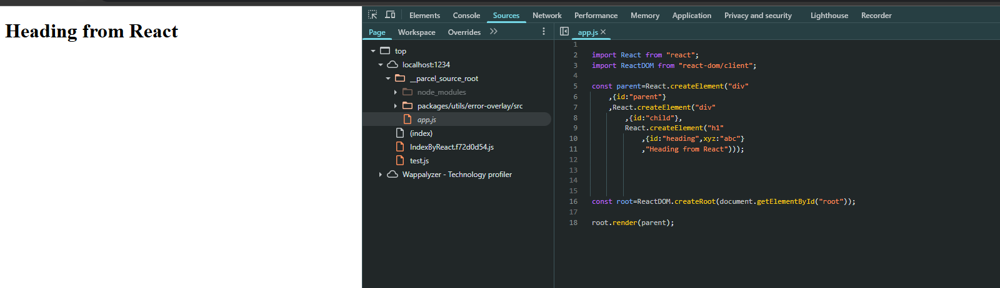

# Ep-2 Igniting Our App

is the code we have written ready to push to production? we do not wnt unneccessary comments!!
I want to bundle up file ,compress them and optimize the files before going to production!!

We will create `create React app` fom where all the production ready React application comes!!

React alone cannot make production ready app !! There are a lot of other things we need to make our application fast!!

## npm (Node package manager)

npm does not stands for node package manager!
Node pacakge manager is not abbreviation for npm!!
! `On official website ,it is everything except Node pacakge manager!!` 

>Note:npm does not have full form !!

`npm manages packages but it has no full form!!`

npm is standard repository for standard repository!!Any pacakge you want to include in project can be imported from npm!!

`create react app` already has npm in it!!

In code we have ex2 of previous class  let us do ,`npm init` on that!!

>Note"do not do `npm init -y` as it will skip a lot of things !!

```sh
PS C:\Users\user\Desktop\Programs\MERN-stack\Namaste React\Ep-2 Igniting Our App\Code\ex2nestedElements> npm init
This utility will walk you through creating a package.json file.
It only covers the most common items, and tries to guess sensible defaults.

See `npm help init` for definitive documentation on these fields
and exactly what they do.

Use `npm install <pkg>` afterwards to install a package and
save it as a dependency in the package.json file.

Press ^C at any time to quit.
package name: (ex2nestedelements) namasteProject
Sorry, name can no longer contain capital letters.
package name: (ex2nestedelements) namaste_project
version: (1.0.0)                                                                                                                                                                                                                    
description: first project                                                                                                                                                                                                          
entry point: (app.js)                                                                                                                                                                                                               
test command: jest                                                                                                                                                                                                                  
git repository:                                                                                                                                                                                                                     
keywords: namaste project
author: Mohit                                                                                                                                                                                                                       
license: (ISC)                                                                                                                                                                                                                      
About to write to C:\Users\user\Desktop\Programs\MERN-stack\Namaste React\Ep-2 Igniting Our App\Code\ex2nestedElements\package.json:

{
  "name": "namaste_project",
  "version": "1.0.0",
  "description": "first project",
  "main": "app.js",
  "scripts": {
    "test": "jest"
  },
  "keywords": [
    "namaste",
    "project"
  ],
  "author": "Mohit",
  "license": "ISC"
}


Is this OK? (yes) y

```

Then we see package.json is created

```json

{
  "name": "namaste_project",
  "version": "1.0.0",
  "description": "first project",
  "main": "app.js",
  "scripts": {
    "test": "jest"
  },
  "keywords": [
    "namaste",
    "project"
  ],
  "author": "Mohit",
  "license": "ISC"
}

```
This is what we have given!!

>Note: package.json is configuration for npm!! It has dependencies and their version used in project!! Like we have pom.xml in springboot!! npm manages all thos dependencies!!

Most iportant pacakge inside Project is Bundler

## Bundler

bundler helps to structure our app, bundles the app ,pacakges app so that is shipped to production eg webPack ,vite,parcel etc, They all do same thing but may use different algorithm to do it!!

`create React app uses WebPack bundler`


We use parcel for now!!

after `npm install parcel` we see pacakge.jso change as

```json

{
  "name": "namaste_project",
  "version": "1.0.0",
  "description": "first project",
  "main": "app.js",
  "scripts": {
    "test": "jest"
  },
  "keywords": [
    "namaste",
    "project"
  ],
  "author": "Mohit",
  "license": "ISC",
  "dependencies": {
    "parcel": "^2.15.2"
  }
}

```

see parcel dependency and version added!! see Sign ^ this is called as caret, you can even use tilda here!!

- caret(^) menas automatically update the package to a new minor version!!
-  tilda(~) menas automatically update the package to a new major version!!
- If you do not need any update just do not put any of symbols!!

>Note: Recommended to use caret as we need to update to inor updates!!

there are 2 dependencies for App 
1. Dev dependency - required for development!!
2. Normal depedency - used in depedency too!!

`npm install -D parcel` --> tells we want parcel to be in Dev dependency!!

- we have another file over here package-lock.json!!what is pacakge-lock.json??

package.json we know is configuration file!!

pacakge-lock.json have exact version of pacakge which is used!! It put a lock on that version!!

in pacakge-lock.json seacrh parcel!!
```json
    "node_modules/@parcel/bundler-default": {
      "version": "2.15.2",
      "resolved": "https://registry.npmjs.org/@parcel/bundler-default/-/bundler-default-2.15.2.tgz",
      "integrity": "sha512-k0psV7OZYs1g6jcJweBjINVZaVTcfFr6PuCQr28biZ85qbc70f5pWzCzY963+dF3XO/QwTzDABZsJUiDf5jPfQ==",
      "license": "MIT",
      "dependencies": {
        "@parcel/diagnostic": "2.15.2",
        "@parcel/graph": "3.5.2",
        "@parcel/plugin": "2.15.2",
        "@parcel/rust": "2.15.2",
        "@parcel/utils": "2.15.2",
        "nullthrows": "^1.1.1"
      },
      "engines": {
        "node": ">= 16.0.0",
        "parcel": "^2.15.2"
      },
      "funding": {
        "type": "opencollective",
        "url": "https://opencollective.com/parcel"
      }
    },

```

package.json have approx version ,pacakge-lock.json have exact version!!

see 3rd key integrity , it is hash !! you seen people saying working in local but not on production ,yes??

so package-lock.json makes sure that both local and production have same thing!!

Then we have node_modules folder!!

## Node_modules 

it has all code we fetch from npm !! It has all dependencies we needed !!


node_modules is very heavy folder!! We have included only parcel as dependency!!what are other folders??

this might be dependencies of parcel which needs more dependncies and so on trasitive dependencies!!Every dependency will have its own package.json so from there it will get it's transitive dependency!!

>Note:We do not put thses node modules on git and on production so we put them in gitIgnore!!

we put package.json and package-lock.json on git as they have dependencies!!package-lock.json has all dependency list even transitive ones!! so we put both on git !! and these both can regeneate node_modules!!
we can get them all by `npm install`!!

>Note: whatever you can regeenerate do not put on git

now we will `ignite our app` by command `npx parcel index.html`

```sh
PS C:\Users\user\Desktop\Programs\MERN-stack\Namaste React\Ep-2 Igniting Our App\Code\ex2nestedElements> npx parcel indexByReact.html
Server running at http://localhost:1234
√ Built in 16ms


```



parcel has ccreated a server for us and host our application on that !!

>npx means executing a pacakge !!npx parcel means execute parcel !! 

One wasy to install React by CDN on project !!as we need to give network call to CDn to get react!! Also for each version upgrade of react need to update CDN link!!

Another way is `npm install React` as React is a node package!! so we will have react dependency in package.json!! also version will be upgraded by npm only!! do not put `-D` here as we need react in normal dependency!!

we used the command 

```json 
{
  "name": "namaste_project",
  "version": "1.0.0",
  "description": "first project",
  "scripts": {
    "test": "jest"
  },
  "keywords": [
    "namaste",
    "project"
  ],
  "author": "Mohit",
  "license": "ISC",
  "dependencies": {
    "parcel": "^2.15.2",
    "react": "^19.1.0"
  }
}

```
 >Note: we have removed `  "main": "app.js",` from above json !! as that is not needed with parcel!!we tell what is main file when running the application !! If you not do this then error will come up!!

see here we put react 19 in project!!Can see in package-lock.json too!!Now lwt us install react-dom!!
use command `npm install react-dom`

```json
{
  "name": "namaste_project",
  "version": "1.0.0",
  "description": "first project",
  "scripts": {
    "test": "jest"
  },
  "keywords": [
    "namaste",
    "project"
  ],
  "author": "Mohit",
  "license": "ISC",
  "dependencies": {
    "parcel": "^2.15.2",
    "react": "^19.1.0",
    "react-dom": "^19.1.0"
  }
}
```
>Note: sometimes people `npm i <package-name>` ,i is small form of install just!!


Now we removed CDN links and run `npx parcel index.html`

now we run out app!!



we need to import 

```javascript

import React from "react";
import ReactDOM from "react-dom";
```

the "react" and "react-dom" are folders inside the node-modules so these are dependencies!!

then on run we got this error 

```sh
× Build failed.

@parcel/transformer-js: Browser scripts cannot have imports or exports.

  C:\Users\user\Desktop\Programs\MERN-stack\Namaste React\Ep-2 Igniting Our App\Code\ex2nestedElements\app.js:8:1
     7 | // </div>
  >  8 | import React from "react";
  >    | ^^^^^^^^^^^^^^^^^^^^^^^^^^
     9 | 
    10 | const parent=React.createElement("div"
  
  C:\Users\user\Desktop\Programs\MERN-stack\Namaste React\Ep-2 Igniting Our App\Code\ex2nestedElements\IndexByReact.html:8:1
     7 |   <div id="root"></div>
  >  8 |   <script src="app.js"></script>
  >    | ^ The environment was originally created here
     9 | 
    10 |   </body>

  ℹ Add the type="module" attribute to the <script> tag.
  ℹ Learn more: https://parceljs.org/languages/javascript/#classic-scripts
```
The `app.js` is treated as Browser-scripts , Browser is thinking js is normal JS ans normal JS does not have import statement so we need to tell that app.js is a module type

The error you're seeing is caused because your JavaScript file (app.js) uses ES module syntax (i.e., import React from "react";), but your HTML is loading it as a classic script using:
```html
<script src="app.js"></script>
```
Classic scripts do not support import or export statements.

✅ Solution: `Use type="module" in the script tag`

To enable ES module syntax, update your script tag in the HTML file like this:
```html
<script type="module" src="app.js"></script>
```

but see stil getting error!!


need to put actually 

```javascript

import React from "react";
import ReactDOM from "react-dom/client";
```

now working 



>Note :With parcel builds are vry fast!! When we do production build parcel will bundle and minify and optimize our file and compress it too so that we can deploy them on prd!! So react is not only thing making application fast ,Bundler also do many things!! There is file watching algo where if you chnage file build automatically happens!!

Parcel is also not doing everything own it's own ,it has various dependencies who do that!!

Parcel uses Consistent hashing!!

Parcel is also doing Diffrential Bundling!!IF will make you are websit compatible with old browsers!!


`Parcel automatically produces a <script type="module"> with modern JavaScript syntax, as well as a fallback <script nomodule> for older browsers when necessary. This reduces bundle sizes for a majority of users by avoiding transpilation of features like classes, async/await, and more. See Differential bundling in the Targets documentation for more details.`


 Parcel also gives feature to try to host over https!! just do `parcel src/index.html --https`


can see documenatation here --> https://parceljs.org/docs/

Parcel do tree shaking too (it removes usused code for you)!!

Parcel have different build for dev nd prod !!

Parcel’s production mode automatically bundles and optimizes your application for production. It can be run using the parcel build command:

`npx parcel build src/index.html`

## dist folder

dist is  automatically generated folder during build having build files!! all the hosted webpage comes from dist folder!! so from dist the website is hosted!!

it has one html ,css, js file!! These are just main files !!! these 3 files are the files having compresed code in just one line!!

parcel_cache is automatically generated too!! so we do not put that in git!! As we can regenerate it!! as we will run all commands on server!!

#### what is hot module Replacement(HMR)?this is we do in next class!!

to make your app compatabile with older versions ,you can use browser list(another npm package)!!

in package.json you need to tell browser list!!!!!

You need to give list!! In list of browser you provided it will definitely work but for other it may or may not work!!


link -->https://browsersl.ist/#q=%3E+0.2%25+and+not+dead

to check verion coverage of differnt browsers!!

Government website should have 99 percent of browser coverage but webaite for developer can cover latest version only as devleopers use latest browsers!! 

`React just only makes application faster ,it uses many other things like Bundler`

This is all inside a create React app or vite etc!!