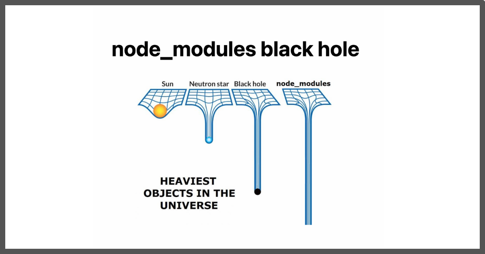

# Ep-2 Igniting Our App

is the code we have written ready to push to production? we do not wnt unneccessary comments!!
I want to bundle up file ,compress them and optimize the files before going to production!!

We will create `create React app` fom where all the production ready React application comes!!

React alone cannot make production ready app !! There are a lot of other things we need to make our application fast!!

## npm (Node package manager)

npm does not stands for node package manager!! `On official website ,it is everything except Node pacakge manager!!` 

>Note:npm does not have full form !!

`npm manages packages but it has no full form!!`

npm is standard repository for standard repository!!Any pacakge you want to include in project can be imported from npm!!

`create react app` already has npm in it!!

In code we have ex2 of previous class  let us do ,`npm init` on that!!

>Note"do not do `npm init -y` as it will skip a lot of things !!

```sh
PS C:\Users\user\Desktop\Programs\MERN-stack\Namaste React\Ep-2 Igniting Our App\Code\ex2nestedElements> npm init
This utility will walk you through creating a package.json file.
It only covers the most common items, and tries to guess sensible defaults.

See `npm help init` for definitive documentation on these fields
and exactly what they do.

Use `npm install <pkg>` afterwards to install a package and
save it as a dependency in the package.json file.

Press ^C at any time to quit.
package name: (ex2nestedelements) namasteProject
Sorry, name can no longer contain capital letters.
package name: (ex2nestedelements) namaste_project
version: (1.0.0)                                                                                                                                                                                                                    
description: first project                                                                                                                                                                                                          
entry point: (app.js)                                                                                                                                                                                                               
test command: jest                                                                                                                                                                                                                  
git repository:                                                                                                                                                                                                                     
keywords: namaste project
author: Mohit                                                                                                                                                                                                                       
license: (ISC)                                                                                                                                                                                                                      
About to write to C:\Users\user\Desktop\Programs\MERN-stack\Namaste React\Ep-2 Igniting Our App\Code\ex2nestedElements\package.json:

{
  "name": "namaste_project",
  "version": "1.0.0",
  "description": "first project",
  "main": "app.js",
  "scripts": {
    "test": "jest"
  },
  "keywords": [
    "namaste",
    "project"
  ],
  "author": "Mohit",
  "license": "ISC"
}


Is this OK? (yes) y

```

Then we see package.json is created

```json

{
  "name": "namaste_project",
  "version": "1.0.0",
  "description": "first project",
  "main": "app.js",
  "scripts": {
    "test": "jest"
  },
  "keywords": [
    "namaste",
    "project"
  ],
  "author": "Mohit",
  "license": "ISC"
}

```
This is what we have given!!

>Note: package.json is configuration for npm!! It has dependencies and their version used in project!! Like we have pom.xml in springboot!! npm manages all thos dependencies!!

Most iportant pacakge inside Project is Bundler

## Bundler

bundler helps to structure our app, bundles the app ,pacakges app so that is shipped to production eg webPack ,vite,parcel etc, They all do same thing but may use different algorithm to do it!!

`create React app uses WebPack bundler`


We use parcel for now!!

after `npm install parcel` we see pacakge.jso change as

```json

{
  "name": "namaste_project",
  "version": "1.0.0",
  "description": "first project",
  "main": "app.js",
  "scripts": {
    "test": "jest"
  },
  "keywords": [
    "namaste",
    "project"
  ],
  "author": "Mohit",
  "license": "ISC",
  "dependencies": {
    "parcel": "^2.15.2"
  }
}

```

see parcel dependency and version added!! see Sign ^ this is called as caret, you can even use tilda here!!

- caret(^) menas automatically update the package to a new minor version!!
-  tilda(~) menas automatically update the package to a new major version!!

>Note: Recommended to use caret as we need to update to inor updates!!

there are 2 dependencies for App 
1. Dev dependency - required for development!!
2. Normal depedency - used in depedency too!!

`npm install -D parcel` --> tells we want parcel to be in Dev dependency!!

- we have another file over here package-lock.json!!what is pacakge-lock.json??

package.json we know is configuration file!!

pacakge-lock.json have exact version of pacakge which is used!! It put a lock on that version!!

in pacakge-lock.json seacrh parcel!!
```json
    "node_modules/@parcel/bundler-default": {
      "version": "2.15.2",
      "resolved": "https://registry.npmjs.org/@parcel/bundler-default/-/bundler-default-2.15.2.tgz",
      "integrity": "sha512-k0psV7OZYs1g6jcJweBjINVZaVTcfFr6PuCQr28biZ85qbc70f5pWzCzY963+dF3XO/QwTzDABZsJUiDf5jPfQ==",
      "license": "MIT",
      "dependencies": {
        "@parcel/diagnostic": "2.15.2",
        "@parcel/graph": "3.5.2",
        "@parcel/plugin": "2.15.2",
        "@parcel/rust": "2.15.2",
        "@parcel/utils": "2.15.2",
        "nullthrows": "^1.1.1"
      },
      "engines": {
        "node": ">= 16.0.0",
        "parcel": "^2.15.2"
      },
      "funding": {
        "type": "opencollective",
        "url": "https://opencollective.com/parcel"
      }
    },

```

package.json have approx version ,pacakge-lock.json have exact version!!

see 3rd key integrity , it is hash !! you seen people saying working in local but not on production ,yes??

so package-lock.json makes sure that both local and production have same thing!!

Then we have node_modules folder!!

## Node_modules 

it has all code we fetch from npm !! It has all dependencies we needed !!



node_modules is very heavy folder!! We have included only parcel as dependency!!what are other folders??

this might be dependencies of parcel which needs more dependncies and so on trasitive dependencies!!