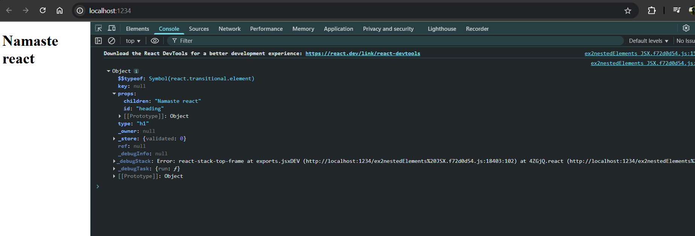

# Ep-3 laying the foundation!!

Previously we have use `npx parcel <html-file>` to run in development build and hosted on localhost !!

npx parcel --> executing a npm package parcel with index.html!!

we will create npm scripts to run react program in package.json instead of writing `npx parcel ` again and again!!

we change our filename to run to index.html and provide scripts in package.json

```json
{
  "name": "namaste_project",
  "version": "1.0.0",
  "description": "first project",
  "scripts": {
    "start": "parcel index.html",
    "runprd": "parcel build index.html",
    "test": "jest"
  },
  "keywords": [
    "namaste",
    "project"
  ],
  "author": "Mohit",
  "license": "ISC",
  "dependencies": {
    "parcel": "^2.15.2",
    "react": "^19.1.0",
    "react-dom": "^19.1.0"
  }
}
```

now in company if you do not know how to run project go to package.json and there you find scripts and there you see command to run code!!

to run script use `npm run <script-name>`

>Note: If you script-name is `start` then can use `npm start` directly ,only for start script!!

>Note :React.createElement does not return html element ,it returns REact element which is object which when rendered over DOM becomes HTML element!!

>Note: for root we create root by ReactDOM !! from here DOM comes into picture!!

>Note: `root.render` takes the react element , converts it to html and put to browser by replacing content inside div id=root!!`It will replace not append`!!

Sometimes people initially put `Not rendered` inside div so that id React is unable to render they can see not rendered over screen!!

React.createElement() is not a good way!!It is very Clumsy !! So FB developers created JSX!! JSX is not a part of React!! React is different and JSX is different!! React application can be written without JSX!!

## JSX

Befor JSX ,we used to have Html ,Css and JS !! JSX makes Html and JS in one file!!

```javascript
let jsxHeading=<h1>Namaste react</h1>
```
This is valid JS syntax !!

JSX is not like HTML inside JS ,JSX is HTMl like syntax!!

This piece of code returns React element !! JSX is just syntax!!

```js

let jsxHeading=<h1 id="heading">Namaste react</h1>

console.log(jsxHeading);

const root=ReactDOM.createRoot(document.getElementById("root"));

root.render(jsxHeading);
```

```html
<!DOCTYPE html>
<html>
  <head>

  </head>
  <body>
  <div id="root"></div>
  <script type="module" src="app.js"></script>

  </body>
</html>


```

see the log statement 



returning object!!That is React Element!!

Js engine doesn't understand JSX !! but we write JSX inside js file!! JS engine understand Ecmascript(ES6)!! Browser does not understand JSX !! can try writing in console and can see error!!

Parcel is doing job behind the scenes!!Before going to JS engine code is transpiled (converted) before going to JS engine!! JS engine receive code which browser can understand!!

Parcel do not do the transpiling it self ,it has depedency called Babel!!


## Babel


