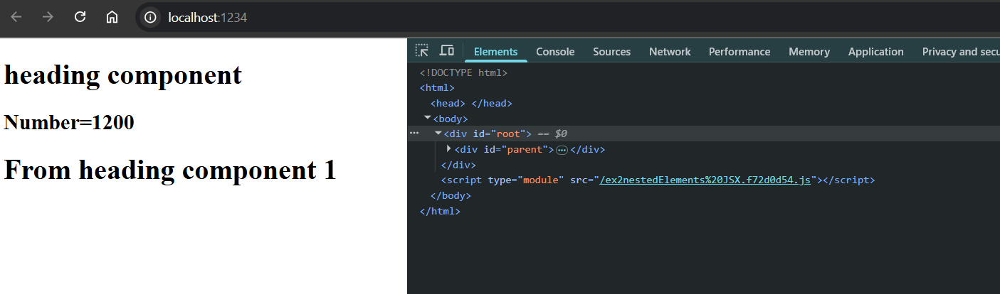
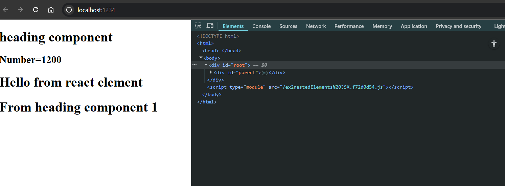
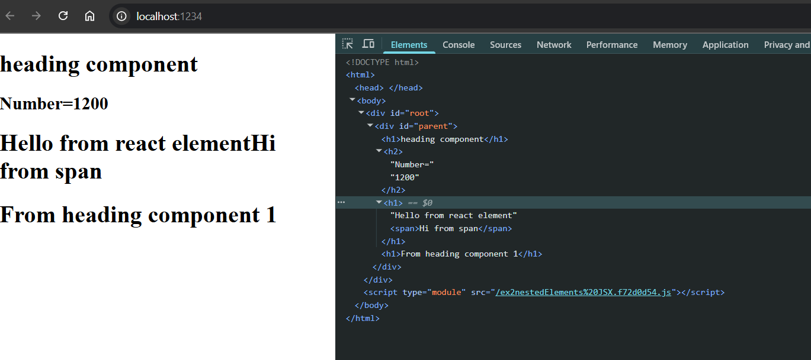

# Ep-3 laying the foundation!!

Previously we have use `npx parcel <html-file>` to run in development build and hosted on localhost !!

npx parcel --> executing a npm package parcel with index.html!!

we will create npm scripts to run react program in package.json instead of writing `npx parcel ` again and again!!

we change our filename to run to index.html and provide scripts in package.json

```json
{
  "name": "namaste_project",
  "version": "1.0.0",
  "description": "first project",
  "scripts": {
    "start": "parcel index.html",
    "runprd": "parcel build index.html",
    "test": "jest"
  },
  "keywords": [
    "namaste",
    "project"
  ],
  "author": "Mohit",
  "license": "ISC",
  "dependencies": {
    "parcel": "^2.15.2",
    "react": "^19.1.0",
    "react-dom": "^19.1.0"
  }
}
```

now in company if you do not know how to run project go to package.json and there you find scripts and there you see command to run code!!

to run script use `npm run <script-name>`

>Note: If you script-name is `start` then can use `npm start` directly ,only for start script!!

>Note :React.createElement does not return html element ,it returns REact element which is object which when rendered over DOM becomes HTML element!!

>Note: for root we create root by ReactDOM !! from here DOM comes into picture!!

>Note: `root.render` takes the react element , converts it to html and put to browser by replacing content inside div id=root!!`It will replace not append`!!

Sometimes people initially put `Not rendered` inside div so that id React is unable to render they can see not rendered over screen!!

React.createElement() is not a good way!!It is very Clumsy !! So FB developers created JSX!! JSX is not a part of React!! React is different and JSX is different!! React application can be written without JSX!!

## JSX

Befor JSX ,we used to have Html ,Css and JS !! JSX makes Html and JS in one file!!

```javascript
let jsxHeading=<h1>Namaste react</h1>
```
This is valid JS syntax !!

JSX is not like HTML inside JS ,JSX is HTMl like syntax!!

This piece of code returns React element !! JSX is just syntax!!

```js

let jsxHeading=<h1 id="heading">Namaste react</h1>

console.log(jsxHeading);

const root=ReactDOM.createRoot(document.getElementById("root"));

root.render(jsxHeading);
```

```html
<!DOCTYPE html>
<html>
  <head>

  </head>
  <body>
  <div id="root"></div>
  <script type="module" src="app.js"></script>

  </body>
</html>


```

see the log statement 


returning object!!That is React Element!!

Js engine doesn't understand JSX !! but we write JSX inside js file!! JS engine understand Ecmascript(ES6)!! Browser does not understand JSX !! can try writing in console and can see error!!

Parcel is doing job behind the scenes!!Before going to JS engine code is transpiled (converted) before going to JS engine!! JS engine receive code which browser can understand!!

Parcel do not do the transpiling it self ,it has depedency called Babel!!


## Babel

Babel is JS compiler or transpiler takes JSX code and converts to JS code that browser understand!!


#### JSX code is converted to React.createElement first then it returns Object which is rendered as HTML by DOM!! so that's why when we log it gives same object as of React.createElement!!`Babel converts this JSX to React.createElement .` Now React understand code properly!!

https://babeljs.io/

Can see above link how code is converetd by babel!!


see the conversion!! Some old browser does not understand ES6 so Babel converts this ES6 to a lanaguage that old browser can understand!!

Read it's documentation and it do a lot of things!! Another important package after parcel!!

can say Babel is transpiler tooo!It reads one by one each character (token) and construct a abstarct syntax tree and do conversion!!


```js
let jsxHeading=<h1 id="heading">Namaste react</h1>
```
>Note:This is not HTML as see in JSX to give class we need to give className not class!! so JSX is HTML like sytax,for attributes in JSX we use CamelCase!!

In JSX (JavaScript XML, used in React), the `` tag works similarly to HTML, with a few small differences due to JSX syntax rules:

Basic Example
```jsx

```
- className instead of class
```jsx

```
- Attributes are camelCase:onClick, onLoad, etc.

Example:
```jsx

```
- Self-closing Tag: If you don't include children (which `` never has), always self-close:

Example:
```jsx

```
- Dynamic src with JS expressions:
Example:
```jsx
const imageUrl = "/images/photo.jpg";

```

- Importing images in React (e.g., with Webpack):

Example:
```jsx
import logo from './logo.png';

```

If JSX is in multiple lines ,then use JSX inside `{}`!! 

## React components

1. Class based components (old way)(uses JS classes)
2. Functional Components (new way)(we will use this only)(uses JS functions)


Functional Component --> normal JS function returns some piece of JSX!!
>Note: must start with captital letter

```jsx
const HeadingComponent=()=>{
    return <h1>hi bro</h1>;
}

```
Again see Note
>Note:
If JSX is in multiple lines ,then use JSX inside `{}`!! 

JSX is react element so can say Functional compoenent `is a function returns React element!!`

```jsx
const HeadingComponent=()=>{
     <h1>hi bro</h1>;
}

```
 we no need to write keyword `return`!!Like above!!

Another syntax for one liners is below 

```jsx
const HeadingComponent1=()=><h1>hi bro</h1>;
```

now can we do something like this 

```jsx
root.render(HeadingComponent);
```
no render takes React element not Functionla component!! we use syntax as below for `functional Component`

#### Syntax:
```jsx
root.render(<HeadingComponent/>);
```

#### Program
```jsx

const HeadingComponent=()=>{
    return <h1>hi bro</h1>;
}

const root=ReactDOM.createRoot(document.getElementById("root"));

root.render(<HeadingComponent/>);
```

#### Output 


### Using one component inside other!!

```jsx

const HeadingComponent=()=>{
    return <h1>heading component</h1>;
}

const HeadingComponent1=()=>{
     return (
         <div id="parent">
            <HeadingComponent/>
            <h1>From heading component 1</h1>
        </div>
     );

}


const root=ReactDOM.createRoot(document.getElementById("root"));

root.render(<HeadingComponent1/>);

```

#### do not write as below 

```jsx
const HeadingComponent1 = () => {
    <div id="parent">
        <HeadingComponent/>
        <h1>From heading component 1</h1>
    </div>
}
```
JSX inside the curly braces {} needs to be explicitly returned.

#### Below one is ok 

```jsx
const HeadingComponent1=()=>(
         <div id="parent">
            <HeadingComponent/>
            <h1>From heading component 1</h1>
        </div>
     )

```
so around Only JSX we put `()`
### Output 


Babel transpile all React Component ,Browser does not care about Components!!

### Component Composition is above ,component inside component!!Composing two componnets into one another!!

we can write normal function too!!Not manadatory to use arrow function!!

```jsx

const HeadingComponent=()=>{
    return <h1>heading component</h1>;
}

const HeadingComponent1=function() {
    return( <div id="parent">
        <HeadingComponent/>
        <h1>From heading component 1</h1>
    </div>);
}

```

But below one is wrong !!

```jsx

const HeadingComponent=()=>{
    return <h1>heading component</h1>;
}

const HeadingComponent1=function() {
    return
    ( <div id="parent">
        <HeadingComponent/>
        <h1>From heading component 1</h1>
    </div>);
}

```
as here the jsx is unreachable and we are returning nothing!!as we have put JSX bracket in next line!!


Inside JSX you can put `{}` and that can run any JS code!!so that why we say JSX is mix of JS and HTML or JSX is having HTML like syntax


```jsx
let number=12;


const HeadingComponent=()=>{
    return <h1>heading component</h1>;
}

const HeadingComponent1=function() {
    return( <div id="parent">
        <HeadingComponent/>
        <h2>Number={number*100}</h2>
        <h1>From heading component 1</h1>
    </div>);
}


const root=ReactDOM.createRoot(document.getElementById("root"));

root.render(<HeadingComponent1/>);
```

#### Output 



even console.log() works ,as soon as code is executed!!So can be used with `{}`


### React element inside component!!

We know react element is normal JS variable!!

```jsx
import ReactDOM from "react-dom/client";

let number=12;

const titled=(
    <h1>Hello from react element</h1>
)

const HeadingComponent=()=>{
    return <h1>heading component</h1>;
}

const HeadingComponent1=function() {
    return( <div id="parent">
        <HeadingComponent/>
        <h2>Number={number*100}</h2>
        {titled}
        <h1>From heading component 1</h1>
    </div>);
}


const root=ReactDOM.createRoot(document.getElementById("root"));

root.render(<HeadingComponent1/>);
```

#### Output 



Frontend just see everything on screen, We know how java is!! It is terrible ,backend !! 

### React element inside React element !!

```jsx
import ReactDOM from "react-dom/client";

let number=12;

const spanTag=<span>Hi from span</span>

const titled=(
    <h1>Hello from react element{spanTag}</h1>
)

const HeadingComponent=()=>{
    return <h1>heading component</h1>;
}

const HeadingComponent1=function() {
    return( <div id="parent">
        <HeadingComponent/>
        <h2>Number={number*100}</h2>
        {titled}
        <h1>From heading component 1</h1>
    </div>);
}


const root=ReactDOM.createRoot(document.getElementById("root"));

root.render(<HeadingComponent1/>);

```

#### Output 



Can see span tag in Html!!

### Component inside React Element!!

let us see wrong one first 

```jsx
const HeadingComponent=()=>{
    return <h1>heading component</h1>;
}

// const HeadingComponent1=function() {
//     return( <div id="parent">
//         <HeadingComponent/>
//         <h2>Number={number*100}</h2>
//         {titled}
//         <h1>From heading component 1</h1>
//     </div>);
// }

const titled1=(
    <h1>Hello from react element{spanTag}</h1>
    <HeadingComponent/>
);
```

is invalid JSX because:

- JSX expressions must return one single parent element.

- You're returning two sibling elements without a wrapper.

valid one 

```jsx
const HeadingComponent=()=>{
    return <h1>heading component</h1>;
}

// const HeadingComponent1=function() {
//     return( <div id="parent">
//         <HeadingComponent/>
//         <h2>Number={number*100}</h2>
//         {titled}
//         <h1>From heading component 1</h1>
//     </div>);
// }

const titled1=(
    <div>
        <h1>Hello from react element{spanTag}</h1>
        <HeadingComponent/>
    </div>
);

const root=ReactDOM.createRoot(document.getElementById("root"));

root.render(titled1);

```

>Note : do not put div insde h1 !! h1 ,h2,h3,h4,h5,h6 are for headings!!
## Cross Site Scripting
If suppose data is coming from API!!now API is giving some bad data!!now data coming in is executed in JS code so it will be executed!! so whatever API is sending we are running code!!
This attack is called as `Cross Site Scripting`. It is like running JS written by attcker on client !! So it can steal cookies and much more personal info!!

JSX takes care of these Attacks, JSX can escape it!!JSX sanitises the data and then run it!!so feel free to use JSX!! `nobody can do malicious attack!!`

also one more thing

## Some Examples
below both code (code1 and code2 and code3)are same!!

#### code 1

```jsx
const HeadingComponent=()=>{
    return <h1>heading component</h1>;
}

const titled1=(
    <div>
        <h1>Hello from react element{spanTag}</h1>
        <HeadingComponent/>
    </div>
);
```
#### code 2

```jsx
const HeadingComponent=()=>{
    return <h1>heading component</h1>;
}

const titled1=(
    <div>
        <h1>Hello from react element{spanTag}</h1>
        <HeadingComponent> </HeadingComponent>
    </div>
);
```
Later episodes we will se use of both ways!!

there is one more way As HeadingComponent is a function so we can call like function

#### code 3

```jsx
const HeadingComponent=()=>{
    return <h1>heading component</h1>;
}

const titled1=(
    <div>
        <h1>Hello from react element{spanTag}</h1>
        {HeadingComponent()}
    </div>
);
```
All 3 ways are doing same thing!!

>Note:JSX is making code readble not React as we know REact.createElement works ,it is terrible!!
