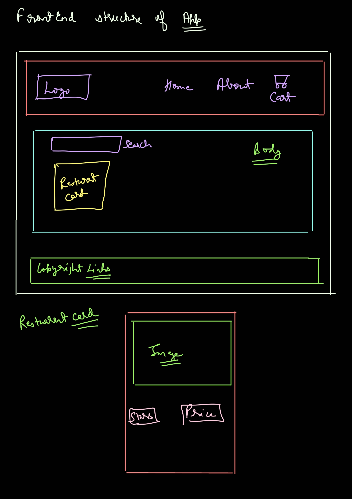

# Ep-4 show me code

We are going to make food ordering app  like swiggy ,zomato!!

Planning needs to be done before building any app!!Do not blindly write code!

1. How app should look like???

This is how our app gonna look like!! This is how we plan structure first!! 

2. components we can have ,we can have 3 major components : header ,body ,footer!!Further Header can have logo ,nav items(Ahome ,about us ,cart)!! Then body we have search , then we will have card container so we have Retuarant container inside that we have Retuarant card !! Then at footer we have copyright ,links ,Adresss and contact !!

so now let us create vite app in code section!! as using intellij idea ultimate!!It creates gitignore fiel too for itself!!

