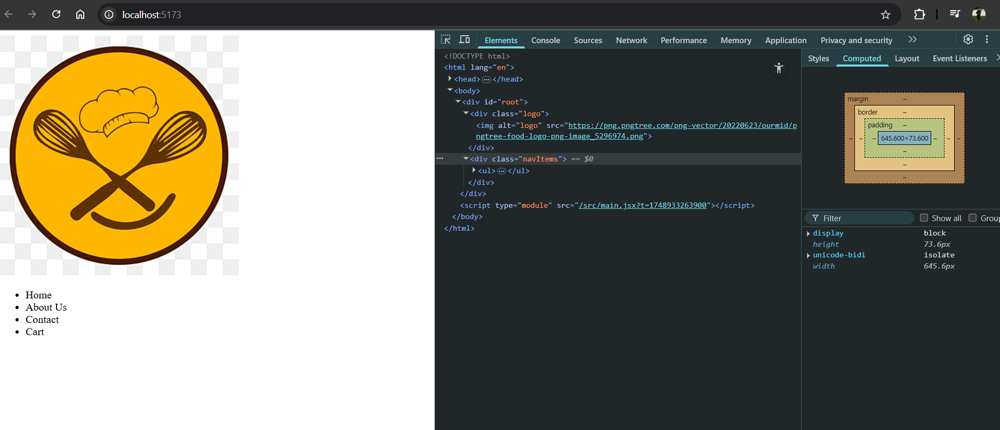
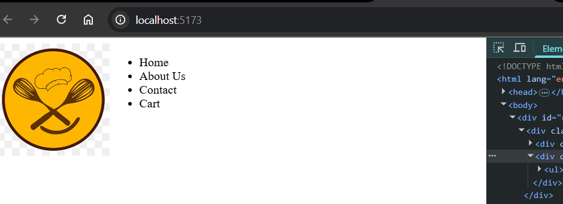
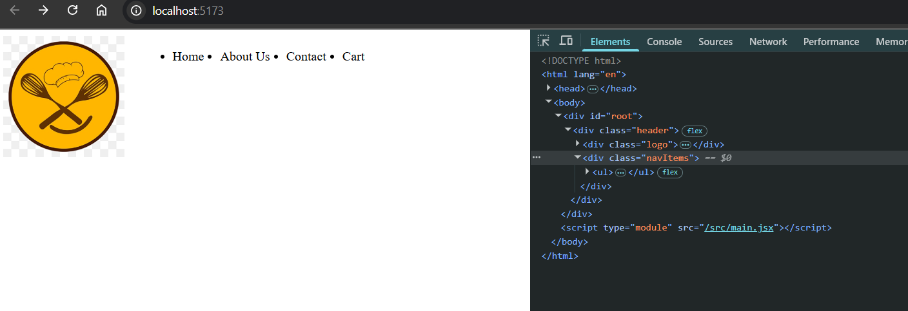
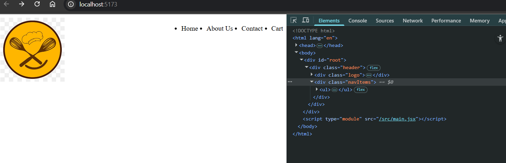
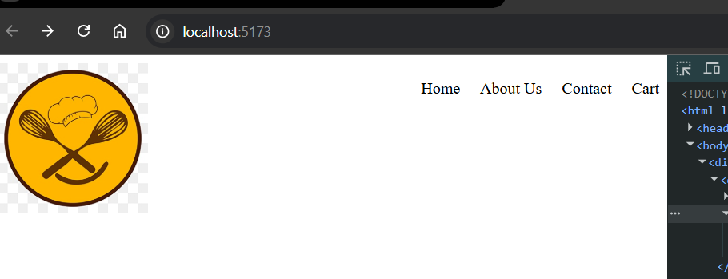
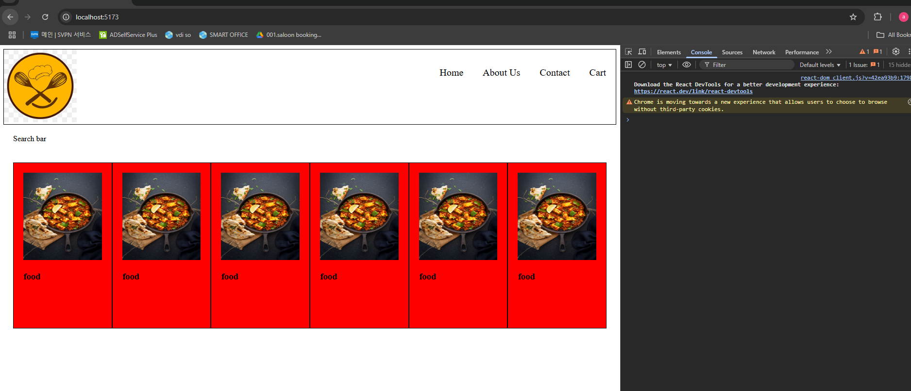
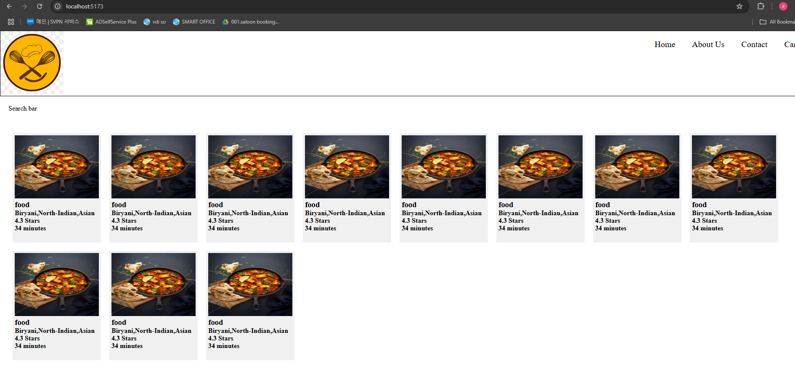
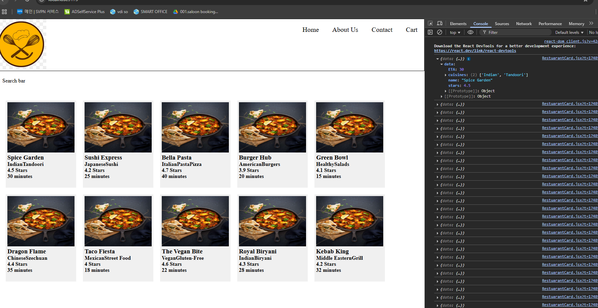
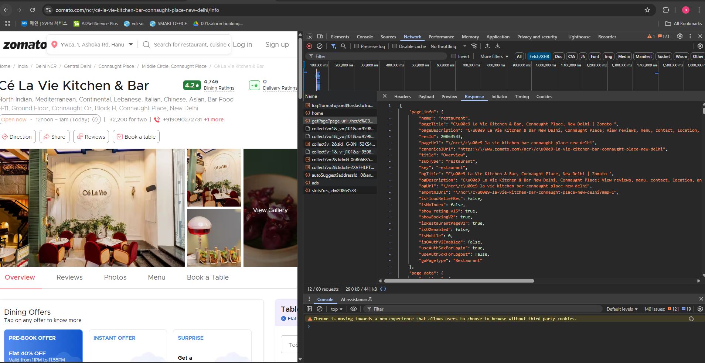

# Ep-4 show me code

We are going to make food ordering app  like swiggy ,zomato!!

Planning needs to be done before building any app!!Do not blindly write code!

1. How app should look like???


This is how our app gonna look like!! This is how we plan structure first!! 

2. components we can have ,we can have 3 major components : header ,body ,footer!!Further Header can have logo ,nav items(Ahome ,about us ,cart)!! Then body we have search , then we will have card container so we have Retuarant container inside that we have Retuarant card which has name of restuarant ,star-rating,cuisine,delivery-date !! Then at footer we have copyright ,links ,Adresss and contact !!

so now let us create vite app in code section!! as using intellij idea ultimate!!It creates gitignore file too for itself!!


### App

```jsx
import './App.css'

function App() {
  return (
    <>

    </>
  )
}

export default App
```
### main.jsx

```jsx
createRoot(document.getElementById('root')).render(
  <StrictMode>
    <App />
  </StrictMode>,
)

```

in main.jsx app is rendered to root!!

### index.html 

```html
<!doctype html>
<html lang="en">
  <head>
    <meta charset="UTF-8" />
    <link rel="icon" type="image/svg+xml" href="/vite.svg" />
    <meta name="viewport" content="width=device-width, initial-scale=1.0" />
    <title>Vite + React</title>
  </head>
  <body>
    <div id="root"></div>
    <script type="module" src="/src/main.jsx"></script>
  </body>
</html>

```

In index.html we have root this html page is rendered when you run app!!

Let us now build Header ,body,footer component!!

for a component remember structure 
1. lambda function 
2. export statement

1st created Header 

```jsx
const Header = () => {
    return (
        <>
            <div className="logo">
                
            </div>
            <div className="navItems">
              <ul>
                  <li>Home</li>
                  <li>About Us</li>
                  <li>Contact</li>
                  <li>Cart</li>
              </ul>
            </div>
        </>
    )
}

export default Header
```

#### output :



can see how html is rendred!! Let us add some CSS!!

```css
.header{
    display: flex;
}

.logo img{
    width: 150px;
}
```
#### output :


The below css not works and shifts nav-bar to left above image!!Instead of changing size of image!!
```css
.logo {
  width: 100px;
}
```

Is because you're trying to control the image size, but you're only setting the size of the container div, not the image itself.

- .logo targets the div that wraps the image.

- But unless you also tell the image inside .logo to scale based on that container (e.g., with width: 100%), the image will keep its original size.

Now make list items horizntal!!and add some margin else list-items will hit each other

```css
.header{
    display: flex;
}

.logo img{
    width: 150px;
}

.navItems > ul {
    display: flex;
}

.navItems > ul > li {
    margin-left: 20px;
}
```
#### Output:


Now make nav-bar on left !!

```css
.header{
    display: flex;
    justify-content: space-between;
}

.logo img{
    width: 150px;
}

.navItems > ul {
    display: flex;
}

.navItems > ul > li {
    margin-left: 20px;
}
```

#### Output: 



then remove dots from the list!!

so put 

```css
.navItems > ul {
    display: flex;
    list-style: none;
}

```

#### Output :



IN JSX we cannot put Inline CSS like we do in HTML !! we need to give it object!!
As It is an Object so need to put inside `{}`
```jsx
import './RestuarantCard.css';

const RestuarantCard = () => {

    let styleCard={
        backgroundColor: "red"
    }
    return (
        <div className="res-card" style={styleCard}>
            
            <h3>food</h3>
        </div>
    )
}

export default RestuarantCard;

```

This is how we give inline CSS



This is we writing CSS inside JS!!

>Note:Inline styles is not recommended way of styling!!

we can also give inside style directly!! see two `{}` 1st one tell inside we have JS and 2nd tell that this is object!!

#### Body
```jsx

const Body = () => {
    return (
        <div className="body">
            <div className="search-bar"> Search bar</div>
            <div className="res">
               <div className="card"><RestuarantCard/></div>
                <div className="card"><RestuarantCard/></div>
                <div className="card"><RestuarantCard/></div>
                <div className="card"><RestuarantCard/></div>
                <div className="card"><RestuarantCard/></div>
                <div className="card"><RestuarantCard/></div>
                <div className="card"><RestuarantCard/></div>
                <div className="card"><RestuarantCard/></div>
                <div className="card"><RestuarantCard/></div>
                <div className="card"><RestuarantCard/></div>
                <div className="card"><RestuarantCard/></div>
            </div>
        </div>
    )
};

export default Body;
```
#### Restuarant card
```jsx
import './RestuarantCard.css';

const RestuarantCard = () => {

    return (
        <div className="res-card" style={{
        backgroundColor: "red"
    }}>
            
            <h3>food</h3>
        </div>
    )
}

export default RestuarantCard;

```

now we can chnage color it will look better !!

```css
.res-card:hover{
    cursor: pointer;
    border: 1px solid black;
}
```

when cursor hover over card cursor change to pointer and border will appear!!



now card is static ,we want dynamic data!!We can use props for that we know!!

## Dynamic data to each card (props)

props means properties!!

We know functional component is normal JS function!!`like that props are normal arguments to that function!!`

React takes all the argument passed and put it in object and pass to that component!!
###### Way-1
```jsx

import RestuarantCard from "./RestuarantCard.jsx";
import './Body.css';

let resturants=[
    {
        "name": "Spice Garden",
        "cuisines": ["Indian", "Tandoori"],
        "stars": 4.5,
        "ETA": 30
    },
    {
        "name": "Sushi Express",
        "cuisines": ["Japanese", "Sushi"],
        "stars": 4.2,
        "ETA": 25
    },
    {
        "name": "Bella Pasta",
        "cuisines": ["Italian", "Pasta", "Pizza"],
        "stars": 4.7,
        "ETA": 40
    },
    {
        "name": "Burger Hub",
        "cuisines": ["American", "Burgers"],
        "stars": 3.9,
        "ETA": 20
    },
    {
        "name": "Green Bowl",
        "cuisines": ["Healthy", "Salads"],
        "stars": 4.1,
        "ETA": 15
    },
    {
        "name": "Dragon Flame",
        "cuisines": ["Chinese", "Szechuan"],
        "stars": 4.4,
        "ETA": 35
    },
    {
        "name": "Taco Fiesta",
        "cuisines": ["Mexican", "Street Food"],
        "stars": 4.0,
        "ETA": 18
    },
    {
        "name": "The Vegan Bite",
        "cuisines": ["Vegan", "Gluten-Free"],
        "stars": 4.6,
        "ETA": 22
    },
    {
        "name": "Royal Biryani",
        "cuisines": ["Indian", "Biryani"],
        "stars": 4.3,
        "ETA": 28
    },
    {
        "name": "Kebab King",
        "cuisines": ["Middle Eastern", "Grill"],
        "stars": 4.2,
        "ETA": 32
    }
];

const Body = () => {
    return (
        <div className="body">
            <div className="search-bar"> Search bar</div>
            <div className="res">
                {resturants.map((restaurant, index) => (
                    <div className="card" key={index}>
                        <RestuarantCard data={restaurant} />
                    </div>
                ))}

            </div>
        </div>
    )
};

export default Body;
```

Note: we use map function for looping in React!!

```jsx
const RestuarantCard = (props) => {
    console.log(props)
    let styleCard={
        backgroundColor: "#f0f0f0"
    }
    return (
        <div className="res-card" style={styleCard}>
            
            <h3>{props.data.name}</h3>
            <h4>{props.data.cuisines}</h4>
            <h4>{props.data.stars} Stars</h4>
            <h4>{props.data.ETA} minutes</h4>
        </div>
    )
}
```

This is how parsed!!

#### Output 



This was way-1  now let us see way -2 of destructuring !! Now we see putting list data here as can see above ,thhis below is how we pass

###### Way-2

```jsx

const Body = () => {
    return (
        <div className="body">
            <div className="search-bar"> Search bar</div>
            <div className="res">
                {resturants.map((restaurant, index) => (
                    <div className="card" key={index}>
                        <RestuarantCard
                            name={restaurant.name}
                            cuisines={restaurant.cuisines}
                            stars={restaurant.stars}
                            ETA={restaurant.ETA}
                        />
                    </div>
                ))}

            </div>
        </div>
    )
};

export default Body;

```
Now below can see how we recieve 

```jsx
const RestuarantCard = ({ name, cuisines, stars, ETA } ) => {

    let styleCard={
        backgroundColor: "#f0f0f0"
    }
    return (
        <div className="res-card" style={styleCard}>
            
            <h3>{name}</h3>
            <h4>{cuisines}</h4>
            <h4>{stars} Stars</h4>
            <h4>{ETA} minutes</h4>
        </div>
    )
}

export default RestuarantCard;
```

Jsx passed as object and we just destructured it!! even in way-1 can do 

```jsx
{ name, cuisines, stars, ETA }=props 
```

way-2 do it implicitly!!!


>Note:Generally we have alot of data in JSON so we pass whole data at once like we did in way-1 and get from props.data!!So what data you are getting you can see by logging that log(props) and fetch out whatever you want!!!

Also you can detructure .data

```jsx
const { name, cuisines, stars, ETA }=props?.data;

```


In the Network tab of your browser’s Developer Tools (DevTools), "Fetch/XHR" refers to network requests made by your web application to retrieve or send data asynchronously — typically to and from a server or API.

🔹 What are XHR and Fetch?
1. XHR (XMLHttpRequest)
- Older way to make network requests in JavaScript.

- Used heavily in legacy apps and libraries like jQuery.

- Verbose API.

2. Fetch
- Modern JavaScript API for making HTTP requests.

- Cleaner syntax, based on Promises.

- Preferred in modern React/JS apps.


🔹 In the Network → Fetch/XHR tab, you'll see:

Column--	What It Means

Name--	Name/URL of the request.

Status--	HTTP response code (e.g., 200, 404, 500).

Type--	fetch, xhr, script, etc.

Initiator--	What triggered the request (e.g., a JS file or line of code).

Time--	How long the request took.

Size--	Size of the response payload.



## Config-driven UI!!

When UI is driven by Configs,it is config-driven UI!!

Some offers in bangalore ,some other in Delhi!! we do not have different websites !! Websites are driven by data!! drven by configs!! These configs come from Backend!e.g. Just different background colors based on different locations!!

>Note: A Good Frontend engineer must ask backend devloper why you are sending this data!!Data is very important for Frontend devloper!!

The above Restuarant card we created is config driven UI!! We get that many cards which we get from backend !! so depends on backend!!

### Warning 

`each child in list shiuld have a unique 'key' string`

```jsx

const Body = () => {
    return (
        <div className="body">
            <div className="search-bar"> Search bar</div>
            <div className="res">
                {resturants.map((restaurant) => (
                    <div className="card" >
                        <RestuarantCard
                            name={restaurant.name}
                            cuisines={restaurant.cuisines}
                            stars={restaurant.stars}
                            ETA={restaurant.ETA}
                        />
                    </div>
                ))}

            </div>
        </div>
    )
};

export default Body;

```

we need to tell each of items should be uniquely represented . `key` is reserved work!! for now we pass index!!

```jsx

const Body = () => {
    return (
        <div className="body">
            <div className="search-bar"> Search bar</div>
            <div className="res">
                {resturants.map((restaurant, index) => (
                    <div className="card" key={index}>
                        <RestuarantCard
                            name={restaurant.name}
                            cuisines={restaurant.cuisines}
                            stars={restaurant.stars}
                            ETA={restaurant.ETA}
                        />
                    </div>
                ))}

            </div>
        </div>
    )
};

export default Body;

```

>Note:so with map always give a key!!