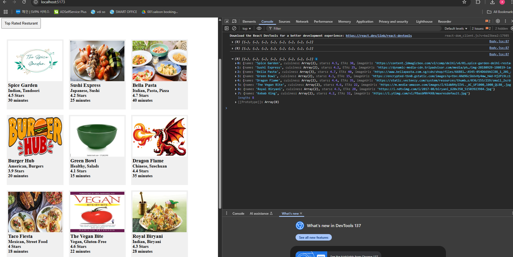
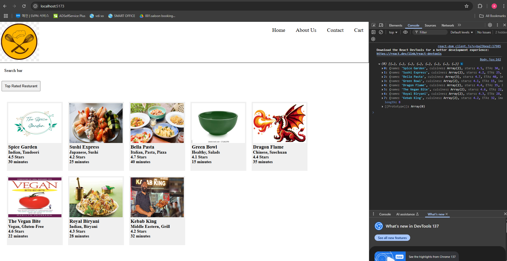
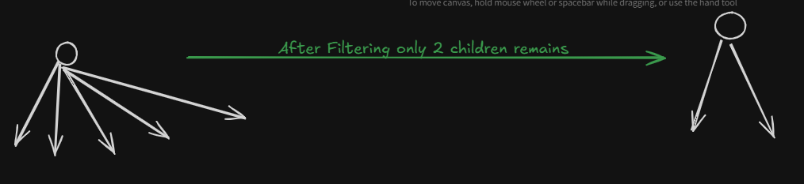
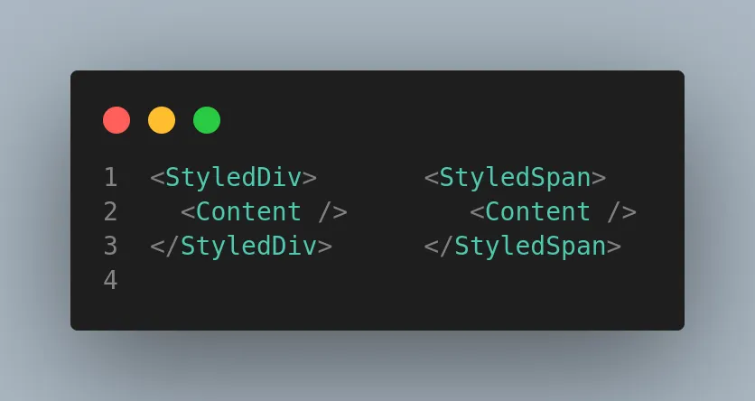
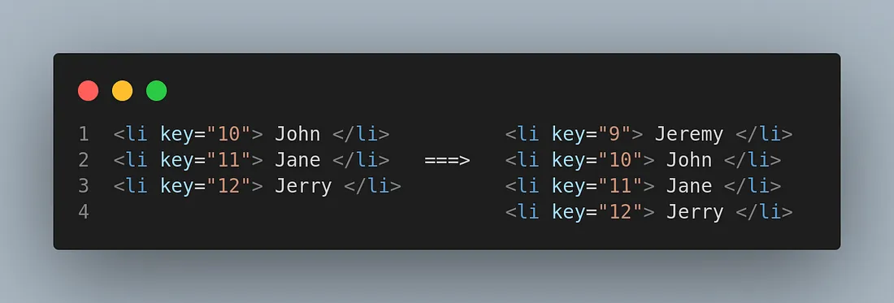

# Episode-5 lets get hooked

React like framework makes devloper's life easy and evn optimises the code!!
We will see React Hooks today!!

Always make separate files for spearate components!! All code inside `src` folder!!

>Note: React does not have any opinion about folder structure!!You can have any folder structure ,no standard way!!`Only file name should be same as functional component` as it twll what a component have!!

>Note:file extension js or jsx or tsx(for typescript) can be there !!No debates ,can use any!! It does not matter!!
## export and import 

In import you no need to put file extension (js and jsx) ,if you even put ,it will make no difference!!Better keep it simple do not put extension!!

>Note:For importing css you just need to import css no need to put use this!!

>Note:Never put hardcoded data in component folder!!Keep it in separate folder!! keep in utils or config foler !!Put the file name in small letters only Component shouydl be in Capital letters!!

export are of two types 
1. default export --> can be exported only once in a file!!
2. named export --> multiple things to export in a file!! below is example of named export

```js
export const LOGO_URL="https://png.pngtree.com/png-vector/20220623/ourmid/pngtree-food-logo-png-image_5296974.png";

export const tmp="temp";
```

Below you can see how to import and use named export 

```js
import './Header.css';
import {LOGO_URL} from '../utils/constants.js'
const Header = () => {
    return (
        <div className="header">
            <div className="logo">
                
            </div>
            <div className="navItems">
              <ul>
                  <li>Home</li>
                  <li>About Us</li>
                  <li>Contact</li>
                  <li>Cart</li>
              </ul>
            </div>
        </div>
    )
}

```
>Note: rememeber LOGO_URL is a constant so need to use {} around it!!

for default export we do not use `{}`,Good practice is use deafult export for components!!

>Note:In companies we have to put a component below 100 lines!!

### Ques. Can we use both exports with one another??

## React Hooks

Till now we have static website ,we do not have buttons no clicks,now we make our website dynmaic!!

We want a button on click of that show top rated restuarnt(>4 rating)!!

```jsx

const Body = () => {
    return (
        <div className="body">
            <div className="search-bar"> Search bar</div>
            <div className="filter">
                <button className="filter-btn"
                >Top Rated Resturant</button>
            </div>
            <div className="res">
                {resturants.map((restaurant, index) => (
                    <div className="card" key={index}>
                        <RestuarantCard
                            data={restaurant}
                        />
                    </div>
                ))}

            </div>
        </div>
    )
};

```

added a button!!

```css
.filter-btn{
    padding: 10px;
    margin:10px;
    cursor: pointer;
}
```

now added a event

```jsx
            <div className="filter">
                <button className="filter-btn" onClick={() => {
                    alert("filter clciekd")
                }}>
                Top Rated Resturant</button>
            </div>
```

now we implement functionality !!

```jsx
export let resturants = [
    {
        name: "Spice Garden",
        cuisines: ["Indian", "Tandoori"],
        stars: 4.5,
        ETA: 30,
        imageUrl: "https://content.jdmagicbox.com/v2/comp/delhi/v6/011pxx11.xx11.230205060526.n9v6/catalogue/the-spice-garden-delhi-restaurants-ptcucdn9ri-250.jpg"
    },
    {
        name: "Sushi Express",
        cuisines: ["Japanese", "Sushi"],
        stars: 4.2,
        ETA: 25,
        imageUrl: "https://dynamic-media-cdn.tripadvisor.com/media/photo-o/14/e2/87/56/img-20180929-180819-largejpg.jpg?w=900&h=500&s=1"
    },
    {
        name: "Bella Pasta",
        cuisines: ["Italian", "Pasta", "Pizza"],
        stars: 4.7,
        ETA: 40,
        imageUrl: "https://www.bellapasta.com.sg/cdn/shop/files/66B81750-D477-4343-A545-054D669ACC88_1_201_a_1500x.jpg?v=1661917543"
    },
    {
        name: "Burger Hub",
        cuisines: ["American", "Burgers"],
        stars: 3.9,
        ETA: 20,
        imageUrl: "https://static.wixstatic.com/media/9a1d3f_98137e3ad55a455c866d8b5bbd444988~mv2.png/v1/fill/w_440,h_196,al_c,lg_1,q_85,enc_avif,quality_auto/Burger%20Hub%20Logo%20_%20Located%20at%206231%20S%2027th%20St%20Greenfield%2C%20WI%2053221%20_edited.png"
    },
    {
        name: "Green Bowl",
        cuisines: ["Healthy", "Salads"],
        stars: 4.1,
        ETA: 15,
        imageUrl: "https://encrypted-tbn0.gstatic.com/images?q=tbn:ANd9GcSbUvHy4mw_hWd-Hj2Pl9Lz1f9bpYc-V638lg&s"
    },
    {
        name: "Dragon Flame",
        cuisines: ["Chinese", "Szechuan"],
        stars: 4.4,
        ETA: 35,
        imageUrl: "https://static.vecteezy.com/system/resources/thumbnails/036/155/219/small_2x/dragon-on-white-vector.jpg"
    },
    {
        name: "Taco Fiesta",
        cuisines: ["Mexican", "Street Food"],
        stars: 4.0,
        ETA: 18,
        imageUrl: "https://encrypted-tbn0.gstatic.com/images?q=tbn:ANd9GcTN0yMgADaXm9WF17MJ4avt2jBH0lSYgPhUeA&s"
    },
    {
        name: "The Vegan Bite",
        cuisines: ["Vegan", "Gluten-Free"],
        stars: 4.6,
        ETA: 22,
        imageUrl: "https://m.media-amazon.com/images/I/61dWR4yIIVL._AC_UF1000,1000_QL80_.jpg"
    },
    {
        name: "Royal Biryani",
        cuisines: ["Indian", "Biryani"],
        stars: 4.3,
        ETA: 28,
        imageUrl: "https://i.ndtvimg.com/i/2017-08/biryani_620x350_51503923984.jpg"
    },
    {
        name: "Kebab King",
        cuisines: ["Middle Eastern", "Grill"],
        stars: 4.2,
        ETA: 32,
        imageUrl: "https://i.ytimg.com/vi/PBasbMRf4X0/maxresdefault.jpg"
    }
];


const Body = () => {
    return (
        <div className="body">
            <div className="search-bar"> Search bar</div>
            <div className="filter">
                <button className="filter-btn" onClick={() => {
                    resturants=resturants.filter(
                        (resturant => resturant.stars>4.0)
                    )
                    console.log(resturants);
                }}>
                Top Rated Resturant</button>
            </div>
            <div className="res">
                {resturants.map((restaurant, index) => (
                    <div className="card" key={index}>
                        <RestuarantCard
                            data={restaurant}
                        />
                    </div>
                ))}

            </div>
        </div>
    )
};

export default Body;
```

Now when we click on button data is filtered can see on logs but cannot get on UI!!

see UI and log statement 



see below output all >4 stars
```json
(8) [{…}, {…}, {…}, {…}, {…}, {…}, {…}, {…}]
0
: 
{name: 'Spice Garden', cuisines: Array(2), stars: 4.5, ETA: 30, imageUrl: 'https://content.jdmagicbox.com/v2/comp/delhi/v6/01…spice-garden-delhi-restaurants-ptcucdn9ri-250.jpg'}
1
: 
{name: 'Sushi Express', cuisines: Array(2), stars: 4.2, ETA: 25, imageUrl: 'https://dynamic-media-cdn.tripadvisor.com/media/ph…/img-20180929-180819-largejpg.jpg?w=900&h=500&s=1'}
2
: 
{name: 'Bella Pasta', cuisines: Array(3), stars: 4.7, ETA: 40, imageUrl: 'https://www.bellapasta.com.sg/cdn/shop/files/66B81…-A545-054D669ACC88_1_201_a_1500x.jpg?v=1661917543'}
3
: 
{name: 'Green Bowl', cuisines: Array(2), stars: 4.1, ETA: 15, imageUrl: 'https://encrypted-tbn0.gstatic.com/images?q=tbn:ANd9GcSbUvHy4mw_hWd-Hj2Pl9Lz1f9bpYc-V638lg&s'}
4
: 
{name: 'Dragon Flame', cuisines: Array(2), stars: 4.4, ETA: 35, imageUrl: 'https://static.vecteezy.com/system/resources/thumb…s/036/155/219/small_2x/dragon-on-white-vector.jpg'}
5
: 
{name: 'The Vegan Bite', cuisines: Array(2), stars: 4.6, ETA: 22, imageUrl: 'https://m.media-amazon.com/images/I/61dWR4yIIVL._AC_UF1000,1000_QL80_.jpg'}
6
: 
{name: 'Royal Biryani', cuisines: Array(2), stars: 4.3, ETA: 28, imageUrl: 'https://i.ndtvimg.com/i/2017-08/biryani_620x350_51503923984.jpg'}
7
: 
{name: 'Kebab King', cuisines: Array(2), stars: 4.2, ETA: 32, imageUrl: 'https://i.ytimg.com/vi/PBasbMRf4X0/maxresdefault.jpg'}
length
: 
8

```

But our UI is not updated!!

React is fast as it can do DOM manipulation very fast!!

We use a state variable ,sate is a Keyword in React!! state variable is superpowerful variable!!

for that we use Hooks we are going to use useState hooks!!

`A hook is normal JS function which have already written body!! These function are inside React in node_modules!!`

two very imp hooks 

1. useState()
2. useEffect()

---
### useState Hook

used to create State variable!!imported as NamedImport as need to put `{}`!! React is imported as DefaultImport as no `{}`. 

```jsx
import {UseState} from "react";
```

The state Variable is called as state variable as it maintains scope of component!!

Now below can see how to create a state variable and put default value

```jsx
    let [resturants]=useState([]);
```

It is like resturants=[] empty array!!

we can even pass an array for initial value 

```jsx
    let [resturants]=useState([
        {
            name: "Spice Garden",
            cuisines: ["Indian", "Tandoori"],
            stars: 4.5,
            ETA: 30,
            imageUrl: "https://content.jdmagicbox.com/v2/comp/delhi/v6/011pxx11.xx11.230205060526.n9v6/catalogue/the-spice-garden-delhi-restaurants-ptcucdn9ri-250.jpg"
        },
        {
            name: "Sushi Express",
            cuisines: ["Japanese", "Sushi"],
            stars: 4.2,
            ETA: 25,
            imageUrl: "https://dynamic-media-cdn.tripadvisor.com/media/photo-o/14/e2/87/56/img-20180929-180819-largejpg.jpg?w=900&h=500&s=1"
        },
        {
            name: "Bella Pasta",
            cuisines: ["Italian", "Pasta", "Pizza"],
            stars: 4.7,
            ETA: 40,
            imageUrl: "https://www.bellapasta.com.sg/cdn/shop/files/66B81750-D477-4343-A545-054D669ACC88_1_201_a_1500x.jpg?v=1661917543"
        },
        {
            name: "Burger Hub",
            cuisines: ["American", "Burgers"],
            stars: 3.9,
            ETA: 20,
            imageUrl: "https://static.wixstatic.com/media/9a1d3f_98137e3ad55a455c866d8b5bbd444988~mv2.png/v1/fill/w_440,h_196,al_c,lg_1,q_85,enc_avif,quality_auto/Burger%20Hub%20Logo%20_%20Located%20at%206231%20S%2027th%20St%20Greenfield%2C%20WI%2053221%20_edited.png"
        },
        {
            name: "Green Bowl",
            cuisines: ["Healthy", "Salads"],
            stars: 4.1,
            ETA: 15,
            imageUrl: "https://encrypted-tbn0.gstatic.com/images?q=tbn:ANd9GcSbUvHy4mw_hWd-Hj2Pl9Lz1f9bpYc-V638lg&s"
        },
        {
            name: "Dragon Flame",
            cuisines: ["Chinese", "Szechuan"],
            stars: 4.4,
            ETA: 35,
            imageUrl: "https://static.vecteezy.com/system/resources/thumbnails/036/155/219/small_2x/dragon-on-white-vector.jpg"
        },
        {
            name: "Taco Fiesta",
            cuisines: ["Mexican", "Street Food"],
            stars: 4.0,
            ETA: 18,
            imageUrl: "https://encrypted-tbn0.gstatic.com/images?q=tbn:ANd9GcTN0yMgADaXm9WF17MJ4avt2jBH0lSYgPhUeA&s"
        },
        {
            name: "The Vegan Bite",
            cuisines: ["Vegan", "Gluten-Free"],
            stars: 4.6,
            ETA: 22,
            imageUrl: "https://m.media-amazon.com/images/I/61dWR4yIIVL._AC_UF1000,1000_QL80_.jpg"
        },
        {
            name: "Royal Biryani",
            cuisines: ["Indian", "Biryani"],
            stars: 4.3,
            ETA: 28,
            imageUrl: "https://i.ndtvimg.com/i/2017-08/biryani_620x350_51503923984.jpg"
        },
        {
            name: "Kebab King",
            cuisines: ["Middle Eastern", "Grill"],
            stars: 4.2,
            ETA: 32,
            imageUrl: "https://i.ytimg.com/vi/PBasbMRf4X0/maxresdefault.jpg"
        }
    ]);
```

component is rendered perfectly!!

Now how to modify this variable!that si done by function and that is returned by 2nd value of array!!

just see the syntax below how to get function 

```jsx
 let [resturants,setResturants]=useState([
        {
            name: "Spice Garden",
            cuisines: ["Indian", "Tandoori"],
            stars: 4.5,
            ETA: 30,
            imageUrl: "https://content.jdmagicbox.com/v2/comp/delhi/v6/011pxx11.xx11.230205060526.n9v6/catalogue/the-spice-garden-delhi-restaurants-ptcucdn9ri-250.jpg"
        },
        {...

```

now how ti use that function!!
```jsx
    return (
        <div className="body">
            <div className="search-bar"> Search bar</div>
            <div className="filter">
                <button className="filter-btn" onClick={() => {
                    resturants=resturants.filter(
                        (resturant => resturant.stars>4.0)
                    )
                    console.log(resturants);
                    setResturants(resturants);
                }}>
                Top Rated Resturant</button>
            </div>
            <div className="res">
                {resturants.map((restaurant, index) => (
                    <div className="card" key={index}>
                        <RestuarantCard
                            data={restaurant}
                        />
                    </div>
                ))}

            </div>
        </div>
    )
};

```

this is how we filter we filter first and to update the dom pass to the function returned by the useState hook!!

We passing filtered list to the setFunction!!

see now on click our list is updated ,see 



`Whenever a state variable updates ,react re-renders the component`

Now we want data in separate file so 

```jsx
import RestuarantCard from "./RestuarantCard.jsx";
import {useState} from "react";
import {resturantList} from "../utils/data.jsx"
import './Body.css';


const Body = () => {

    let [resturants,setResturants]=useState(resturantList);

    return (
        <div className="body">
            <div className="search-bar"> Search bar</div>
            <div className="filter">
                <button className="filter-btn" onClick={() => {
                    resturants=resturants.filter(
                        (resturant => resturant.stars>4.0)
                    )
                    console.log(resturants);
                    setResturants(resturants);
                }}>
                Top Rated Resturant</button>
            </div>
            <div className="res">
                {resturants.map((restaurant, index) => (
                    <div className="card" key={index}>
                        <RestuarantCard
                            data={restaurant}
                        />
                    </div>
                ))}

            </div>
        </div>
    )
};

export default Body;
```

ResturantList has all data in list format!!

`Logic of updating UI is called as re-rendering!!`

`Whenever a state variable updates ,react re-renders the component`


## How React works behind the scene?

React uses somethng called as `Reconciliation`!!This `reconciliation` is also know as `React fiber`!!

Suppose initially 5 chilren of conatiner class and after filtering only 2 left!!



let us see what `Virtual DOM` is?

Actual Dom is real DOM, tags ..But Virtual DOM is representation of Actual DOM!!

to see virtual DOM log `<Body />`!! which you will see is a object!! It is react virtual DOM!!

### Diff algorithm /REact fiber /Reconcilation

finds out difference in two (curr and prev ) Virtual DOM!! after that difference and that difference is updated in Actual DOM!!

This algo came  in React16!!

changing anything in DOM is expensive.
Especially, if we are changing multiple things at the same time in DOM.
Re-rendering in that scenario is gonna be super slow. So we have to be mindful whenever we are updating the DOM.

Now, this is the problem that Virtual DOM solves.

Instead of rendering all the changes to real DOM, react applies them to virtual DOM.
Virtual DOM doesn’t get re-rendered, So changes are cheap there.
React batches the changes together for efficiency.


### The Virtual DOM
A lightweight representation of DOM

Exists in memory & is never actually rendered.

It’s just a tree data structure of plain javascript objects.

Popularized by React & also used by other frameworks like Angular 2 and Vue.

## Reconciliation
Finding the minimum no. of modifications required is an O(n³) complexity problem.

React uses a heuristic that is of complexity O(n).

#### Ex-1

Two elements of different types will produce different trees.



React will not attempt to find the diff between them, but will replace them completely.
It uses Breadth-First-Reversal while diffing the two trees.

#### Ex-2

However, child elements may be hinted as stable across the renders with a key.



In this case, even if we add a new element at the top React won’t render the whole list of items again. It’ll only render the one which was added later.

## Incremental Rendering 

Read about it !!

Rect is fast as it do Effiecient DOM manipulation as it has virtual DOM!! After React ,Virtual DOM becomes popular!! Virtual DOM was present even before react!!