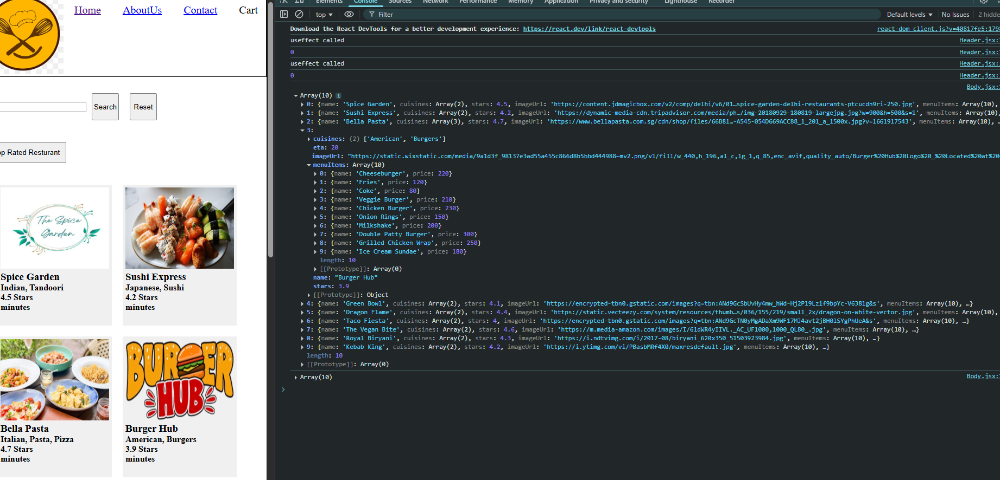
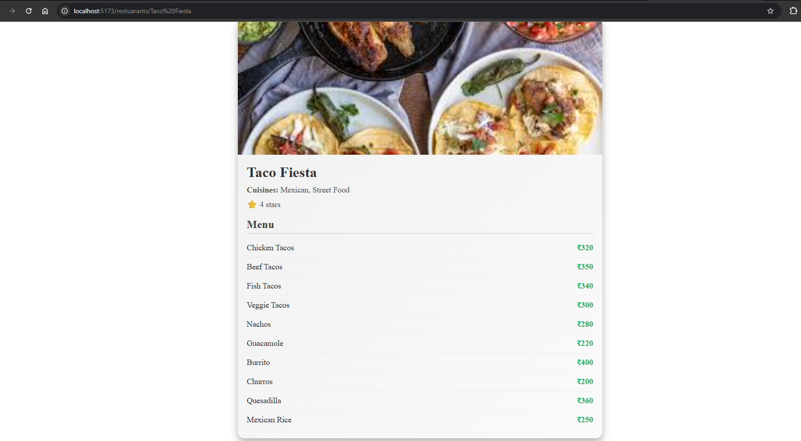
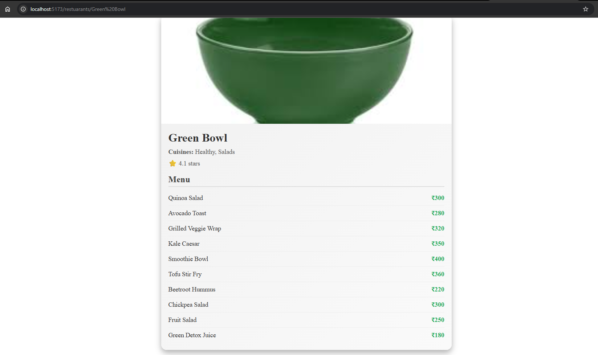

# Ep-7 finding path (routing)

Routing among different pages in react!!

## useEffect working!!
 we know syntax of useEffect!! 

 ```text
useEffect(callback function, dependencies?)
 ```
 ```jsx
useEffect(()=>{},[])
 ```
 useEffect is called after every render of component!! Dependency array chnage behaviour of useEffect!!

>Note:if no dependency array ,useEffect is called at every render!! 

>Note:If empty dependency array is empty then useEffect is called on initial render and just once!!Now it will not be called even if component re-renders!!


```jsx

const Body = () => {

    let [resturants,setResturants]=useState([]);

    const [searchTerm, setSearchTerm] = useState("");

    useEffect(() => {fetchdata()},[])

    const fetchdata = async()=> {
        const data=await fetch("http://localhost:8080/api/res");
        const json=await data.json()
        setResturants(json)
    }


```

see we calling fetchData() only on 1st render ,we have seen how many times fetchData() is called when we have not provided depedency array!!


what if we put something in dependency array , so now on dependency change ,useEffect will be called!!

```jsx
const Header = () => {

    const [buttonVal,setbuttonVal]=useState('Login');

    const [count,setCount]=useState(0);

    useEffect(() => {
        console.log("useffect called");
        setCount(count+1);
        console.log(count);
    }, [buttonVal]);

    return (
        <div className="header">
            <div className="logo">
                
            </div>
            <div className="navItems">
              <ul>
                  <li>Home</li>
                  <li>About Us</li>
                  <li>Contact</li>
                  <li>Cart</li>
                  <button onClick={()=>{
                      if (buttonVal == "Login"){setbuttonVal("Logout")}
                      else setbuttonVal("Login");
                  }}>{buttonVal}</button>
              </ul>
            </div>
        </div>
    )
}

export default Header

```
Now as many times buttonVal changes useEffect will be called!!


just ignore error ,it is there as backend was not running!!

so there are 3 cases for useEffect 

1. no depedency array every time compoenent render
2. empty depdendency array only 1st time 
3. non-empty dependency array ,whenever depedency chnages useEfefct will be called!!

### Best practices
- Never use useState or any hook outside body!!
- try to call hooks on start 
- never useState inside if-else,for-loops and functions  ,it will create inconsitency in your program!!
- always create hooks on top of functional component ,inside it!!

## Routing

for this we will be using npm package `React Router DOM`

install by
```npm 
 npm i react-router-dom
```

our pacakage.json chnages

```json
  "dependencies": {
    "react": "^19.1.0",
    "react-dom": "^19.1.0",
    "react-router": "^7.6.2",
    "react-router-dom": "^7.6.2"
  },
```
we created aboutus page from chatGPt 

now we want `/about` should take to AboutUs page!!!
so in main.jsx

```jsx

import { StrictMode } from 'react'
import { createRoot } from 'react-dom/client'
import './index.css'
import App from './App.jsx'
import {createBrowserRouter, RouterProvider } from "react-router";
import AboutUs from "./AboutUs/AboutUs.jsx";

const appRouter=createBrowserRouter([
    {
        path: "/",
        element:<App/>
    },
    {
        path: "/about",
        element:<AboutUs/>
    }
]);

createRoot(document.getElementById('root')).render(
    <StrictMode>
        <RouterProvider router={appRouter}/>
    </StrictMode>
)

```

added contactus page too! adding routes of that!!

```jsx
import { StrictMode } from 'react'
import { createRoot } from 'react-dom/client'
import './index.css'
import App from './App.jsx'
import {createBrowserRouter, RouterProvider } from "react-router";
import AboutUs from "./AboutUs/AboutUs.jsx";
import ContactUs from "./ContactUs/ContactUs.jsx";

const appRouter=createBrowserRouter([
    {
        path: "/",
        element:<App/>
    },
    {
        path: "/about",
        element:<AboutUs/>
    },
    {
        path: "/contact",
        element:<ContactUs/>
    }
]);

createRoot(document.getElementById('root')).render(
    <StrictMode>
        <RouterProvider router={appRouter}/>
    </StrictMode>
)


```

see previously we were rendering AppComponent but now we are rendering approuter and based on route we will get the page!!

There are various kind of Router can see on react website!! Each one for different usecase but recommended one is `createBrowserRouter` by react!!

If you use some other route ,it will show some error page telling 404 error page!!


so let us configure our own error page!!


our own error page

```jsx

const appRouter=createBrowserRouter([
    {
        path: "/",
        element:<App/>,
        errorElement:<ErrorPage/>
    },
    {
        path: "/about",
        element:<AboutUs/>
    },
    {
        path: "/contact",
        element:<ContactUs/>
    }
]);

createRoot(document.getElementById('root')).render(
    <StrictMode>
        <RouterProvider router={appRouter}/>
    </StrictMode>
)
```
we can even get more info by putting `useRouteError` hook on error page!!

```jsx
    const err=useRouteError();
    console.log(err);
```


we can shoow whole err object!! or can show some parts of it!!

Now we want to keep our header intact !! our header should not change!! Only pages below header be chnaged!!

We want header on every page except error page!! 

for this we need to create children routes!!

### Children routes

```jsx
import './App.css'
import Header from "./Header/Header.jsx";
import {Outlet} from "react-router";

function App() {
  return (
    <>
      <Header />
        <Outlet />
    </>
  )
}

export default App


```

we put outlet from react -router , now this outlet will be replaced by other children components!!

```jsx

import { StrictMode } from 'react'
import { createRoot } from 'react-dom/client'
import './index.css'
import App from './App.jsx'
import {createBrowserRouter, RouterProvider } from "react-router";
import AboutUs from "./AboutUs/AboutUs.jsx";
import ContactUs from "./ContactUs/ContactUs.jsx";
import ErrorPage from "./Error/Error.jsx";
import Body from "./Body/Body.jsx";

const appRouter=createBrowserRouter([
    {
        path: "/",
        element:<App/>,
        children:[
            {
                path: "/",
                element:<Body/>
            },
            {
            path: "/about",
            element:<AboutUs/>
            },
            {
                path: "/contact",
                element:<ContactUs/>
            }
            ],
        errorElement:<ErrorPage/>
    }

]);

createRoot(document.getElementById('root')).render(
    <StrictMode>
        <RouterProvider router={appRouter}/>
    </StrictMode>
)
```


Now we want to link various links to the header ,we click onaboutus it take us to about us page and contact should take us to contact us page!! here we cannot use anchor `<a href ></a>` here!! as it will make whole page refresh!! We do not want whole page to refresh!!

we will use link by react-router 

### Link by react-router

works same as anchor tag ,just change in syntax!!

```jsx
const Header = () => {

    const [buttonVal,setbuttonVal]=useState('Login');

    const [count,setCount]=useState(0);

    useEffect(() => {
        console.log("useffect called");
        setCount(count+1);
        console.log(count);
    }, [buttonVal]);

    return (
        <div className="header">
            <div className="logo">
                
            </div>
            <div className="navItems">
              <ul>
                  <li>
                      <Link to={`/`}>Home</Link>
                  </li>
                  <li>
                      <Link to={`/about`}>AboutUs</Link>
                  </li>
                  <li>
                      <Link to={`/contact`}>Contact</Link>
                  </li>
                  <li>Cart</li>
                  <button onClick={()=>{
                      if (buttonVal == "Login"){setbuttonVal("Logout")}
                      else setbuttonVal("Login");
                  }}>{buttonVal}</button>
              </ul>
            </div>
        </div>
    )
}

```

see how we linked!!

>Note:Link is gieven by react but at backend it is still have anchor tag!! It is wrapper around anchor tag!! When you see html of page you will see anchor tag only!!

when we click on some link our page will not refresh!! anchor tag is slow but Link is very fast!!

It not reload whole page ,it just refreshes the component on same page !! so that is why it is called as Single page application!!

## Types of routing 

there are two types of routing in web apps 

1. client side routing --> no network calls as all component are already there ,it just put the component in that Outlet place!! In SPA ,just single page ,just compoenents get inter changed!!
2. server side routing --> get new html from server by network call and re-loads whole page!!


Now we create page for each resturant!!

we want to display menu page for each resturant at backend added menuItem!!




This is what we are getting from backend now!! Now we got restuarantdetails page from chatgPT!!

```jsx
const RestaurantDetails = ({ restaurant }) => {
    if (!restaurant) return <div>No restaurant selected.</div>;

    return (
        <div className="restaurant-card">
            
            <div className="restaurant-info">
                <h2 className="restaurant-name">{restaurant.name}</h2>
                <p className="restaurant-cuisines">
                    <strong>Cuisines:</strong> {restaurant.cuisines.join(', ')}
                </p>
                <p className="restaurant-rating">⭐ {restaurant.stars} stars</p>

                <h3 className="menu-heading">Menu</h3>
                <div className="menu-list">
                    {restaurant.menu.map((item, index) => (
                        <div key={index} className="menu-item">
                            <span>{item.name}</span>
                            <span className="menu-price">₹{item.price}</span>
                        </div>
                    ))}
                </div>
            </div>
        </div>
    );
};

export default RestaurantDetails;


```

now we want this to be routed by something!!

On router card we put Link to 

```jsx
const RestuarantCard = (props ) => {

    if (!props || !props.data) {
        return null; // or a fallback UI
    }
    const { name, cuisines, stars, ETA ,imageUrl}=props.data;

    let styleCard={
        backgroundColor: "#f0f0f0"
    }
    return (
        <div className="res-card" style={styleCard}>
            
            <h3><Link
                to={`restuarants/${name}`}>
                {name}</Link></h3>
            <h4>{cuisines.join(", ")}</h4>
            <h4>{stars} Stars</h4>
            <h4>{ETA} minutes</h4>
        </div>
    )
}

export default RestuarantCard;

```
see how we passing name to URL!!

can also be passed by 

```jsx
   <h3><Link
                to={"restuarants/"+name}>
```
as concartenation done in jsx so put `{}`
## What is useParams?
✅ It is a React Router hook.

✅ You use it to read parameters from the URL.

```jsx

const RestaurantDetails = () => {
    const { resName } = useParams();


    let [restaurant,setRrestaurant]=useState(null);

    useEffect(() => {fetchdata()},[resName])

    const fetchdata = async()=> {
        const data=await fetch(`http://localhost:8080/api/res/getMenu?name=${resName}`);
        const json=await data.json()
        setRrestaurant(json)
        console.log(json)
    }
    if (!restaurant) return <div>No restaurant selected.</div>;


    return (
        <div className="restaurant-card">
            
            <div className="restaurant-info">
                <h2 className="restaurant-name">{restaurant.name}</h2>
                <p className="restaurant-cuisines">
                    <strong>Cuisines:</strong> {restaurant.cuisines.join(', ')}
                </p>
                <p className="restaurant-rating">⭐ {restaurant.stars} stars</p>

                <h3 className="menu-heading">Menu</h3>
                <div className="menu-list">
                    {restaurant.menuItems?.map((item, index) => (
                        <div key={index} className="menu-item">
                            <span>{item.name}</span>
                            <span className="menu-price">₹{item.price}</span>
                        </div>
                    ))}
                </div>
            </div>
        </div>
    );
};

export default RestaurantDetails;

```

getting name from parameter using hook !! 

calling api using useEffectHook on that name!! and then on that we are setting resturant to the return value!!

> we have written backend API to get whole resturant by name 

```java
    @GetMapping("/getMenu")
    public Restaurant getRetaurantByName( @RequestParam String name){
        System.out.println(name);
        return restaurantList.stream().filter(
                restaurant -> restaurant.getName().toLowerCase().contains(name.toLowerCase())
        ).findFirst().orElse(null);
    }
```

So here our menu 






