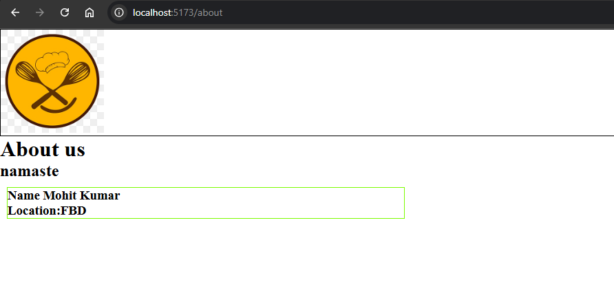
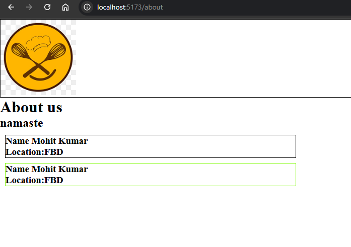
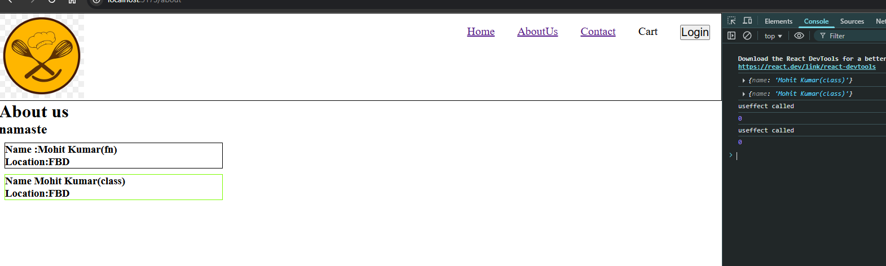

# Ep-8 Let get classy 

Class based component is older way to create React component!! Till now we were using Functional component!!
But in legacy application and in interviews ,Class based ocmponents are widely used!!

Now we will make our about us page a class compnent!! we will remove old about us page!!

See our about us page!!

```jsx
const AboutUs = () => {

    return (
        <div>
           <h1>About us</h1>
            <h2>namaste</h2>
        </div>
    );
};

export default AboutUs;
```


This we are going to make class component!! Here we will get data !!We wil put data for users who helped in creation of website !! So we create UsersCard!!

see userCard as functional component 

```jsx

const UserCard = () => {
    return (
        <div className="UserCard">
            <h3>Name Mohit Kumar</h3>
            <h3>Location:FBD</h3>
        </div>
    )
}

export default UserCard;

```
## Class Component 
Now we are gonna make same fucntional compnent as class compoenent!!

```jsx
class UserClass extends React.Component {
        render() {
            return (
                <div className="UserCardClass">
                    <h3>Name Mohit Kumar</h3>
                    <h3>Location:FBD</h3>
                </div>
            )
        }
 }

  export default UserClass;
```

We neeed to extend React.component and then in render() we return  Jsx!!

` Class component is js class extends React.component which returns jsx in render() fucntion`

`Function component is a js Function that returns some JSX` 

can see difference between two above!!

React.Component is coming from react!!

How to use see below !!

```jsx
import UserClass from "./UserClass.jsx";

const AboutUs = () => {

    return (
        <div>
           <h1>About us</h1>
            <h2>namaste</h2>
            <UserClass/>
        </div>
    );
};

export default AboutUs;


```



We have applied different CSS on class This useCardClass so green border!!

just chnage of little syntax!!

Now we want to pass props to class component!!

### Props in class component

let us show both in the UI!!



 black one functional component and green one class component!!

Now we want to pass props!!

To get props in class based component we need to create constructor and put super(props).

`For using props we need to use this.props.name`

```jsx

class UserClass extends React.Component {
        constructor(props) {
            super(props);
            console.log(props)
        }

        render() {
            return (
                <div className="UserCardClass">
                    <h3>Name {this.props.name}</h3>
                    <h3>Location:FBD</h3>
                </div>
            )
        }
 }

 export default UserClass;

```

This is how we use in class based and below can see in fucntional component!!

```jsx
const UserCard = ({name}) => {
    return (
        <div className="UserCard">
            <h3>Name :{name}</h3>
            <h3>Location:FBD</h3>
        </div>
    )
}

export default UserCard;
```
 see aboutus.jsx,how we are calling the two components!!
 ```jsx

const AboutUs = () => {

    return (
        <div>
           <h1>About us</h1>
            <h2>namaste</h2>
            <UserCard name={"Mohit Kumar(fn)"} />
            <UserClass  name={"Mohit Kumar(class)"}/>
        </div>
    );
};

export default AboutUs;

```


