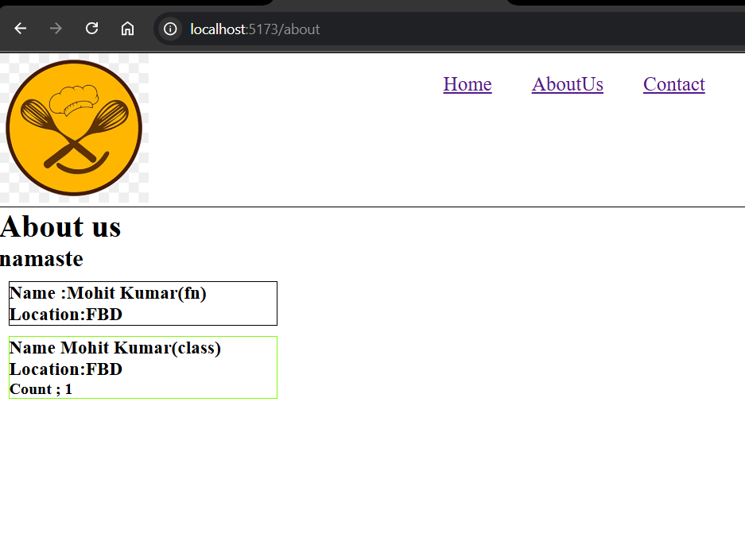
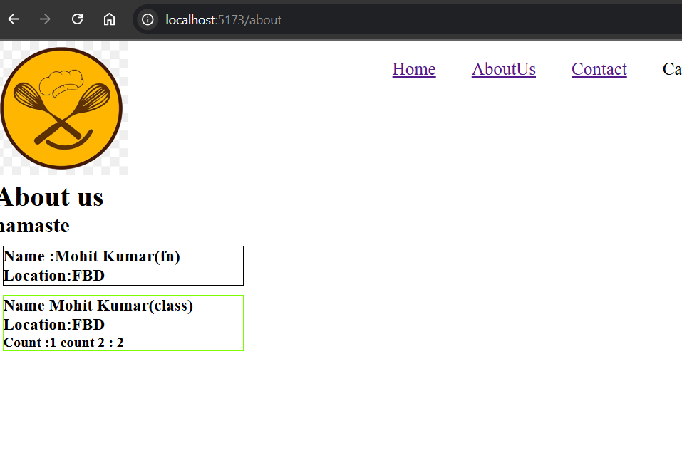
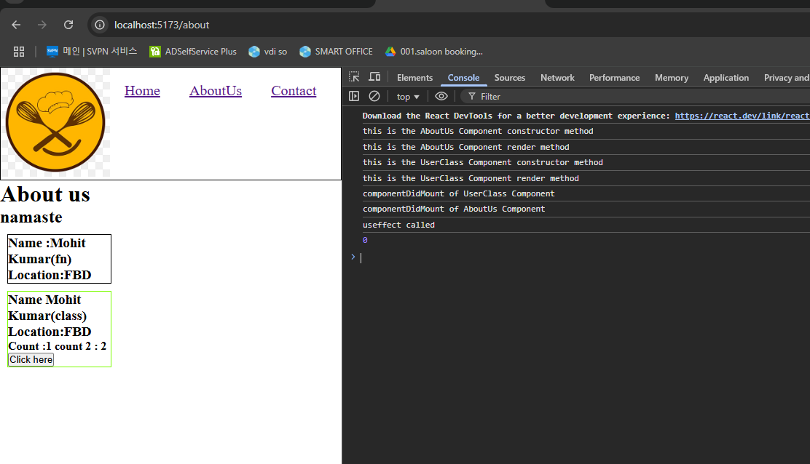
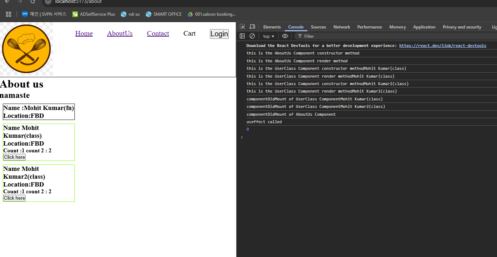
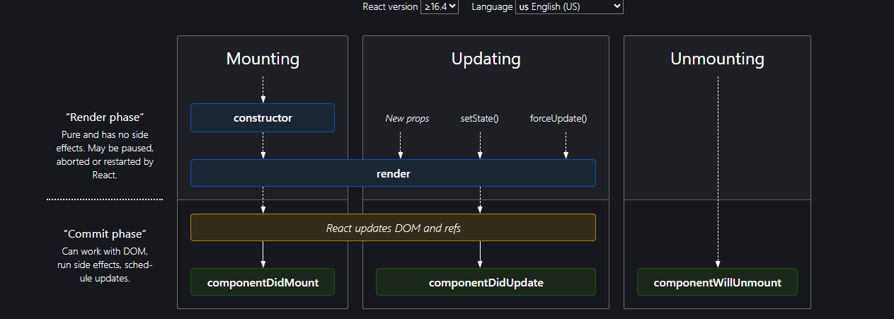

# Ep-8 Let get classy 

Class based component is older way to create React component!! Till now we were using Functional component!!
But in legacy application and in interviews ,Class based ocmponents are widely used!!

Now we will make our about us page a class compnent!! we will remove old about us page!!

See our about us page!!

```jsx
const AboutUs = () => {

    return (
        <div>
           <h1>About us</h1>
            <h2>namaste</h2>
        </div>
    );
};

export default AboutUs;
```


This we are going to make class component!! Here we will get data !!We wil put data for users who helped in creation of website !! So we create UsersCard!!

see userCard as functional component 

```jsx

const UserCard = () => {
    return (
        <div className="UserCard">
            <h3>Name Mohit Kumar</h3>
            <h3>Location:FBD</h3>
        </div>
    )
}

export default UserCard;

```
## Class Component 
Now we are gonna make same fucntional compnent as class compoenent!!

```jsx
class UserClass extends React.Component {
        render() {
            return (
                <div className="UserCardClass">
                    <h3>Name Mohit Kumar</h3>
                    <h3>Location:FBD</h3>
                </div>
            )
        }
 }

  export default UserClass;
```

We neeed to extend React.component and then in render() we return  Jsx!!

` Class component is js class extends React.component which returns jsx in render() fucntion`

`Function component is a js Function that returns some JSX` 

can see difference between two above!!

React.Component is coming from react!!

How to use see below !!

```jsx
import UserClass from "./UserClass.jsx";

const AboutUs = () => {

    return (
        <div>
           <h1>About us</h1>
            <h2>namaste</h2>
            <UserClass/>
        </div>
    );
};

export default AboutUs;


```


We have applied different CSS on class This useCardClass so green border!!

just chnage of little syntax!!

Now we want to pass props to class component!!

### Props in class component

let us show both in the UI!!


 black one functional component and green one class component!!

Now we want to pass props!!

To get props in class based component we need to create constructor and put super(props).

`For using props we need to use this.props.name`

```jsx

class UserClass extends React.Component {
        constructor(props) {
            super(props);
            console.log(props)
        }

        render() {
            return (
                <div className="UserCardClass">
                    <h3>Name {this.props.name}</h3>
                    <h3>Location:FBD</h3>
                </div>
            )
        }
 }

 export default UserClass;

```

This is how we use in class based and below can see in fucntional component!!

```jsx
const UserCard = ({name}) => {
    return (
        <div className="UserCard">
            <h3>Name :{name}</h3>
            <h3>Location:FBD</h3>
        </div>
    )
}

export default UserCard;
```
 see aboutus.jsx,how we are calling the two components!!
 ```jsx

const AboutUs = () => {

    return (
        <div>
           <h1>About us</h1>
            <h2>namaste</h2>
            <UserCard name={"Mohit Kumar(fn)"} />
            <UserClass name={"Mohit Kumar(class)"}/>
        </div>
    );
};

export default AboutUs;

```


Now similrly we can pass location!!

```jsx
class UserClass extends React.Component {
        constructor(props) {
            super(props);
            console.log(props)
        }

        render() {
            return (
                <div className="UserCardClass">
                    <h3>Name {this.props.name}</h3>
                    <h3>Location:{this.props.location}</h3>
                </div>
            )
        }
 }
```

Aboutus component

```jsx
const AboutUs = () => {

    return (
        <div>
           <h1>About us</h1>
            <h2>namaste</h2>
            <UserCard name={"Mohit Kumar(fn)"} />
            <UserClass name={"Mohit Kumar(class)"}
            location={"FBD"}/>
        </div>
    );
};
```
All this things will be combined in one object called props !! now we can even  destructure and get in UserCarcClass!!Like bwelow!!

```jsx

import React from "react";

class UserClass extends React.Component {
        constructor(props) {
            super(props);
            console.log(props)
        }

        render() {

            const {name,location}=this.props;
            return (
                <div className="UserCardClass">
                    <h3>Name {name}</h3>
                    <h3>Location:{location}</h3>
                </div>
            )
        }
 }

```

We know how to use state varible in Functional component , lt us see how we can use it in Class based component!!

Invoking a function component is same as mounting a fucntional component !!!

Loading a class based component means creating instance of that class!!

so to create state variables in class-based componnts ,we define them in constructor!!Earlier there was no hooks so we use a different way here!!

### State variable in class component

we define it inside a state variable!!

```jsx
class UserClass extends React.Component {
        constructor(props) {
            super(props);
            this.state = {
                count:1,
            }
        }

        render() {

            const {name,location}=this.props;
            return (
                <div className="UserCardClass">
                    <h3>Name {name}</h3>
                    <h3>Location:{location}</h3>
                    <h4>Count ; {this.state.count}</h4>
                </div>
            )
        }
 }


```


we can detructure it too !!

we know how to create two or more state variable inside functional component !!Now we want to create multiple  state variable in class based componet so we will create it inside state variable only!! 

```jsx
import React from "react";

class UserClass extends React.Component {
        constructor(props) {
            super(props);
            this.state = {
                count:1,
                count2:2,
            }
        }

        render() {

            const {name,location}=this.props;
            const{ count,count2 } = this.state;
            return (
                <div className="UserCardClass">
                    <h3>Name {name}</h3>
                    <h3>Location:{location}</h3>
                    <h4>Count :{count} count 2 : {count2}</h4>
                </div>
            )
        }
 }


```


### Updating state variable in Class component

```jsx
class UserClass extends React.Component {
        constructor(props) {
            super(props);
            this.state = {
                count:1,
                count2:2,
            }
        }

        render() {

            const {name,location}=this.props;
            const{ count,count2 } = this.state;
            return (
                <div className="UserCardClass">
                    <h3>Name {name}</h3>
                    <h3>Location:{location}</h3>
                    <h4>Count :{count} count 2 : {count2}</h4>
                    <button OnClick={()=>{
                            this.state.count=this.state.count+1;
                    }}>Click here</button>
                </div>
            )
        }
 }

```

this is wrong ,never do it like this!! Never put `=` in state variable and then assign some value !!

>Note:Never do it directly!!

so react give a function called as `this.setState()`!!In this method we give object!!


```jsx

class UserClass extends React.Component {
        constructor(props) {
            super(props);
            this.state = {
                count:1,
                count2:2,
            }
        }

        render() {

            const {name,location}=this.props;
            const{ count,count2 } = this.state;
            return (
                <div className="UserCardClass">
                    <h3>Name {name}</h3>
                    <h3>Location:{location}</h3>
                    <h4>Count :{count} count 2 : {count2}</h4>
                    <button onClick={()=>{
                            this.setState({
                              count:this.state.count+1,
                                count2:this.state.count2+2,
                    });
                    }}>Click here</button>
                </div>
            )
        }
 }

 export default UserClass;

```

This is how we set both these variables and increment them in class based component!!

Each time component is re-rendered when count is increased!! 

>Note:if we have only updated count and not count2 in setState ,count2 will not be updated !! only the ones we try to update will be updated!!

### Life-cycle of class based component!!

How this class-based component is mounted(loaded) on webpage??

When in Aboutus page JSX is rendred ,then it sees class based component then the instance of that class component is needed so we call Class constructor!! 

After constructor then render is called !! Can check by putting log statemnt in both methods!!

This can be complicated when even parent is class based component!! 

1st parent constructor then parent render then child constructor and then child render is called !! it is easy i guess!!

React give another method in Classbased component `componentDidMount()`

```jsx
class UserClass extends Component{
        constructor(props) {
            super(props);
            this.state = {
                count:1,
                count2:2,
            }
        }

        componentDidMount(){
            console.log("componentDidMount");
        }

        render() {

            const {name,location}=this.props;
            const{ count,count2 } = this.state;
            return (
                <div className="UserCardClass">
                    <h3>Name {name}</h3>
                    <h3>Location:{location}</h3>
                    <h4>Count :{count} count 2 : {count2}</h4>
                    <button onClick={()=>{
                            this.setState({
                              count:this.state.count+1,
                                count2:this.state.count2+2,
                    });
                    }}>Click here</button>
                </div>
            )
        }
 }

 export default UserClass;

```
1st constructor then render and then componentDidmoount() is called when component is mounted on DOM!! This is `LifeCycle of class-based component`!! 

Now see we have made AboutUs class component (Parent component)

```jsx

class AboutUs extends React.Component {
    
    constructor(props) {
        super(props);
        console.log("this is the AboutUs Component constructor method");
    }

    componentDidMount() {
        console.log("componentDidMount of AboutUs Component");
    }
 render() {
     console.log("this is the AboutUs Component render method");
     return (
         <div>
             <h1>About us</h1>
             <h2>namaste</h2>
             <UserCard name={"Mohit Kumar(fn)"} />
             <UserClass name={"Mohit Kumar(class)"}
                        location={"FBD"}/>
         </div>
     );
 }
};

export default AboutUs;
```
Now see child component 


```jsx

class UserClass extends Component{
        constructor(props) {
            super(props);
            this.state = {
                count:1,
                count2:2,
            }
            console.log("this is the UserClass Component constructor method");
        }

        componentDidMount(){
            console.log("componentDidMount of UserClass Component");
        }

        render() {
            console.log("this is the UserClass Component render method");
            const {name,location}=this.props;
            const{ count,count2 } = this.state;
            return (
                <div className="UserCardClass">
                    <h3>Name {name}</h3>
                    <h3>Location:{location}</h3>
                    <h4>Count :{count} count 2 : {count2}</h4>
                    <button onClick={()=>{
                            this.setState({
                              count:this.state.count+1,
                                count2:this.state.count2+2,
                    });
                    }}>Click here</button>
                </div>
            )
        }
 }

 export default UserClass;

```
In what order statement be printed !!



componentDidMount() of child component is called 1st as it is mounted first!! and then parent!!

If multiple childsthen all childs be mounted first and then parent is mounted!! 

```jsx
class AboutUs extends React.Component {

    constructor(props) {
        super(props);
        console.log("this is the AboutUs Component constructor method");
    }

    componentDidMount() {
        console.log("componentDidMount of AboutUs Component");
    }
 render() {
     console.log("this is the AboutUs Component render method");
     return (
         <div>
             <h1>About us</h1>
             <h2>namaste</h2>
             <UserCard name={"Mohit Kumar(fn)"} />
             <UserClass name={"Mohit Kumar(class)"}
                        location={"FBD"}/>
             <UserClass name={"Mohit Kumar2(class)"}
                        location={"FBD"}/>
         </div>
     );
 }
};

export default AboutUs;

```


See Child class componentDidMount() is called two times !! one for MohitKumar and other for Mohit Kumar2!!

Let us see which children is called first!! 

```jsx

class UserClass extends Component{
        constructor(props) {
            super(props);
            this.state = {
                count:1,
                count2:2,
            }
            console.log("this is the UserClass Component constructor method"+this.props.name);
        }

        componentDidMount(){
            console.log("componentDidMount of UserClass Component"+this.props.name);
        }

        render() {
            console.log("this is the UserClass Component render method"+this.props.name);
            const {name,location}=this.props;
            const{ count,count2 } = this.state;
            return (
                <div className="UserCardClass">
                    <h3>Name {name}</h3>
                    <h3>Location:{location}</h3>
                    <h4>Count :{count} count 2 : {count2}</h4>
                    <button onClick={()=>{
                            this.setState({
                              count:this.state.count+1,
                                count2:this.state.count2+2,
                    });
                    }}>Click here</button>
                </div>
            )
        }
 }

 export default UserClass;
```

changed child like the above!!



see how it is called !! 1st constructor ,render of 1 then constructor ,render of 2 then componentDidMount of 1 and then of 2 !! 

We are creating two instances of same class!! All child component componentDidMount happens at end in order of contructor is called!! and then parent DidcomponentMount will be called!!



This react Lifecycle Diagram!! 

First focus on leftmost block ,React component is mounted in 2 phases!!React is fast because of these two phases ,the diff algorithm!!

1. render phase --> onstructor and render is in this phase after that react updates the DOM !!

2. commit phase--> update DOM, once  DOM is updated ,then componentDidMount() is called!!

every component goes to these two phases in React!!

AboutUs let  us call it par and UserClass 1be called as ch1 and 2nd be ch2!!

1st par is mounted !! so it's constructor and render will be called!!

Now it sees ch1 and call constructor and render of it!!  

`Now as we have 2 child so react will batched render phase of 2 child`. So these two child render phase happens 1st!! 

`then commit phased is batched together`

Why it happens? as onc commit phase starts ,React tries to update the DOM , and DOM updation is expensive operation!! In render ,reconciliation happens ,finding diff , updates in virtual DOM!!
So `render phase is fast as updation in virtual DOM!!` so it batches for all children!! 

`commit phase takes time as actual DOM is updated and it is expensive operation`!! So react treis to update DOM in single batch!!It optimises the performace of react!! 


#### Why we have componentDidMount()?

this is used to make API calls .  In Useeffect we used to put empty dependency array to make API call only once!!

In functional component,1st component is loaded with basic details then API call is made as we do not want to be dependent on API!! 

So In class-based component too we first render component then make API call!!It will re-render the compoenent!!


## Extras
Importing component way-1

```jsx
import React from "react";


class UserClass extends React.Component {
```
way-2 ,destructuring way!!

```jsx
import React from "react";
import {Component} from 'react';

class UserClass extends Component{
```

