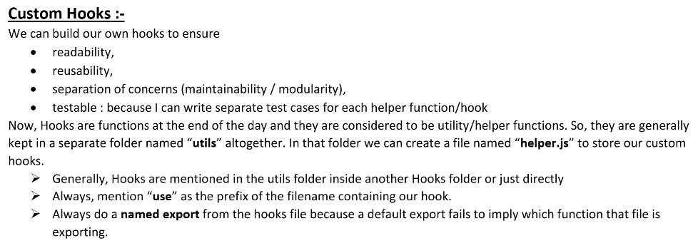
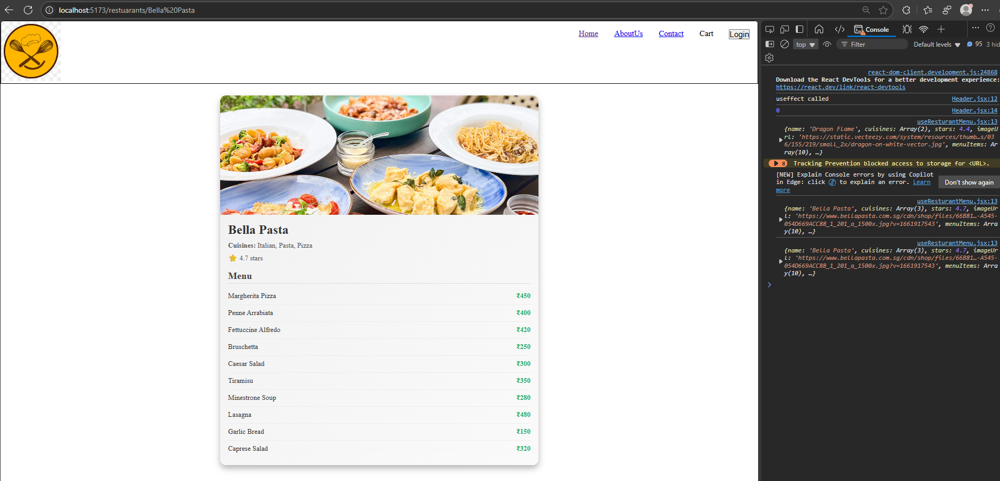

# Ep-9 optimizing App

Let us see how we optimise our app !! We know What SRP(Single Responsibility Principle) means!! So here each component should have single responsibility!! 

We break code into Modules so that we can create test case and bug can be caught by just testing this component!!

If you follow SRP , your code become more reusable , mainatianble and testable!!

SRP dot have some rules , but code should be as light as possible!!

If there is any bug then TestCase should be able to get that!! Now if you Component is having single responsibility then the testcase we need to devlop need to test only that single responsibility ,and if that fails we can say it is bug so more testable!!


Today we will see Custom Hooks (normal JS functions ) !!Hook is normal utility function!! We will take our some thing from some component and create hook so that our code becomes more modular!!



Now let us see this component 

```jsx

const RestaurantDetails = () => {
    const { resName } = useParams();


    let [restaurant,setRrestaurant]=useState(null);

    useEffect(() => {fetchdata()},[resName])

    const fetchdata = async()=> {
        const data=await fetch(`http://localhost:8080/api/res/getMenu?name=${resName}`);
        const json=await data.json()
        setRrestaurant(json)
        console.log(json)
    }
    if (!restaurant) return <div>No restaurant selected.</div>;


    return (
        <div className="restaurant-card">
            
            <div className="restaurant-info">
                <h2 className="restaurant-name">{restaurant.name}</h2>
                <p className="restaurant-cuisines">
                    <strong>Cuisines:</strong> {restaurant.cuisines.join(', ')}
                </p>
                <p className="restaurant-rating">⭐ {restaurant.stars} stars</p>

                <h3 className="menu-heading">Menu</h3>
                <div className="menu-list">
                    {restaurant.menuItems?.map((item, index) => (
                        <div key={index} className="menu-item">
                            <span>{item.name}</span>
                            <span className="menu-price">₹{item.price}</span>
                        </div>
                    ))}
                </div>
            </div>
        </div>
    );
};

export default RestaurantDetails;


```
This have 2 responsibilities 
1. fetch data
2. display on UI

from this component we take out responsibility to fetchdata from backend API and put in custom hook!!

A hook usually starts from `use` keyword!!It helps React to understand that this function is a hook!!

so we name our hook as `useRestuarantMenu` and will place API insied that !! so that component just use hook and display the data!! We abstracted how to get the data!!

`Hooks are just utility fucntions or helper fucntions so we keep it in utils folder`

```jsx
const RestaurantDetails = () => {
    const { resName } = useParams();
    
    const restaurant = useResturantMenu(resName);
    if (!restaurant) return <div>No restaurant selected.</div>;


    return (
        <div className="restaurant-card">
            
            <div className="restaurant-info">
                <h2 className="restaurant-name">{restaurant.name}</h2>
                <p className="restaurant-cuisines">
                    <strong>Cuisines:</strong> {restaurant.cuisines.join(', ')}
                </p>
                <p className="restaurant-rating">⭐ {restaurant.stars} stars</p>

                <h3 className="menu-heading">Menu</h3>
                <div className="menu-list">
                    {restaurant.menuItems?.map((item, index) => (
                        <div key={index} className="menu-item">
                            <span>{item.name}</span>
                            <span className="menu-price">₹{item.price}</span>
                        </div>
                    ))}
                </div>
            </div>
        </div>
    );
};

export default RestaurantDetails;

```
Let us see custom hook ,it is just like a functional component!!

```jsx
import {useEffect, useState} from "react";

const  useResturantMenu=(resName)=>{

    const [resInfo,setResInfo]=useState(null);

    useEffect(()=>{fetchdata()},[]);

    const fetchdata = async()=> {
        const data=await fetch(`http://localhost:8080/api/res/getMenu?name=${resName}`);
        const json=await data.json();
        setResInfo(json);
        console.log(json);
    }
    return resInfo;
}


export default useResturantMenu;

```

Working fine!!




