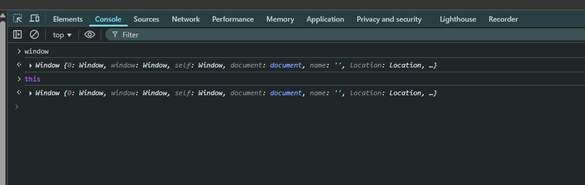
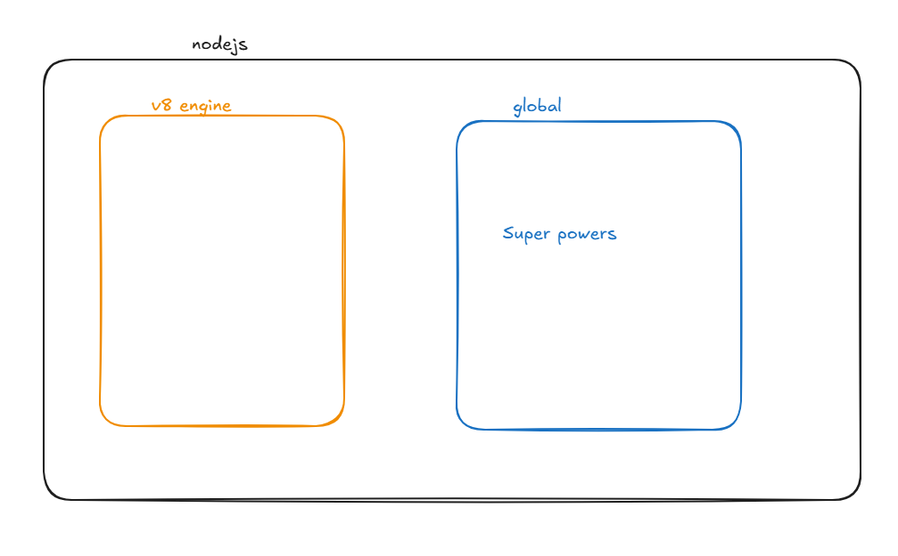
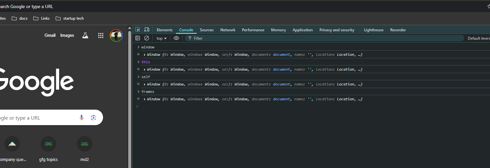
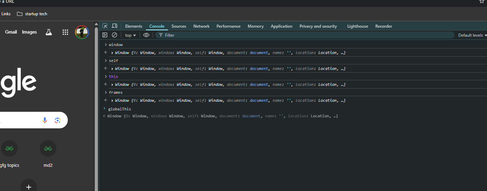

# Ep-3 let us write code 

First we need to install nodejs

npm is installed along with nodejs!!

node REPL(Read ,evaluate ,print, loop) is easiet way to write code in node!!

>Nodejs at end of day is JS !! 

Nodejs is just v8 engine +some more superpowers!!

When we write nodejs code ,the code is passed to V8 engine and then that v8 engine runs the code!!

We do not write code in REPL generally , we create folder and create js code and run `node <filename>.js` in terminal!!!

>Note:must give file extension

To open terminal inside VS code press `Ctrl + ~` .This is shortcut for Vscode !!

## The global obejct

The global object inside browser is `window`!! also when you write `this` keyword you will get same windiow object!!

see the output above!!

window is not V8 concept ,it is given by browser!!

Now in nodejs the global object name is `global`!!It is easy!! You see `setTimeout` , `setInterval` and other function when you log `global` !!

These are super-powers given by nodejs!! It is not presnt in JS!!

`global is not part of v8 it is  super-powers of nodejs`

v8 follows ECMA standard!! It do not understand global!! global is understood by v8 when nodejs provides it!!

but  `this` in case of node js does not point to global object `global` ,`this` when you log gives an empty object!!

>Note: this in browser points to global object but in nodejs it  is just empty object!!

on browser you see all keyword `window` ,`this` ,`self` ,`frames` all point to global object !! can see above!!

global in undefined for brower!!

In 2020,To standardise this `the JS commitee` proposed a standard global object whatever run-time environment you are using!! committee used word `globalThis` --> it refered as global object in all runtime!! 

