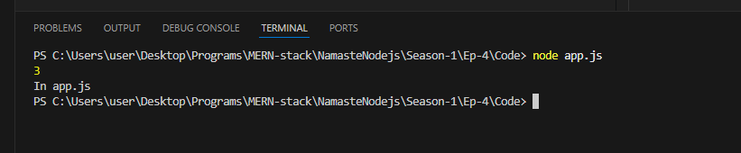
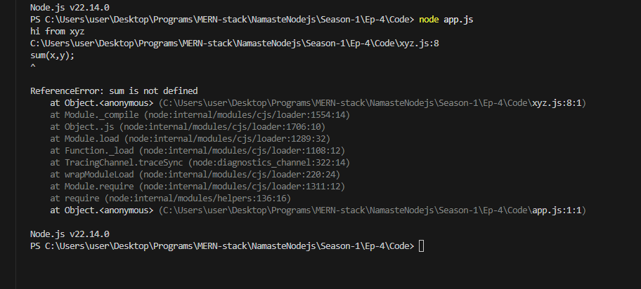
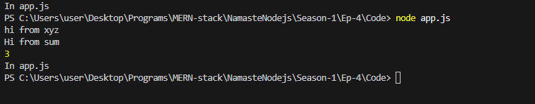

# Ep-4

We can code into single file ,but it is not good practice!! We create multiple files and use a directory structure!!

When we write command `node file-name.js`,the file-name.js is entry-point of our code!! Every node.js have entry point!! But what happen if we have separate files!! In JS we call it as Module!!


this is xyz.js
```js

let x=1;
let y=2;
console.log(x+y);

```
this is app.js

```js

require ("./xyz.js")

console.log("In app.js");
```



now when we run app.js we gwt output 3 from xyz.js when we have put require in app.js!!! 1st required code is run and then after that app.js or the file in which statemnt is required!!


`require is always there in node.js`

Now let us see 
sum.js has a fucntion!!
```js
function sum (a,b){
    console.log("Hi from sum");
    
    return a+b;
}
```

now we imported in xyz.js

```js

require("./sum.js")

let x=1;
let y=2;

console.log("hi from xyz");

sum(x,y);
```
now in app.js

```js
require ("./xyz.js")

console.log("In app.js");
```



sum is not defined!! but we required? right?

>Note:When we do require ,the require file will run once but you cannot acquire variables and function of that module!!Modules are protected by default !! Modules protect their variables and functions to leaking!!

But  we want to use sum from sum.js !! so for that we need to export sum from sum.js!!

we renamed sum method to sumC to avoid confusion with filename!!

see xyz.js
```js
const add=require("./sum.js")

let x=1;
let y=2;

console.log("hi from xyz");

console.log( add(x,y));
```

now see how we export ,remember it is exports not export!!

```js
function sumC (a,b){
    console.log("Hi from sum");
    
    return a+b;
}

module.exports=sumC
```

then see app.js

```js
require ("./xyz.js")

console.log("In app.js");
```
Output:



Now we want to export multiple things