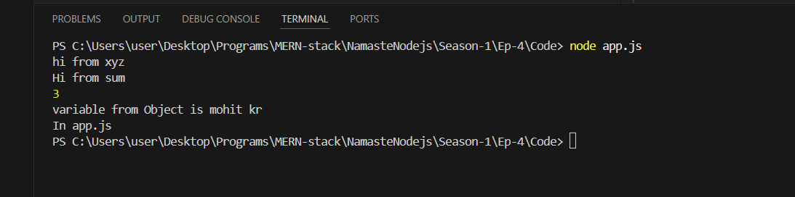

# Ep-4

We can code into single file ,but it is not good practice!! We create multiple files and use a directory structure!!

When we write command `node file-name.js`,the file-name.js is `entry-point` of our code!! Every node.js have entry point!! But what happen if we have separate files!! In JS we call it as Module!!


this is xyz.js
```js

let x=1;
let y=2;
console.log(x+y);

```
this is app.js

```js

require ("./xyz.js")

console.log("In app.js");
```


now when we run app.js we gwt output 3 from xyz.js when we have put require in app.js!!! 1st required code is run and then after that app.js or the file in which statemnt is required!!


`require is always there in node.js`

Now let us see 
sum.js has a fucntion!!

```js
function sum (a,b){
    console.log("Hi from sum");
    
    return a+b;
}
```

now we imported in xyz.js

```js

require("./sum.js")

let x=1;
let y=2;

console.log("hi from xyz");

sum(x,y);
```
now in app.js

```js
require ("./xyz.js")

console.log("In app.js");
```


sum is not defined!! but we required? right?

>Note:When we do require ,the require file will run once but you cannot acquire variables and function of that module!!Modules are protected by default !! Modules protect their variables and functions to leaking!!The module is executed if you require it but you cannot use it;s variable and fucntion outside!! If you write log statement inside sum.js you will see it is executed!! But you will not be able to access sum degined in sum.js in app.js or xyz.js!!

But  we want to use sum from sum.js !! so for that we need to export sum from sum.js!!

we renamed sum method to sumC to avoid confusion with filename!!

see xyz.js
```js
const add=require("./sum.js")

let x=1;
let y=2;

console.log("hi from xyz");

console.log( add(x,y));
```

now see how we export ,`remember it is exports not export`!!

```js
function sumC (a,b){
    console.log("Hi from sum");
    
    return a+b;
}

module.exports=sumC
```

then see app.js

```js
require ("./xyz.js")

console.log("In app.js");
```
Output:


Now we want to export multiple things!!
we eexport byu making an object 

```js
function sumC (a,b){
    console.log("Hi from sum");
    
    return a+b;
}

 const str="mohit kr";
 
module.exports={addAb:sumC,variable:str}
```
now import as object 

```js
const obj=require("./sum.js")

let x=1;
let y=2;

console.log("hi from xyz");

console.log( obj.addAb(x,y));

console.log("variable from Object is "+obj.variable);
```
Output:



Now i can export multiple things!! Most of people do destructuring on the fly!!so no need to do `obj.`!!

```js
const {sumC,str}=require("./sum.js")

let x=1;
let y=2;

console.log("hi from xyz");

console.log( sumC(x,y));

console.log("variable from Object is "+str);


```

also can pass directly like this 
```js
function sumC (a,b){
    console.log("Hi from sum");
    
    return a+b;
}

 const str="mohit kr";
 
module.exports={sumC,str}

```
It will give same ourtput as before!!It is clean and neat!!

>Note: Learning : You cannot export function and variable from module unles exported explicitly!! bY default ,Modules are protected!!It protects conflicting variables and function from other modules!!

>Note:In import statement there is no need to add .js extension ,without that it will work !!

This Module pattern is known As Common JS Modules(cjs)
- Here we have used module.exports and required!!

There ia another pattern called as ES Modules(mjs)!!Here we need package.json!! 

in that we put 

```json
{
    "type":"commonjs"
}
```
for cjs or not put as this is default one but for JS we put module in here!!

```json
{
    "type":"module"
}
```

here we put in sum.js 

```js
export function sumC (a,b){
    console.log("Hi from sum");
    
    return a+b;
}

export  const str="mohit kr";
 

```

in xyz.js

```js
import {sumC,str} from "./sum.js"

let x=1;
let y=2;

console.log("hi from xyz");

console.log( sumC(x,y));

console.log("variable from Object is "+str);

```


MJS or ES Modules or ESM or ES^ modules uses 
- import and export 
- used in Framework in React and angular

CJS is default one in nodeJS, so no need of package.json here!!CJS is older way of doing things!!JS commitee is thinking to make MJS as default one!! But for now we use CJS!!

- CJS require module in synchronous way!! exceutes line by line from top to bottom!!first required one executes line by line and then the current file

- MJS can use async way!

- CJS uses non-strict mode but MJS uses strict mode!!


